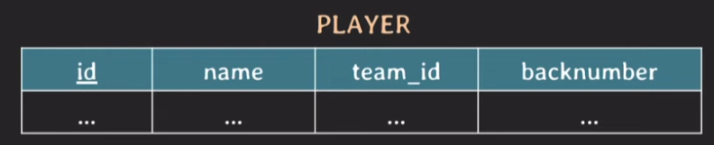
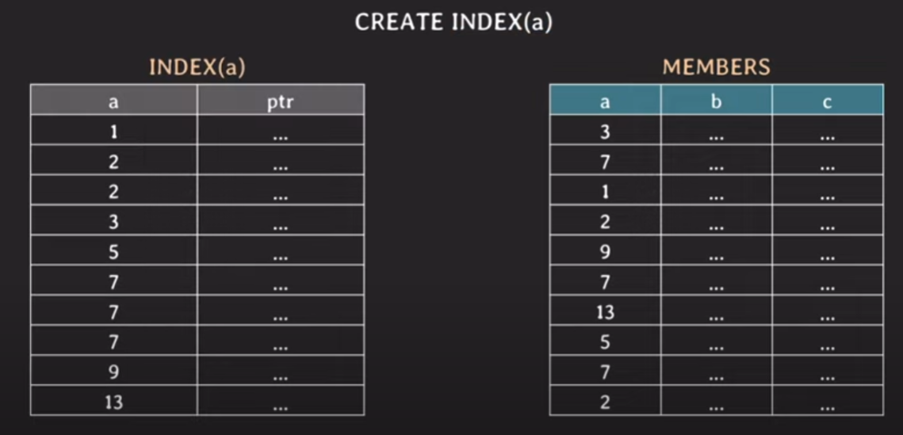
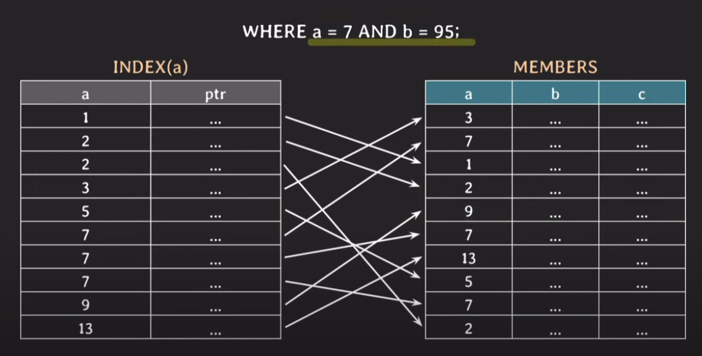
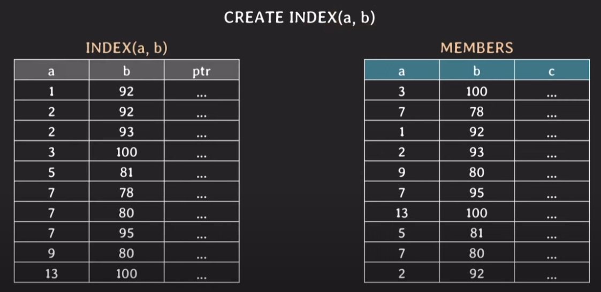

# 인덱스

### 인덱스를 쓰는 이유

- 조건을 만족하는 튜플(들)을 빠르게 조회하기 위해 사용

- 빠르게 정렬 (order by) 하거나 그룹핑 (group by) 하기 위해 사용

### 인덱스를 만드는 법



```SQL
SELECT * FROM player WHERE name = 'Sonny';
SELECT * FROM player WHERE team_id = 105 and backnumber = 7;
```

위의 두 쿼리의 성능을 향상시키기 위해 인덱스를 만들고 싶다면?

```SQL
CREATE INDEX player_name_idx ON player (name);
CREATE UNIQUE INDEX team_id_backnumber_idx ON player(team_id, backnumber); 
```

- name과 같은 속성은 유니크 속성이 아니므로 그냥 인덱스를 만든다.

- team_id와 backnumber는 유니크 속성이므로 유니크 인덱스를 만든다.

    - 두개 이상의 속성으로 구성된 인덱스를 multicolumn index, composite index라고 한다.

    - primary key와 같은 경우에는 RDB에서 index를 자동 생성한다. (clusterd index)

### 인덱스를 조회하는 법

```SQL
SHOW INDEX FROM player;
```

- 유니크 인덱스 여부, 키 이름, 멀티컬럼 인덱스 여부 등을 확인할 수 있음.

## 간단하게 인덱스 작동원리 알아보기 (실제로는 트리구조임)

### 단일 인덱스



- 속성 a에 대한 인덱스는 a값과 실제 튜플의 포인터를 가지고 있음

- 이진탐색을 통해서 a값을 탐색을 함

- 탐색을 완료하면 포인터로 실제 튜플에 접근해서 데이터를 조회함

### 단일 인덱스를 사용하는데 조건이 두 개인 경우



- WHERE 조건 두개가 and로 연결되어 있을 때, a에대한 인덱스만 있다면?

    - a에 관한 조건에 대해서는 조회가 빠르게 된다.

    - 하지만 a에 관한 조건을 만족하는 튜플이 많이 존재한다면, 
    
      이후에 b조건을 만족하는 튜플을 확인할 때 오래걸릴 수 있다.

    - 따라서 이경우 a와 b를 묶은 인덱스를 만들어야한다.

### 멀티컬럼 인덱스(복합 인덱스, 결합 인덱스...)



- 멀티컬럼 인덱스의 경우 a에 대해서 우선정렬한다.

    - 그리고 a의 값이 같다면 b를 기준으로 정렬한다.

- 바로 위의 경우보다 조회속도가 빠르다.

- 다만 이 인덱스의 경우 b에 대한 조건에 관해 조회할때에는 소용이 없다.

### 쿼리가 어떤 인덱스를 쓰는지 확인하기

- EXPLAIN 키워드를 사용하면 된다.

    ```SQL
    EXPLAIN
    SELECT * FROM player WHERE backnumber = 7;
    ```

- 인덱스를 만들어놓으면, 쿼리에 따라서 DB의 옵티마이저가 인덱스를 선택한다

- 내가 직접 index를 고르고 싶다면 아래와 같은방법이 있다.

    ```SQL
    SELECT * FROM player USE INDEX (backnumber_idx) WHERE backnumber = 7;
    ```

    ```SQL
    SELECT * FROM player FORCE INDEX (backnumber_idx) WHERE backnumber = 7;
    ```

- 추가로 특정 인덱스를 제외하고싶다면 `IGNORE INDEX` 키워드를 사용하면 된다.

## 인덱스를 막 만들어도 될까?

- 인덱스를 만드는것은 별도의 데이터 자료 구조를 만드는 것이다.

    - 즉 데이터를 write 하면, 실제 데이터 외에도 인덱스에서도 변경사항이 반영된다 (overhead)

- 인덱스를 사용하면 추가적인 저장공간을 차지하게된다.

<br>

**따라서 불필요한 index는 만들지 않는것이 중요하다.**


## Covering Index

- 조회하는 속성이 인덱스가 모두 cover할 수 있을 때 covering index라고 함

- 조회 성능이 더 빠름

- 예시

    ```SQL
    CREATE UNIQUE INDEX team_id_backnumber_idx ON player(team_id, backnumber); 

    SELECT team_id, backnumber FROM player WHERE team_id = 5;
    ```

## Hash Index

- hash table을 사용하여 index를 구현 (원래 보통은 b-tree 로 구현함)

- 시간복잡도 O(1) 가능

- 단점

    - 데이터가 많아지 면 해시테이블의 크기를 조정하는 rehashing이 일어나는데, 이 비용이 크다.

    - '<' '>' 와 같은 range를 비교하는 경우에서 사용할 수 없다.

    - multicolumn index의 경우 전체 attribute에 대한 조회에서만 사용할 수  있다.

        - b-tree 같은 경우에는 (a, b) 인덱스의 경우 a조건만 있을 때에 사용할 수 있다.


## Full Scan을 하는게 더 나은경우

- table에 데이터가 조금밖에 없을 때 (몇 십, 몇 백건)

- 조회하는 데이터가 테이블의 상당 부분을 차지할 때 (cardinality)

    - 성별 (남, 여)

    - 통신사 (SKT, KT, LG...)

    - 인덱스가 만들어져 있을 때, full scan을 할지 여부는 옵티마이저가 판단한다.

## 그 외...

- order by나 group by도 index가 사용된다.

- foreign key에는 index가 자동으로 생성되지 않을 수 있다. 

    - foreign key 인덱스의 경우 join할 때 성능을 높여줌.
    
    - MySQL은 외래키 생성시 자동으로 인덱스도 생성함.

- 이미 데이터가 몇 백만 건 이상인 테이블에 인덱스를 생성하는 경우 시간이 몇 분 이상 소요될 수 있다.

    - 인덱스 생성시간 동안 DB성능이 안좋아 질 수 있기에,
    
      트래픽이 적은시간에 인덱스를 생성하는것이 권장된다.

