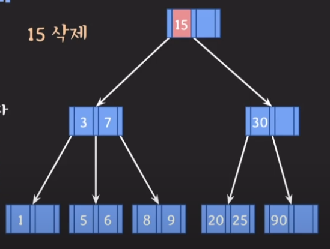

# B-Tree

## B-Tree 주요 파라미터

- M 

    - 각 노드의 최대 자녀 노드 수

    - 이 값에 따라 M차 B-tree라고 부름. B-tree를 처음에 만들 때 설정?

- 각 노드의 최대 key의 수 : M-1

- 각 노드의 최소 자녀 노드 수 : [M/2]     (root, leaf 노드 제외, [ ]는 올림을 의미)

- 각 노드의 최소 key 수 : [M/2] -1       (root 노드 제외)

- 각 노드의 최소 자녀 노드수와, 최소 key 수는 B-tree 삭제시에 사용된다.

## 노드의 구조

- 위의 B-tree는 3차 B-tree이다.

- 노드의 구조가 일반적인 트리와 달라서 유심히 볼 필요가 있다.

    - 각 노드는 n개의 키와 n+1개의 포인터로 구성된다.

        - 각 key들의 왼쪽 포인터는 항상 key보다 작은 key들만 존재하는 노드를 가리킴
        
        - 각 key들의 오른쪽 포인터는 항상 key보다 큰 key들만 존재하는 노드를 가리킴

        - 위에선 왼쪽 포인터, 오른쪽 포인터라고 말했지만, 
        
          실제 코드 구현에서는 배열이나 리스트의 인덱스로 계산하는 듯 하다.

    - 각 노드의 키들은 항상 정렬되어 있어야 한다.

## B tree 데이터 삽입

데이터 삽입시에는 아래의 규칙을 따라야한다.

- 추가는 항상 leaf 노드에서 한다.

- 노드가 넘치면 가운데 key를 기준으로 좌우 key들은 분할 (별개의 노드로 분리) 하고,

  가운데 key는 승진한다.

**[ 예시 ]**

- 위의 B tree에서 20을 추가한다고 할 때..

- 오른쪽 하단 노드에 20이 추가된다.

- 이 때 항상 노드안의 키값은 정렬되어야 한다는 것을 기억하자

- 예시는 3차 b-tree인데, (포인터가 3개, 최대 키값이 2개) 키값이 3개가 되었다.

- 따라서 분할과 승진 과정이 필요하다.

- 좌우 키들 (20, 90)은 분할하고 30은 승진시켰다.

- 승진을 시켰는데, 또다시 노드의 사이즈를 초과하게 되었다.

- 따라서 분할과 승진과정이 한번 더 필요하다.

- 좌우 키들 (2, 30)은 분할하고, 15는 승진시켰다.

- 사이즈를 초과하는 노드가 없으니 데이터 삽입과정은 종료된다.

## B-tree 데이터 삭제

B-tree에서 데이터 삭제는 다음과 같이 나뉜다.

1. leaf노드의 key를 삭제할 경우

2. leaf노드가 아닌 key를 삭제할 경우

### leaf노드의 key를 삭제하는 경우

먼저 B-tree에서는 노드별로 최소 key의 갯수를 만족해야 한다.

여기서 최소 key의 갯수는 [M/2] - 1이다.

따라서 3차 B-tree의 경우 각 노드별 최소 key의 갯수는 [3/2] - 1 = 1이다.

**B-tree에서 삭제연산을 하다 보면 실제 노드의 key의 갯수가 최소 key의 갯수보다 작아지는 상황이 생긴다.**

이 때에 다음과 같은 **재조정 과정**을 거친다.

1. key 수가 여유있는 형제의 지원을 받는다. (왼쪽형제 -> 오른쪽형제 순)

2. 1번이 불가능하면 부모의 지원을 받고, 형제와 합친다. (합칠 때는 왼쪽형제와 합친다.)

3. 2번 후 부모에 문제가 있다면 거기서 다시 재조정한다.

위의 예제에서 5를 삭제해보자.

5를 삭제하면 최소 key 갯수 (1) 보다 작은 노드가 생기게 된다.

따라서 형제노드의 지원을 받아야하는데, 왼쪽형제는 키가 2개라서 여유가 있다.

**그런데 이 때, 무턱대고 형제노드의 key를 옮기면 안된다. (B-tree의 기본 규칙에 맞지않게됨)**

왼쪽 형제의 가장 오른쪽값을 부모노드로 올리고, 부모노드의 값을 내려줘야지 B-tree 규칙을 만족시킬 수 있다.

 
 

위의 예제에서 7을 삭제하는 상황에서는, 형제의 지원을 받을 수 없다.

이럴 때에는 부모노드에서 지원을받고 형제와 합치게 된다.

- 부모로부터 key : 2 를 지원받고, 왼쪽형제와 합침.

- 이때 부모에서 key를 하나 소모한것이므로, 최소key조건에 맞지않게 된다면 재조정과정을 반복하게 된다.

### leaf노드가 아닌 key를 삭제할 경우

이 경우 **해당 key를 leaf 노드의 key와 자리를 바꾼다음**에, 

위의 leaf노드의 key를 삭제하는 것과 똑같은 과정을 거치면 된다. 

이 때, 어떤 leaf노드의 key와 자리를 바꿀지가 관건인데 아래중 아무거나 하나와 바꾸면 된다.

- 나보다 작은 데이터들 중 가장 큰 데이터 (predecessor : 선임자)

- 나보다 큰 데이터들 중 가장 작은 데이터 (succcessor : 후임자 )

위의 예제에서 15를 삭제한다고 하면 9나, 20중 아무거나와 자리를 바꾼후에

삭제 과정을 진행하면 된다. 이렇게 해야 B-tree의 규칙이 안깨지면서 삭제작업이 올바르게 수행된다.

## B-tree의 특징

- 모든 leaf 노드는 같은 level에 있다. (balanced tree)

- 따라서 키값을 탐색할 때 avg케이스, worst케이스 둘다 O(log N)으로 균일하다.