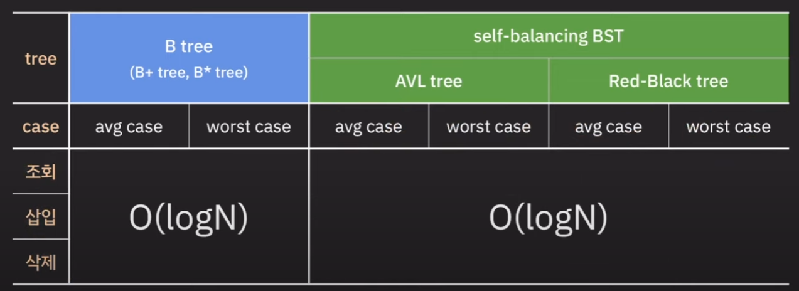
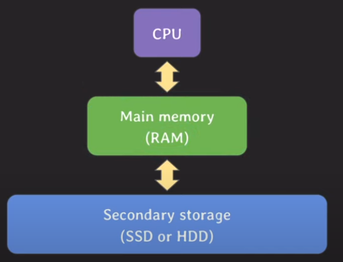
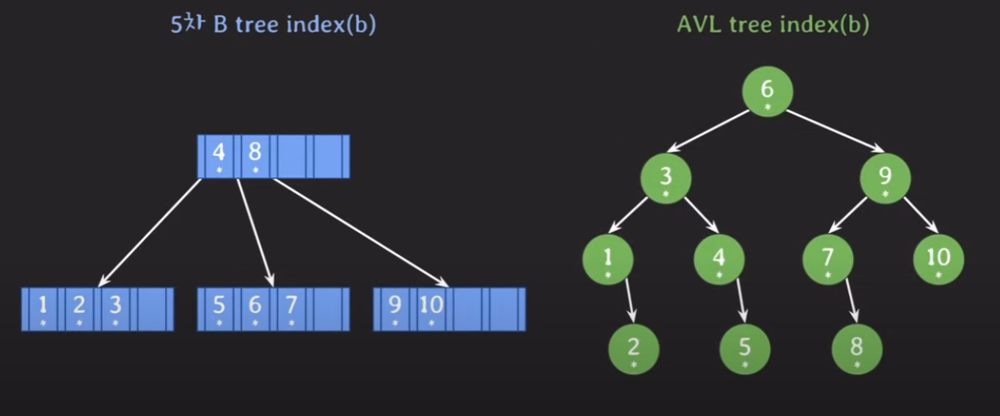
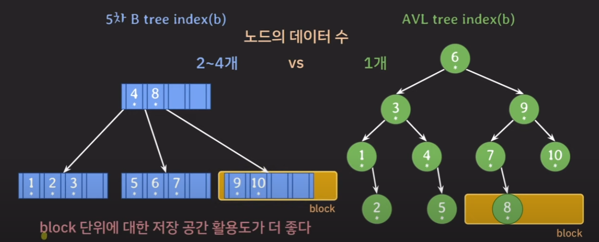
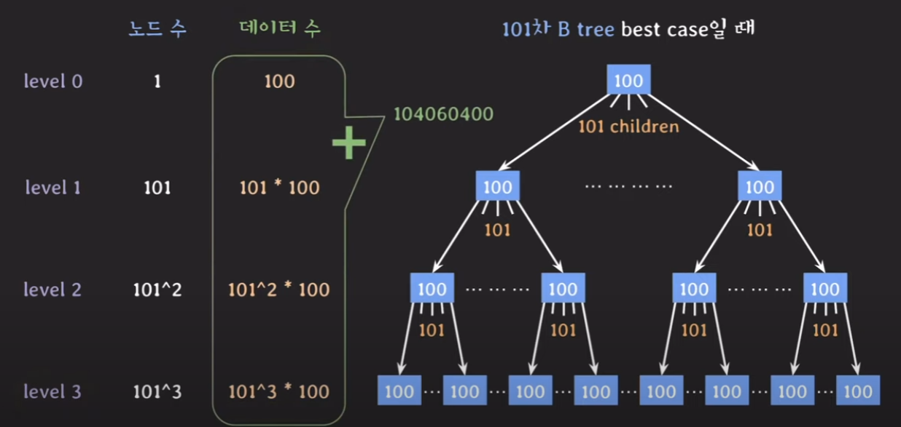

# B-tree를 인덱스로 사용하는 이유

## 시간복잡도 비교

B tree와 다른 balanced의 트리를 비교했을 때, 시간복잡도는 모두 logN으로 같다.

그런데 굳이 B-tree를 사용하는 이유는 무엇일까?

## 컴퓨터 시스템과 데이터베이스

이 이유를 알기 위해서는 컴퓨터 시스템에서, DB가 어떻게 동작하는지 이해해야한다.

- 먼저 데이터베이스는 Secondary Storage 레벨에 (HDD, SDD)에 저장된다. 

    - 영구적인 데이터 보존을 하기 위해서는 휘발성 메모리에 저장할 수 없으니 당연하다.

- DB서버는 DB 프로그램의 일부가 RAM에 올라와있고, 탐색 요청이 오면 Secondary Stroage에서 데이터를 탐색한다.

- Main Memory는 Secondary storage 보다 데이터 접근속도가 빠르다.

    - **따라서 되도록 Secondary storage에 적게 접근하는것이 유리하다.**

- Secondary Storage는 **block** 단위로 데이터를 읽고 쓴다.

    - block : file system에서 데이터를 읽고 쓰는 논리적인 단위. 
    
    - Secondary Storage에서 read하면, RAM에 block단위로 올라감

    - 이러한 특징 때문에 Secondary Storage에서 읽을 때, 메모리에 불필요한 데이터가 올라올 수 있다. 
    
    - 따라서 **연관된 데이터를 모아서 저장하면 더 효율적으로 읽고 쓸 수 있다.**

## B-tree를 사용하는 이유 

B-tree는 아래와 같은 점에서 일반적인 balanced BST보다 유리하다.

- Secondary storage에 적게 접근한다.

- 연관된 데이터를 모아서 저장하기 떄문에, block단위로 읽을 때 RAM에 불필요한 데이터가 적게 올라온다.

- 위의 케이스의 경우 '5' 를 찾을 떄, B tree는 Secondary Storage에 두번밖에 접근하지 않는다.

    - 탐색하는데 1번, 포인터를 이용한 실제데이터 조회 1번

    - 반면 AVL Tree는 탐색하는데 3번, 포인터를 이용한 실제데이터 조회 1번으로 총 4번접근한다.

    - 정리하면 B tree는 같은양의 데이터를 저장할 때, depth가 BST보다 짧다. 
    
      따라서 Secondary Storage 접근 횟수가 적게된다. 

- B-tree의 경우 하나의 노드안에 연관된 데이터를 묶어서 저장하기 때문에 block단위로 읽었을 때, 

  불필요한 데이터가 메모리에 적게 올라온다.

  

  ## B tree의 강력함

  

  - 101차 B-tree를 사용한다고 할 경우, 
  
    best case일 경우 1억개 가량의 데이터를 3depth로 저장할 수 있다.

  - worst case인 경우에도 26만개정도를 3depth 안에 저장할 수 있다.

  - hash index의 경우 시간복잡도가 빠르긴하지만, equal(=) 조회만 가능하고, 범위 기반 검색이나 정렬에서는 사용될 수 없다.
  