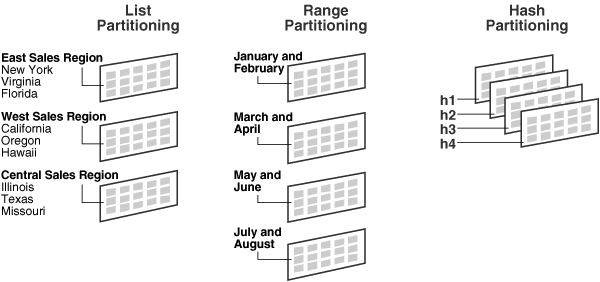
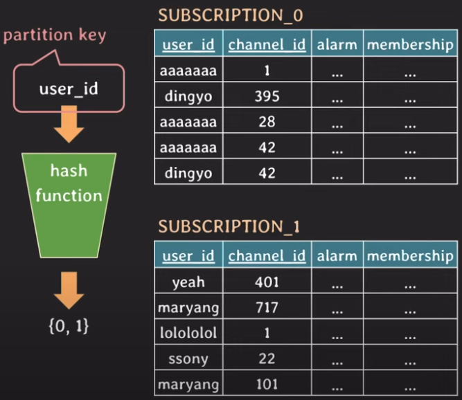
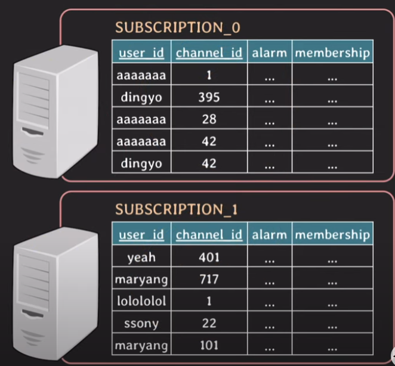

# 파티셔닝 샤딩 레플리케이션

## 파티셔닝 (Partitioning)

### Vertical Partitioning

- 테이블의 세로축(attribute, column) 으로 나누는방법

- 정규화 과정에서 자연스럽게 행해지게도 함.

- 이밖에 사용할 때에는 다음과 같은 경우가 있다.

    - 유독 한가지 column의 데이터가 너무 커서 I/O작업이 부담될 때
    
    - 하나의 테이블 안에서 자주 사용되는 column, 자주 사용되지 않는 Column이 나눠질 때 

- 모든 Column이 필요할때는 조인해서 가져옴

### Horizontal Partitioning

- 테이블의 가로축으로 나누는 방법

- 테이블의 튜플수가 너무 많아져서, 인덱스로도 성능 향상이 버거운경우 사용

- MySQL 에선 자체적으로 지원함.

### Horizontal Partitioning의 종류

- List Partitioning

    - 데이터 값이 특정 목록에 포함된 경우 데이터를 분리

- Range Partitioning
    
    - 데이터를 특정 범위 기준으로 분리 (1~2월, 3~4월 ...)

- Hash Partitioning

    - 해시 함수를 사용하여 데이터를 분할할 때 사용한다. 
    
    - 특정 컬럼의 값을 해싱하여 저장할 파티션을 선택한다. 
    
    - MySQL 공식 문서에 따르면, 여러 컬럼으로 해싱하는 것은 크게 권장하지 않는다고 한다.

- Composite Partitioning

    - 위 파티셔닝 종류 중 두개 이상을 사용하는 방식이다.

### Horizontal Partitioning 예시 (해시)

- user_id를 파티션키로 사용하였다.

    - user_id를 해시함수에 넣으면, 결과 값으로 0과 1만 나오고, 이 결과값을 바탕으로 라우팅된다. 

- 파티션키에 따라서 성능향상이 되는 쿼리가 다르다.

    - 위의 경우는 user_id가 파티션키여서 WHERE user_id = ??에 대한 쿼리성능이 향상된다.

    - 반면 WHERE channer_id = ?? 와 같은 쿼리는 파티셔닝의 효과를 보지 못한다.

    - 따라서 가장 많이 사용될 패턴에 따라서 파티션키를 정하는것이 중요하다.

## 샤딩 (Sharding)

- 각 partition을 서로 다른 DB서버에 저장

    - Horizontal Partitioning을 독립된 서버에서 진행한다고 생각하면 됨.
    
- 테이블의 데이터가 너무많아져서, 인덱스로도 성능향상에 무리가 있을 때 사용

- 트래픽 분산의 이점도 가져갈 수 있음

- 파티션키와 비슷한 개념으로 샤드키가 있음.

- 각 파티션을 샤드라고 부름.

- 각 샤드로 라우팅하는 방법으로 MODULAR 샤딩, RANGE 샤딩 등이 있음.

## Replication

- DB서버를 복제한 또다른 DB서버를 하나 더 둠.

- HA (High Availability : 고 가용성) 를 높이기 위해 사용.

- 트래픽 분산으로 성능향상에도 이점이 있음.

- master/slave, primary/secondary, leader/replica, 주DB/부DB 등 으로 나누어서 사용함

    - master DB에서는 read/write 모두 실행하고, slave DB에서는 read 연산만 실행된다.

    - 보통 read가 비용이 많이 들고, write는 비용이 적게들기 때문에

       masterDB 1대, slaveDB N대로 구성하는듯 함.
    

