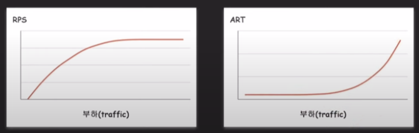

# DBCP (DB Connection Pool)

## DBCP 개념

- API서버와 DB서버의 연결에는 TCP프로토콜이 사용된다. (신뢰성을 위해)

- TCP Connection을 사용하기 때문에, 매번 연결을 열고 닫는데 비용이 발생한다. (3way handshake)

- 이 비용을 없애기 위해 DB Connection Pool을 사용한다.

다음과 같이 동작한다.

- 미리 TCP연결이 맺어져있는 Connection들을 만들어서 Connection Pool에 보관한다.

- API 요청이 들어오면 Connection Pool에서 Connection을 꺼내서 요청을 처리한다.

- 요청이 끝났으면 다시 close connection 해줌으로써 Connection Pool에 반환한다.

## DBCP 설정 파라미터

먼저 DBCP는 백엔드 서버에서 설정해줘야 하는것과, DB서버에서 설정해줘야 하는것이 따로있다.

### DB서버 설정

- max_connections 

    - DB서버 입장에서 클라이언트들 (백엔드 서버)과 맺을수있는 최대 connection 수
    
    - 분산된 백엔드 서버를 고려해야 함. 
    
      max_connections >= 각 백엔드 서버의 커넥션 * 백엔드 서버 갯수

- wait_timeout

    - 커넥션이 비정상적으로 종료되서 제대로 close connection이 되지않는 경우를 대비
    
    - 해당 connection이 inactive할 때 wait_timeout 시간만큼 새로운 요청이 오지 않는다면 DB서버에서 close connection 함.

### 백엔드 서버 설정

- minimumIdle

    - pool에서 유지하는 최소한의 idle connection의 수

- maximumPoolSize

    - pool이 가질수 있는 최대 connection 수

    - idle과 active(in-use) connection 합쳐서 최대 수

    - minimumIdle과 maximumPoolSize가 충돌할 경우 maximumPoolSize가 우선순위가 더 높음.

    - 기본값은 minimumIdle과 maximumPoolSize를 동일함. (poolSize 고정, 이렇게 쓰는것이 권장 됨)

- maxLifetime

    - pool에서 connection의 최대수명

    - connection을 삭제하고 poolSize가 고정이라면 다시 새로만드는 방식임

    - maxLifetime을 넘기면 idle일 경우 pool에서 바로 제거, active인 경우 pool로 반환된 후 제거

    - pool로 반환이 안되면 maxLifetime은 동작하지 않는다.

    - connection time limit (wait_timeout) 보다 몇 초 짧게 설정해야 함.

- connectionTimeout

    - pool에서 connection을 받기 위한 대기 시간

    - pool 입장에서 connection을 무한정 기다릴 순 없으니 타임아웃이 존재

    - 만약 connectinoTimeout이 30초라면? 의미없음. 어차피 유저는 30초전에 새로고침 함.

## 적절한 Connection 수를 찾는 과정

- 모니터링 환경 구축(서버리소스, 서버 스레드수, DBCP 등)

- 백엔드 서버 부하테스트 (nGrinder 등 사용)

- request per seconds와 avg response time 확인

  

- request per seconds와 avg response time 그래프에서 트래픽 처리가 버거워지는 지점을 확인한다.

- 그리고 해당 지점에서 백엔드 서버와 DB서버의 하드웨어 리소스 사용률을 확인한다.

    - ex) 백엔드 서버의 CPU사용률이 60~70%가 넘어간다. -> 백엔드 서버 증설 

    - ex) DB 서버의 CPU 사용률이 60~70%가 넘어간다. -> secondary 서버 추가, cache layer, sharding.. 등

    - 그런데 해당 지점에서 양쪽다 하드웨어 리소스가 널널하다면?

        - thread per request 모델이라면 active thread 수 확인 (너무 적은건 아닌지)

        - DBCP의 active connection 확인 (너무 적은건 아닌지)

        - 계속 부하테스트를 반복하며 DB서버의 max_connections와 백엔드 서버의 를 maximumPoolSize 튜닝 

