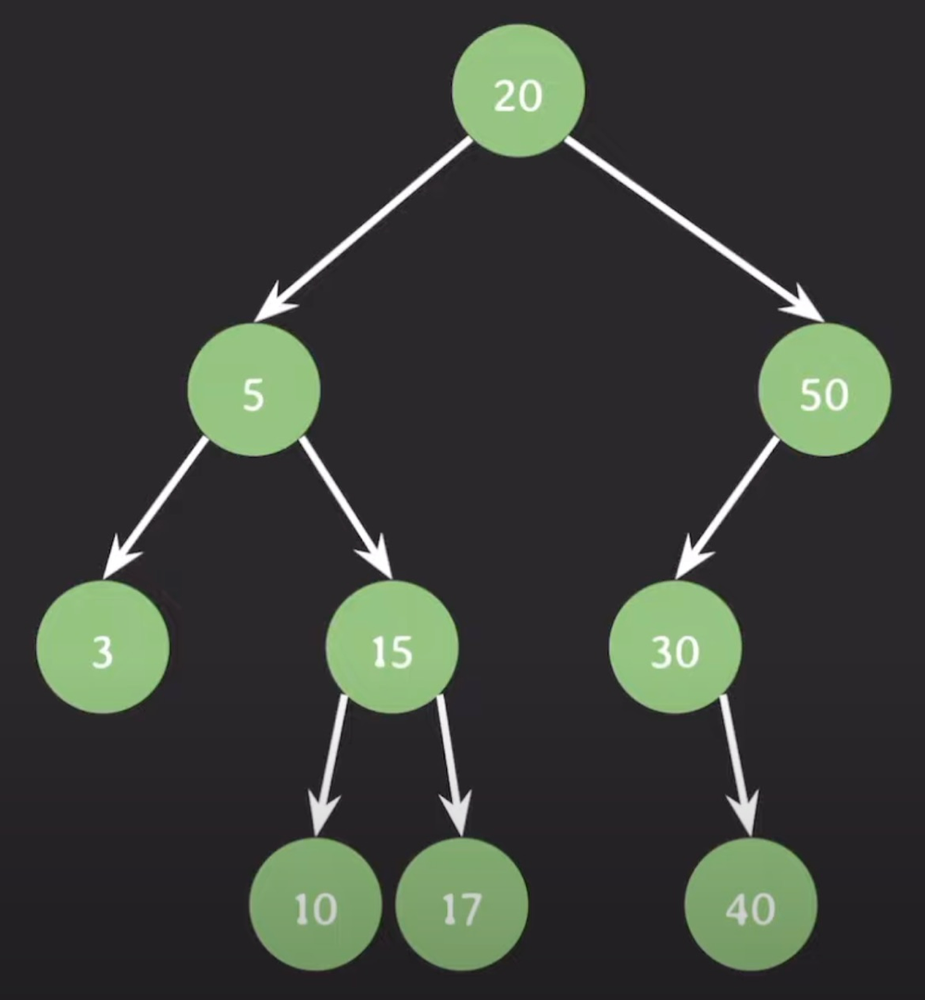
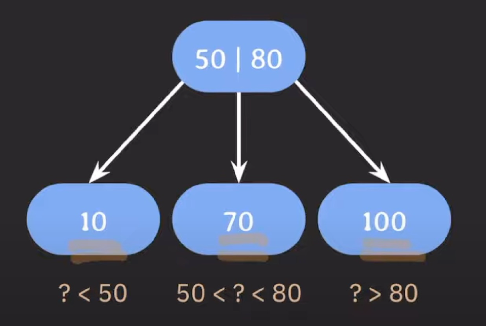

## B-tree
B-tree는 이진 탐색 트리(Binary Search Tree)를 일반화한 트리 기반의 자료구조이다.

> #### 이진 탐색 트리(Binary Search Tree)
> 
> 
> 
> 이진 탐색의 효율적인 탐색 능력을 유지하면서도, 빈번한 데이터 추가와 삭제가 가능하도록 고안된 트리 자료구조이다.    
> 이진 탐색 트리에 있는 모든 노드의 왼쪽 서브 트리는 해당 노드의 값보다 작은 값들만 가지고, 모든 노드의 오른쪽 서브 트리는 해당 노드의 값보다 큰 값들만 가진다.

이진 탐색 트리는 자식 노드를 최대 2개까지밖에 가지지 못한다는 특징이 있는데, 자식 노드의 최대 개수를 늘리기 위해 고안된 개념이 B-tree다.    

부모 노드에 하나의 값만 저장하는 BST(Binary Search Tree)와 달리, B-tree는 부모 노드에 key를 하나 이상 저장한다.   
여기서 key는 B-tree에 저장되어 있는 데이터가 가지고 있는 값을 말하며, 이 key를 기준으로 데이터 추가, 삭제, 검색과 같은 작업이 수행된다.   
부모 노드의 key들은 오름차순으로 정렬되며, 정렬된 순서에 따라 자식 노드들의 key 값의 범위가 결정된다.   

예를 들어, 어떤 노드가 10, 70, 100이 하나씩 저장된 3개의 자식 노드를 가지기 위해서는, 부모 노드에 하나의 값만 저장해서는 안 된다.    
자식 노드마다 각각의 범위(k1보다 작은 값, k1보다 크고 k2보다 작은 값, k2보다 큰 값)를 지정하고, 그 범위의 기준이 되는 값들이 부모 노드에 저장되어 있어야 한다.

이렇듯 B-tree는 자식 노드의 최대 개수를 원하는대로 결정해서 사용할 수 있다.

### B-tree 파라미터
B-tree에 데이터가 추가, 삭제되는 원리를 알기 위해서는 먼저 어떤 파라미터가 쓰이는지 알아야 한다.

- #### `M`: 각 노드의 최대 자식 노드 수
  - 자식 노드의 최대 개수를 원하는대로 결정할 수 있는 자료구조인 만큼, 최대 자식 노드의 개수는 B-tree를 사용할 때 가장 중요한 파라미터이다.  
  - 최대 M개의 자식 노드를 가질 수 있는 B-tree를 M차 B-tree라고 부른다.
- #### `M-1`: 각 노드의 최대 key 수
  - 예를 들어 4개의 자식 노드를 가지려면, `? < k1`, `k1 < ? < k2`, `k2 < ? < k3`, `k3 < ?` 이렇게 구성해야 하기 때문에 최대 key 수는 k1, k2, k3 총 3개가 된다.
- #### `⎡M/2⎤`: 각 노드의 최소 자식 노드 수 (root 노드, leaf 노드 제외)
  - 예를 들어, 3차 B-tree의 M은 3이므로 최소 자식 노드 수는 ⎡3/2⎤ = ⎡1.5⎤ = 2가 된다. 즉, 3차 B-tree의 자식 노드는 2개 미만이 될 수 없다.
  - 각 노드는 최소 하나 이상의 key를 가지기 때문에, 몇 차 B-tree인지는 상관 없이 internal 노드는 항상 최소 2개 이상의 자식 노드를 가진다.
  - root 노드는 시작점이므로 조건을 만족하지 않아도 괜찮다.
  - leaf 노드는 자식 노드가 없는 노드이므로 애초에 조건을 만족할 수 없다.
- #### `⎡M/2⎤-1`: 각 노드의 최소 key 수 (root 노드 제외)
  - internal 노드의 key 수가 n개일 때, 그 노드의 자식 노드 개수는 항상 n+1개가 된다.
  - 처음 데이터가 저장되는 곳이 root 노드이므로, root 노드는 애초에 조건을 만족할 수 없다.

각 노드의 최대 자식 노드 수인 M만 결정하면 나머지 파라미터는 자연스럽게 정해지므로, M을 기준점으로 잡는 것이 좋다.    
하지만 꼭 M을 기준점으로 잡을 필요는 없다. 다만 어떤 파라미터를 기준점으로 잡는지에 따라 B-tree 설명 방식이 조금씩 다를 수 있다.