## 설명에 앞서 
B-tree에 저장되는 각각의 데이터는 key를 가지고 있고, 이 key를 기준으로 동작합니다.   
하지만 아래에서 볼 예제는 편의상 데이터가 key 역할까지 수행한다고 가정하여 용어 구분없이 설명합니다.

---

## B-tree 데이터 추가
B-tree에 데이터를 추가할 때는 아래 두 가지 포인트를 중점으로 보면 된다.
- 데이터는 항상 leaf 노드에 추가한다.
- 노드에 데이터가 넘치게 되면, 가운데 key를 기준으로 좌우 key들을 분할하고 가운데 key를 올린다.
  > M차 B-tree의 최대 key 수는 M-1개이다.    
  > 노드에 데이터가 넘친다는 것은 어떤 노드에서 M-1개보다 더 많은 수의 key를 가지고 있는 경우를 의미한다.  

### 예제에 사용할 B-tree의 초기 모습
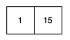

예제에서 사용할 B-tree의 차수는 3이며, 처음에는 1과 15가 저장되어 있다.

### 데이터 추가 과정
1. #### 2 추가
   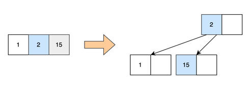   
   
   2를 추가하면, 노드의 key 수가 3개가 된다. 이는 최대 key의 수인 2개를 넘어가는 것이기 때문에, 좌우 key 1과 15를 분할하고, 2를 위로 올린다.

2. #### 5, 30 추가
   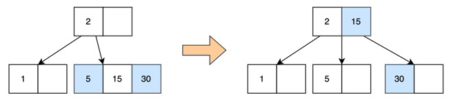
  
   5는 2보다 크기 때문에 오른쪽 자식 노드에 저장된다. (**데이터는 항상 리프 노드에 추가**) 그리고나서 30을 추가하면, 이 또한 2보다 크기 때문에 오른쪽 자식 노드에 저장된다.   
   하지만 오른쪽 자식 노드에는 데이터가 넘치기 때문에, 좌우 key 5와 30을 분할하고 가운데에 있는 15를 위로 올린다.

3. #### 90 추가
   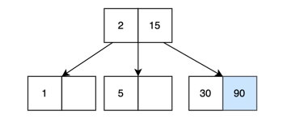
  
   90은 2보다 크고 15보다도 크기 때문에, 가장 오른쪽에 있는 자식 노드에 저장된다. 이때 노드의 key들은 오름차순 정렬되므로 30 다음에 저장된다.

4. #### 20 추가
   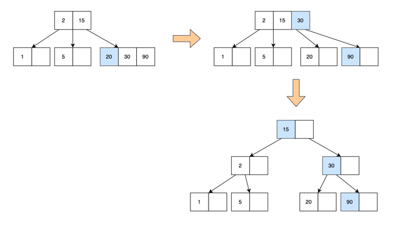

   20은 15보다 크기 때문에 오른쪽 자식 노드에 저장된다. 이렇게 되면 노드에 데이터가 넘치기 때문에, 20과 90을 분할하고 30을 위로 올린다.   
   하지만 이번에는 부모 노드에 데이터가 넘치게 되므로, 해당 노드도 마찬가지로 분할 및 상승 작업을 수행한다.   
   결과적으로 기존 루트 노드는 분할되고, 새로운 루트 노드가 생기게 된다.

5. #### 7, 9 추가
   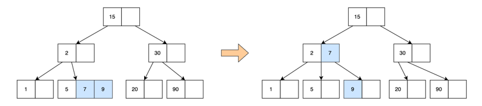

   7과 9가 차례대로 추가되면 노드에 데이터가 넘치므로, 5와 9를 분할하고 7을 위로 올린다. 

6. #### 8, 10 추가
   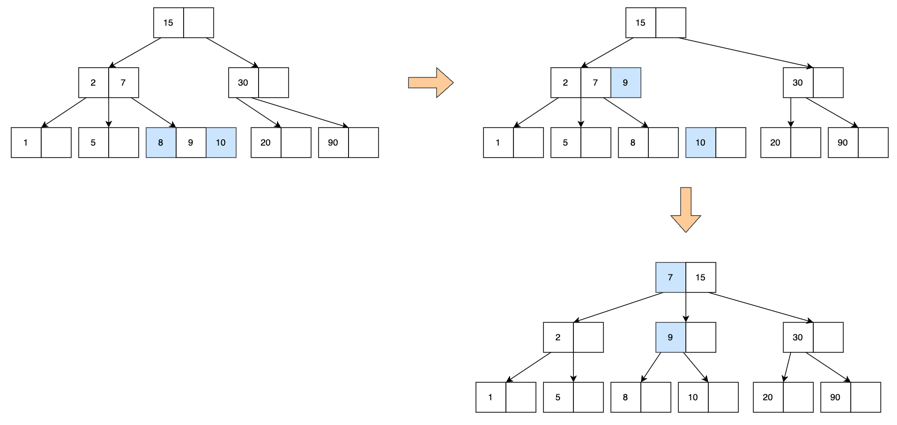

   위에서 수행한 방식대로 데이터가 추가되면 항상 리프 노드에 저장되고, 노드에 데이터가 넘칠 때마다 분할 및 상승 작업을 수행한다.

### Balanced tree
이진 탐색 트리는 아래 그림과 같은 형태로도 나올 수 있기 때문에, 시간 복잡도는 최악의 경우 O(N)이 나온다.

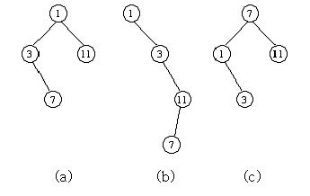

반면 B-tree의 경우 데이터를 추가하는 과정에서 모든 leaf 노드들이 같은 레벨에 존재하는데, 이런 특징을 바탕으로 B-tree를 balanced tree라고도 부른다.

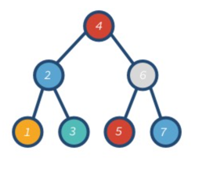

이러한 balanced tree의 검색 속도는 평균, 최악의 경우 모두 O(logN)이 나온다. 따라서 조회할 때 일정한 성능을 낼 수 있는 것이다.   

---

## B-tree 데이터 삭제
B-tree에 있는 데이터를 삭제할 때는 아래 두 가지를 중점으로 보면 된다.
- 데이터는 항상 leaf 노드에서 삭제된다.
- 삭제 후 해당 노드에 있는 데이터 개수가 최소 key의 수보다 적어졌다면 다음과 같이 재조정한다.
  1. key 개수가 여유로운 형제 노드의 지원을 받는다.
  2. 1번이 불가능하면 부모 노드의 지원을 받고 형제 노드와 합친다.
  3. 2번 후 부모 노드에 문제가 발생했다면 부모 노드에서도 다시 재조정한다.

### 예제에 사용할 B-tree의 초기 모습
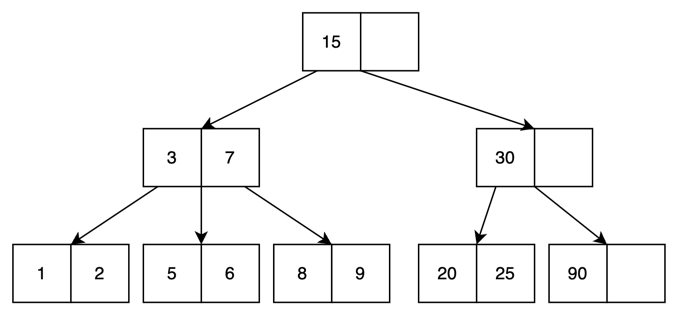

예제에서 사용할 B-tree의 차수는 3이며, 위와 같이 여러 데이터가 저장되어 있는 상태입니다.

### 데이터 삭제 과정
1. #### 6 삭제
    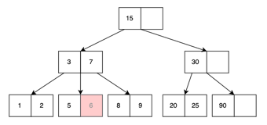

    6을 삭제하기 위해 B-tree를 탐색하다가, leaf 노드에서 6을 발견하여 제거한다.

2. #### 5 삭제
    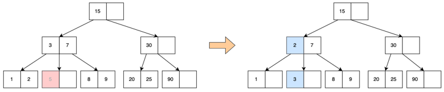

    5를 삭제하면서 해당 노드에는 데이터가 더 이상 존재하지 않게 된다. 즉, 데이터의 개수가 최소 key의 수인 1보다 적어졌으므로 재조정해야 한다.   
    다행히 양 옆에 있는 형제 노드의 key 개수가 여유롭기 때문에 형제 노드의 지원을 받으면 된다. 여기서는 왼쪽 노드의 지원을 받는다.       

    이때 중요한 것은 2를 바로 가져오면 안 된다는 것이다. 2를 가져오게 되면 부모 노드와의 정렬이 깨지기 때문이다. (3차 B-tree의 경우 가운데 자식 노드에 들어가는 데이터의 범위는 k1< ? <k2)      
    따라서 부모 노드에서 3을 가져오고, 형제 노드에 있던 2를 부모 노드로 옮긴다.

3. #### 3 삭제
    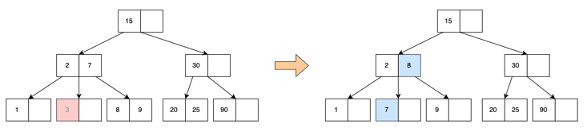

    3을 삭제하면 또 다시 규칙을 위반하기 때문에 이번에도 형제 노드의 지원을 받는다. 이때 왼쪽에 있는 형제 노드도 여유롭지 않으므로 오른쪽에서 지원을 받는다.

4. #### 7 삭제
    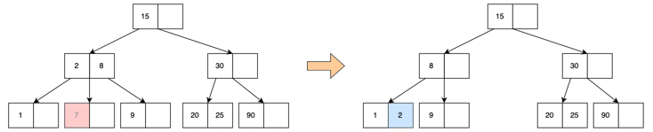

    7을 삭제하면 규칙을 위반하게 되는데, 문제는 양 옆에 있는 형제 노드 모두 지원이 불가능한 상태라는 것이다.   
    따라서 이번에는 부모 노드의 지원을 받고, 형제 노드와 합쳐야 한다. 즉, 부모 노드에 있는 2를 가져오고 왼쪽 형제 노드와 합쳐야 한다. 이때 **합치는 방향은 왼쪽**이다.

5. #### 2, 1 삭제
    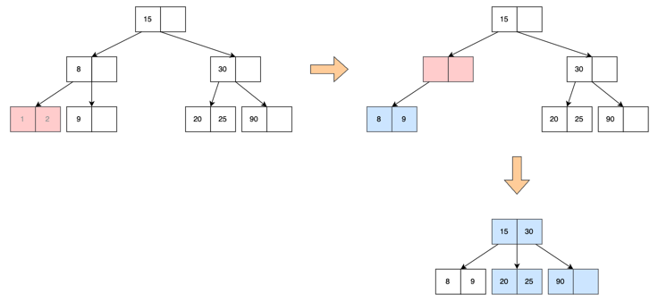
    
    1을 삭제한 뒤 2를 삭제하면 규칙을 위반하게 되는데, 이번에도 형제 노드가 여유롭지 않아 부모 노드의 도움을 받는다.   
    하지만 이번에는 부모 노드에서 데이터 수가 부족해지는 문제가 발생하기 때문에 부모 노드에서도 재조정이 필요하다.     
    따라서 부모 노드의 오른쪽 형제 노드에 있는 30을 부모의 부모 노드로 옮기고, 노드를 합친다.   
   (문제의 부모 노드가 root 노드라면 부모 노드를 삭제한다.)

### 삭제는 leaf 노드 뿐만 아니라, internal 노드에서도 발생할 수 있는데?
당연히 데이터 삭제는 leaf 노드 뿐만 아니라, internal 노드에서도 발생할 수 있다. 이 경우에는 어떻게 삭제가 이루어질까?

internal 노드에 있는 데이터를 삭제하려면, leaf 노드에 있는 데이터 중에서 선임자나 후임자와 위치를 바꾼 후 삭제해야 한다. 어떤 데이터의 선임자, 후임자는 항상 leaf 노드에 있기 때문이다.

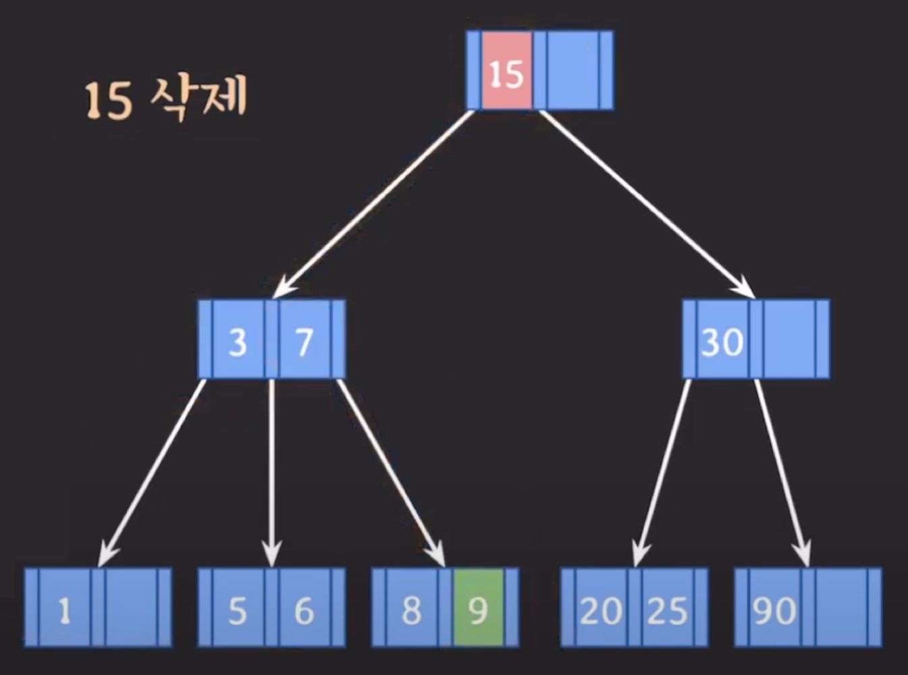

예를 들어, 위와 같은 B-tree에서 15을 삭제한다고 가정해보자.   
15는 root 노드, 즉 internal 노드에 있기 때문에, 15를 삭제하려면 15를 leaf 노드에 있는 선임자나 후임자와 교체해야 한다.   
15보다 작은 값은 모두 왼쪽 서브 트리에 존재하므로 선임자를 찾기 위해 왼쪽 서브 트리를 탐색한다.   
해당 서브 트리 안에서 가장 큰 값이 15의 선임자가 된다. 따라서 15의 자식 노드에서 오른쪽 끝에 있는 leaf 노드로 들어간다.   
결국 9를 찾게 되면, 15와 교체한 뒤 leaf 노드에 있는 15를 삭제한다. 

> #### 선임자와 후임자란?
> - 선임자(predecessor): 보다 작은 데이터들 중에서 가장 큰 데이터
> - 후임자(successor): 보다 큰 데이터들 중에서 가장 작은 데이터
