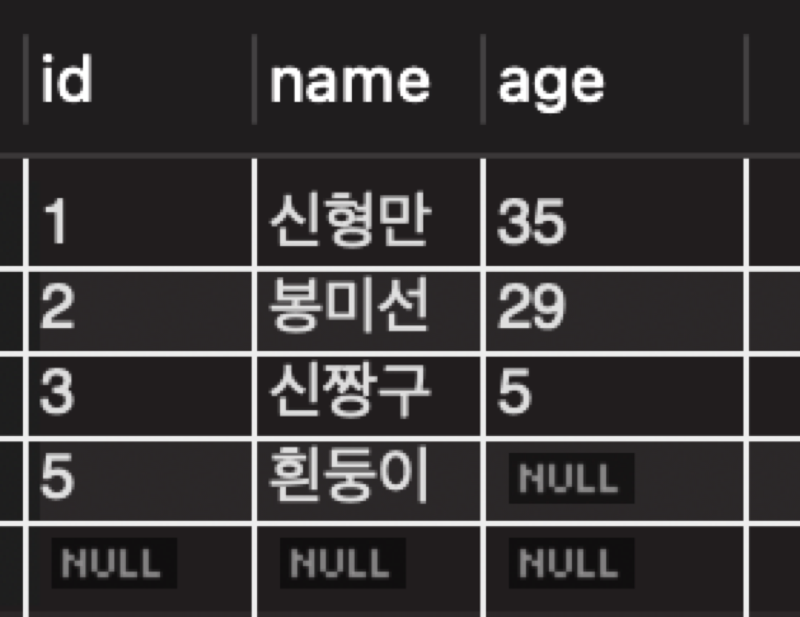
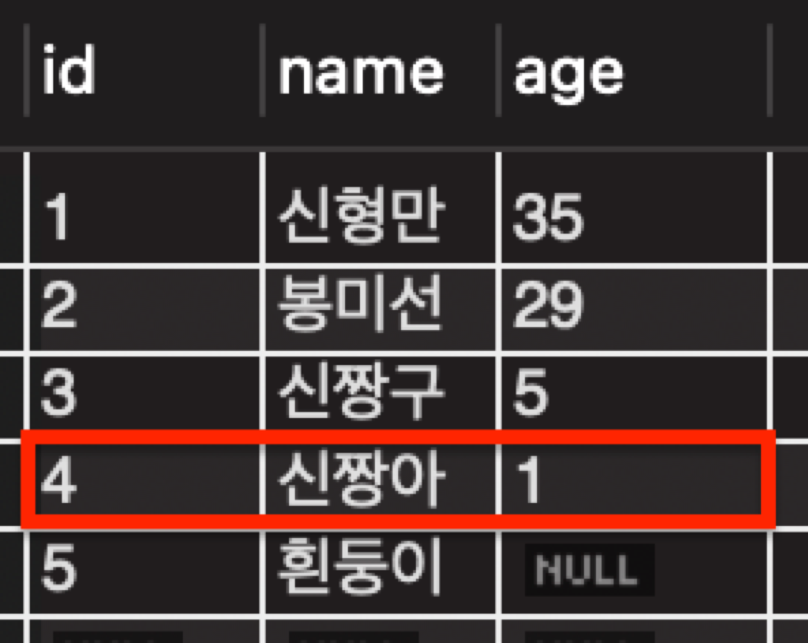
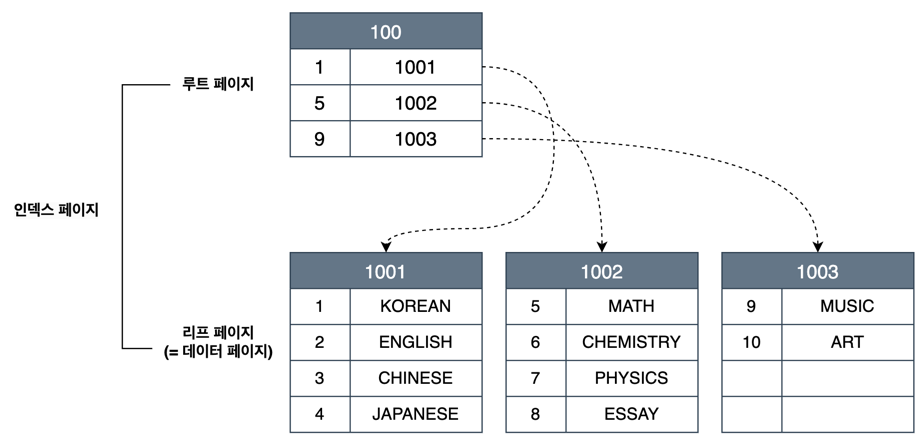
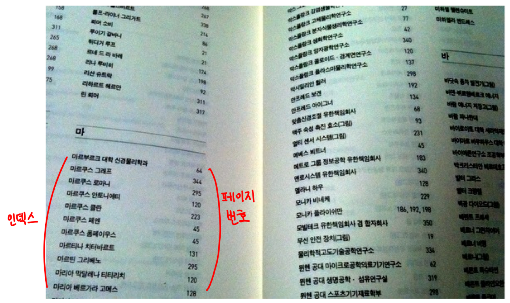
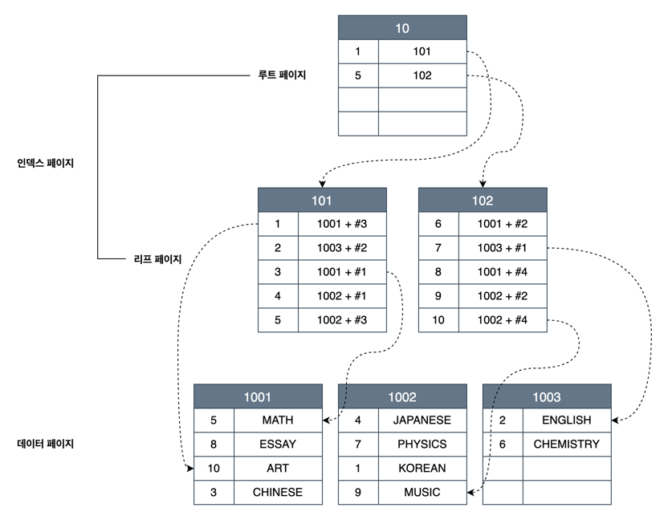
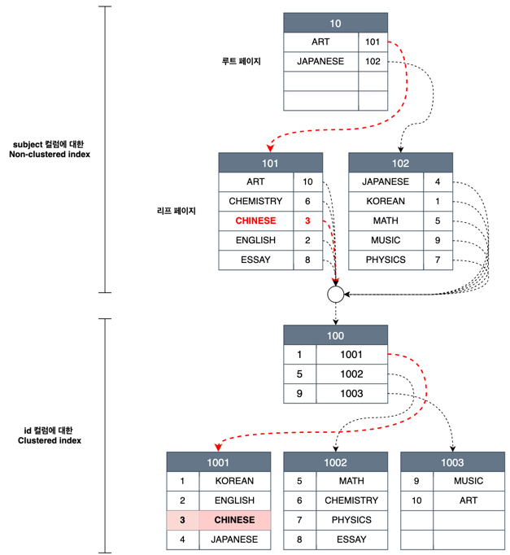

## Clustered index
Clustered가 '군집화된'이라는 뜻을 의미한다는 사실에서 알 수 있듯이 clustered index는 말 그대로 군집화된 인덱스를 말한다.

그렇다면 군집화된 인덱스는 무슨 말일까?



짱구네 가족 정보가 담긴 테이블이 있을 때, 짱아가 태어나서 짱아에 대한 정보를 테이블에 추가한다고 가정해보자.   
짱아는 아무래도 강아지인 흰둥이보다 서열이 높기 때문에(?) 다음과 같이 id를 4로 해서 저장하려고 한다.   
```sql
INSERT INTO family VALUES(4, '신짱아', 1)
```



그런데 짱아에 대한 정보를 추가했더니, 흰둥이보다 늦게 추가했더라도 더 위에 있게 되었다.   
id 컬럼에 대한 클러스터형 인덱스가 지정되어 있기 때문에, 순서는 오직 하나의 컬럼(여기서는 id)으로 결정된다.   
따라서 중간에 데이터를 삽입할 때 id를 기준으로 더 높은 id의 데이터들을 모두 한 칸씩 뒤로 이동시키는 것이다.

이처럼 실제 데이터와 무리를 지어 인덱싱되는 방식을 군집화된 인덱스라고 하고, 이러한 clustered index의 경우 테이블 전체가 하나의 정렬된 인덱스가 된다.   
테이블 전체가 하나의 인덱스가 되기 때문에 clustered index는 테이블당 오직 하나만 생성할 수 있다.   

### 생성 방법
아래 두 가지를 통해 Clustered index를 생성할 수 있다.
- 특정 컬럼을 PK로 지정
- 특정 컬럼을 UNIQUE + NOT NULL로 지정

만약 PK, UNIQUE + NOT NULL로 지정된 컬럼이 동시에 존재하는 경우 PK를 우선으로 선택해 생성된다.   
두 가지 모두 지정된 컬럼이 없으면 (InnoDB 기준) 내부적으로 `GEN_CLUSTERED_INDEX`라는 컬럼을 생성한 후 clustered index로 설정한다.
이 경우 `GEN_CLUSTERED_INDEX`에는 행이 생성된 순서대로 값이 부여된다. 

### 특징
Clustered index는 다음과 같이 B+tree 형태로 구성되어 있으며, 각 페이지는 고유의 페이지 번호를 가지고 있다.      
여기서는 B+tree의 루트 노드를 루트 페이지로, 리프 노드를 리프 페이지로 보면 된다.



**루트 페이지**는 key로 PK를 가지고 있고, 다른 페이지로 이동할 수 있는 **포인터를 가지고 있다.**   
**리프 페이지**도 동일하게 key로 PK를 가지고 있지만, 포인터가 아닌 **데이터를 직접 가지고 있다.**

> ### B+tree란?
> B-Tree는 탐색을 위해 노드를 찾아서 이동해야 한다는 단점을 가지고 있다. 이러한 B-tree의 단점을 커버하기 위해 확장된 개념이 B+tree다.
> 
> 모든 노드에 key와 데이터가 존재하는 B-tree와 달리, B+tree의 경우 실제 데이터는 오직 leaf 노드에만 저장된다. 나머지 모든 internal 노드는 key만 가지고 있고, leaf 노드로 연결해주는 라우팅 역할을 담당한다.
> 
> 이로 인해 메모리를 확보할 수 있게 되어 더 많은 key를 수용 가능하고, 이는 곧 tree의 높이를 낮추게 되므로 탐색 속도가 매우 빨라진다.
> 
> 자세한 내용은 [여기](https://engineerinsight.tistory.com/336)를 참고하자.

## Non-clustered index
보조 인덱스(secondary index)라고도 불리는 non-clustered index는 clustered index와 달리 물리적으로 테이블을 정렬하지 않는다.   
대신 정렬된 별도의 인덱스 페이지를 생성하고 관리한다. 즉, 실제 데이터를 함께 가지고 있지 않는다.



대부분 책들의 뒷장에는 '찾아보기' 페이지가 존재한다. 이 페이지에서는 특정 단어와 그 단어가 있는 페이지 번호를 알려주는데, non-clustered index도 비슷한 역할을 한다.    



Non-clustered index는 인덱스 페이지와 데이터 페이지로 구분되며, 인덱스 페이지에는 Clustered index와 동일하게 루트 페이지와 리프 페이지로 구성되어 있다.   
다만 non-clustered index의 리프 페이지는 데이터를 직접 가지고 있지 않다는 점에서 clustered index와 차이를 보인다.    
Non-clustered index의 리프 페이지는 실제 데이터 대신 해당 `데이터 페이지 번호 + #offset`을 가진다. 즉, 데이터에 접근하기 위해 인덱스 페이지에서 데이터 페이지로 이동하는 과정이 추가되었다고 볼 수 있다.   

Non-clustered의 경우 인덱스 페이지와 달리 데이터 페이지는 정렬되어 있지 않다. 따라서 데이터 페이지에는 정렬 순서 상관 없이 빈 곳에 데이터를 쓸 수 있기 때문에, clustered index에 비해 데이터 쓰기 작업 속도가 빠르다.

## Clustered index와 Non-clustered index 혼합 사용
실제 테이블을 설계할 때 PK는 기본적으로 설정해야 하고, 조회가 자주 발생하는 컬럼에 대해서는 index를 생성해준다.   
따라서 하나의 테이블에 clustered index와 non-clustered index를 혼합해서 사용하는 경우가 대부분이다.   

이 경우 non-clustered index를 먼저 거치고, 이어서 clustered index를 거쳐 데이터를 찾게 된다. 이때 non-clustered index는 `데이터 페이지 번호 + #offset` 대신 clustered index에 대한 컬럼 값을 가지게 된다.



위 그림은 id 컬럼을 PK로 지정하여 clustered index를 생성하고, subject 컬럼에 대한 non-clustered index를 생성한 모습이다.

Non-clustered index의 리프 페이지는 인덱스로 구성한 subject 컬럼에 대해 정렬된다.

> ### Non-clustered index의 리프 페이지에서 물리적인 데이터의 위치가 아닌 clustered index의 컬럼 값을 가지고 있는 이유
> Non-clustered index의 리프 페이지에서 물리적 데이터 위치를 가지지 않는 이유는 다음 상황에서 발생할 수 있는 번거로움을 없애기 위함이다.   
> 만약 clustered index가 데이터를 직접 가지고 있고, 테이블 전체가 정렬된 index일 때 테이블에 데이터 쓰기 작업이 수행된다면 어떻게 될까?   
> 데이터의 페이지 번호와 페이지 내 순서가 모두 변경될 것이다. 이런 구조에서 non-clustered index가 `데이터 페이지 번호 + #offset`을 직접 가지고 있따면, 데이터 쓰기 작업 시 non-clustered index를 모두 수정해야 할 것이다.
> 따라서 non-clustered index의 리프 페이지에서 PK 값을 가진다.

### 데이터 탐색 과정
만약 subject가 CHINESE인 데이터 조회 시 다음과 같이 동작한다.
1. CHINESE는 ART보다 뒤에 있고, JAPANESE보다 앞에 있으므로 101 페이지로 이동한다.
2. subject 인덱스 페이지의 리프 페이지에 있는 'CHINESE'를 탐색한다.
3. 3을 id 컬럼에 대한 clustered index의 인덱스 페이지에서 탐색한다.
4. `id=3`에 해당하는 값인 'CHINESE'를 발견한다. 
