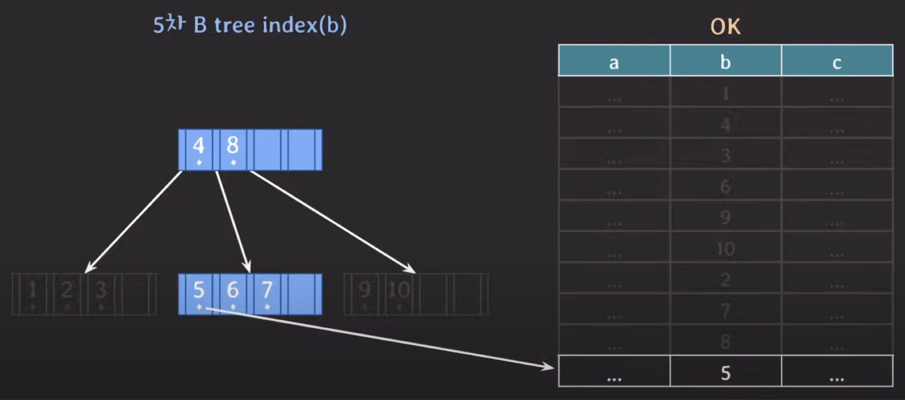

# B-tree가 DB 인덱스로 사용되는 이유

## 시간 복잡도

B tree 계열과 self-balancing BST 계열 모두 시간 복잡도가 O(logN)으로 동일하다.   
그렇다면 시간 복잡도가 동일한 두 계열 중에서 왜 하필 B-tree 계열을 채택했을까?  

> #### self-balancing BST   
> 한쪽으로 쏠리지 않도록 스스로 균형을 맞추는 이진 탐색 트리(BST)

## 컴퓨터 시스템 구조

컴퓨터 시스템은 크게 CPU, Main memory(RAM), Secondary storage(SSD or HDD)로 구성되어 있다.
- **CPU**: 프로그램 코드가 실제로 실행되는 곳
- **Main memory**: 실행중인 프로그램의 코드들과 코드 실행에 필요한(혹은 그 결과로 나온) 데이터들이 위치하는 곳
- **Secondary storage**
  - 프로그램과 데이터가 영구적으로 저장되는 곳
  - 실행중인 프로그램의 데이터 중 일부가 임시로 저장되는 곳
    - main memory의 용량은 크지 않기 때문에, 실행중인 프로그램의 데이터가 많다면 main memory에 전부 담기지 못할 수도 있다.   
      따라서 담지 못한 데이터들 중 자주 사용되지 않는 일부 데이터를 secondary storage에 저장하기도 한다.    
      이처럼 데이터의 일부를 저장하는 secondary storage의 공간을 swap 공간이라고 한다.

### Secondary storage
Secondary storage는 데이터를 영구적으로 저장 가능하며, 저장 용량도 가장 크다. 하지만 데이터를 처리하는 속도는 가장 느리다.   

위 사진을 보면, main memory인 RAM의 처리 속도가 가장 빠르고 SSD와 HDD는 상대적으로 느린 편이다.   

> #### 왜 HDD가 SSD보다 느릴까?
> HDD 안에는 물리적 저장 장치가 존재한다. 데이터를 읽어올 때마다 물리적 장치가 계속 움직이면서 동작하는데, 이 물리적인 시간 때문에 HDD가 SSD보다 상대적으로 더 느린 것이다.

그리고 secondary storage는 다음과 같이 block 단위로 데이터를 읽고 쓰는데, 연관된 데이터를 모아서 저장하는 것이 더 효율적이기 때문이다.   
물을 구매하려고 할 때, 물을 다 마실 때마다 1개씩 사는 것보다 6개가 묶여 있는 것을 사는게 더 효율적이듯이 데이터를 읽고 쓸 때도 마찬가지다.

secondary storage에 있는 특정 데이터를 읽어오고 싶을 때, 해당 데이터를 포함하고 있는 block 전체(여기서는 빨간색 공간을 의미함)를 main memory에 읽어온다.

> 여기서 말하는 **block**이란 file system이 데이터를 읽고 쓰는 논리적인 단위를 의미한다.   
> block의 크기는 2의 승수로 표현되며, 대표적인 block size는 4KB, 8KB, 16KB 등이 있다.

하지만 이렇게 block 단위로 데이터를 읽어오는 경우 불필요한 데이터까지 읽어올 가능성이 존재한다는 단점도 있다.

## AVL tree index vs B tree index
아래 3가지 상황을 가정하고, self-balancing BST인 AVL tree index와 B-tree index의 성능을 비교해보자.

| a   | b  | c   |
|-----|----|-----|
| ... | 1  | ... |
| ... | 4  | ... |
| ... | 3  | ... |
| ... | 6  | ... |
| ... | 9  | ... |
| ... | 10 | ... |
| ... | 2  | ... |
| ... | 7  | ... |
| ... | 8  | ... |
| ... | 5  | ... |

- tree의 각 노드는 서로 다른 block에 있다.
- 초기에는 root 노드를 제외한 모든 노드가 secondary storage에 있다.
- 초기에는 데이터 자체도 모두 secondary storage에 있다.

### AVL tree index(b)
예제 테이블에 저장된 데이터를 AVL tree로 나타내면 다음과 같다. 

이 상태에서 `b=5`인 조건을 통해 데이터를 검색하면, 먼저 main memory에 있는 root 노드부터 탐색하기 시작한다.   

5는 6보다 작기 때문에 왼쪽 서브 트리로 이동해서 3을 발견하고 main memory로 읽어온다. 이러한 과정을 반복하다보면 다음과 같이 마침내 원하는 데이터를 찾을 수 있게 된다.

결과적으로 5라는 데이터를 조회하기 위해 secondary storage에 접근한 횟수는 4번이다. (3 -> 4 -> 5 -> 포인터)

### B-tree index(b)
이번에는 5차 B-tree에서 `b=5`인 데이터를 찾아보자.

가장 먼저 main memory에 있는 root 노드부터 조회를 시작하는데, 5는 4보다 크고 8보다 작기 때문에 두 번째 자식 노드로 이동한다.   
그리고나서 해당 노드에 있는 데이터를 main memory로 읽어오는 작업을 수행한다.

결과적으로 5라는 값을 찾기 위해 secondary storage에 접근한 횟수는 2번이다. (root 노드 -> level 2에 있는 두 번째 자식 노드)

### 결론
위에서 본 것처럼 동일한 데이터를 찾더라도 어떤 자료구조를 사용하는지에 따라 secondary storage에 접근하는 횟수가 달라진다.

이처럼 두 tree의 성능에 차이가 나는 이유는 자식 노드의 개수와 노드에 있는 데이터 개수 때문이다.
- #### 자식 노드의 개수 차이   
  AVL tree에서는 데이터 탐색 범위를 1/2씩 줄여나가는 반면, B-tree에서는 탐색 범위를 (5차 B-tree 기준) 최소 1/3씩 최대 1/5까지 줄여나갈 수 있다.   
  즉, B-tree는 탐색 범위를 빠르게 좁혀 leaf 노드까지의 거리가 짧아지므로 접근 횟수가 적어진다.
- #### 노드에 있는 데이터 개수
  AVL tree의 경우 한 노드에 하나의 데이터만 가질 수 있다. 반면, B-tree의 경우 한 노드에 (5차 B-tree 기준) 2-4개의 데이터를 가질 수 있다.   
  이에 따라 secondary storage에서 데이터를 block 단위로 가져올 때 다음과 같은 차이가 발생한다.   
  
  

  - AVL tree: 불필요한 데이터까지 가져온다.
  - B-tree: 실제 사용될 데이터를 묶어서 가져올 수 있다.

## B-tree의 강력함
위에서 살펴본 성능 비교로도 충분히 B-tree의 강력함을 알 수 있지만, 더 극단적으로 보면 훨씬 체감하기 쉽다.

만약 101차 B-tree에서 원하는 데이터를 조회한다면 어떻게 될까?

우선 101차 B-tree의 각 파라미터는 다음과 같다.
- 최대 자식 노드 개수 = 101개
- 최대 key 개수 = 100개
- 최소 자식 노드 개수 = 51개
  - root 노드의 최소 자식 노드 개수는 2개
- 최소 key 개수 = 50개
  - root 노드의 최소 key 개수는 1개

이를 바탕으로 best, worst, avg 케이스에서 각각 저장 가능한 데이터 개수를 확인해보면 다음과 같다.
- #### Best case
  

  최적의 경우 tree의 높이가 3일 때 저장 가능한 최대 데이터 개수는 무려 약 1억개다.

- #### Worst case
  

  최악의 경우더라도 저장 가능한 데이터가 그렇게 적지 않다.

- #### Avg case
  

  평균적으로 보면, 4개의 level만으로 수백만에서 수천만까지 데이터를 저장할 수 있다. 또한 root 노드에서 가장 멀리 있는 데이터도 3번의 이동만으로 접근이 가능하다.

이러한 B-tree의 강력함으로 인해 대량의 데이터를 저장해야 하는 DB에서 B-tree를 index로 사용하는 것이다.
