## Index
Index는 '색인'이라는 사전적 의미를 가지고 있는데, 색인이란 서적의 내용 중에서 중요한 항목이 본문 어느 쪽에 있는지 쉽게 찾아볼 수 있도록 쪽 번호와 함께 별도로 나열해 놓은 목록을 의미한다.

예를 들어, 보통 책의 가장 마지막 부분에는 다음과 같이 특정 단어를 쉽게 찾을 수 있도록 쪽 번호를 제공하는 페이지가 존재한다.

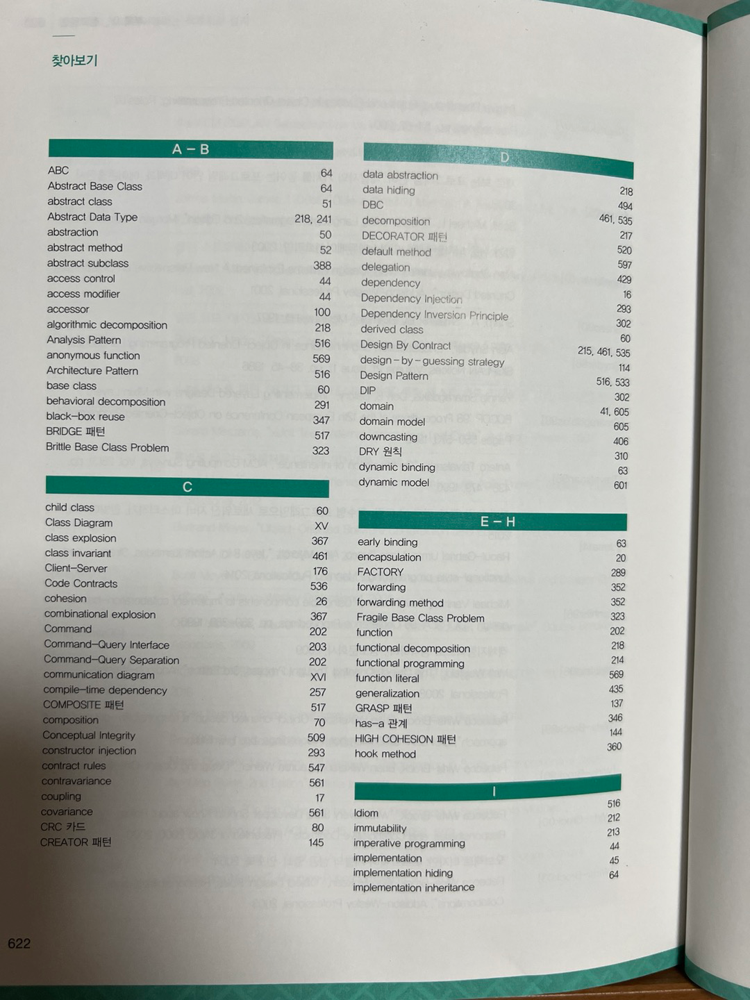

그리고 내가 자주 사용하는 Notion에도 이러한 색인 기능이 존재하는데, 이를 통해 원하는 항목으로 쉽게 이동할 수 있다. 


데이터베이스에서는 이러한 index를 추가적인 저장 공간을 활용하여 테이블의 검색 속도를 향상시키기 위한 자료구조라고 정의한다.   
즉, WHERE 절이나 JOIN 조건 등 특정 조건을 만족하는 튜플들을 빠르게 조회하기 위해 사용하는 것이 index다.

### 인덱스의 유무에 따른 차이
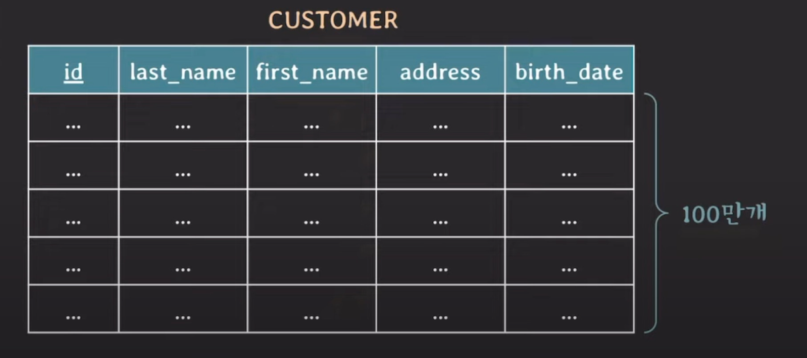

만약 first_name 컬럼에 인덱스가 걸려 있지 않다면 100만개의 데이터를 모두 탐색해서 찾아야 한다.   
이러한 탐색 기법을 full scan이라고 하며, full scan을 사용했을 때 시간 복잡도는 O(N)이다.   

반면 first_name 컬럼에 인덱스가 걸려 있다면 인덱스를 활용하여 더 빠른 시간에 특정 데이터를 찾을 수 있다. 이 경우 시간 복잡도는 B-tree 기반의 인덱스 기준 O(logN)이 된다.

### 인덱스 사용법
- #### 이미 테이블이 생성되고 데이터가 저장되어 있는 경우 index 생성   
  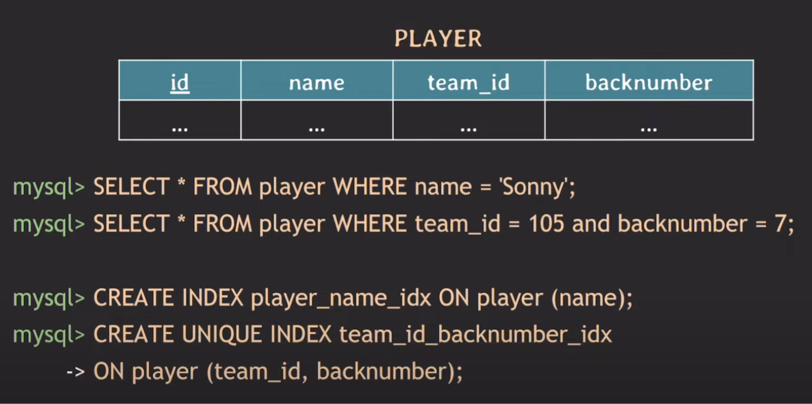   
  같은 팀에서 등 번호는 중복되지 않는다. 따라서 team_id와 backnumber를 AND 조건으로 조회하면 선수 정보를 unique하게 조회할 수 있다.   
  이러한 조회의 경우 index를 걸어줄 때 UNIQUE라는 키워드를 추가한다. 

- #### 테이블을 처음 생성하는 경우 index 생성 
  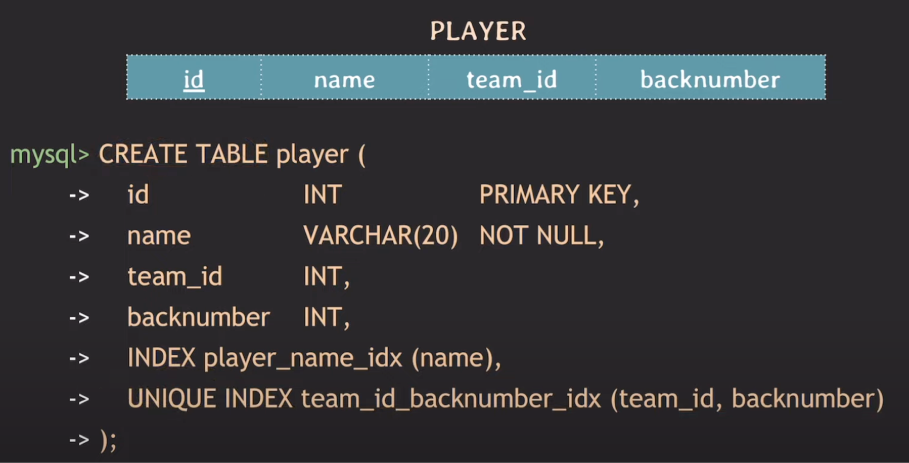   
  - PK에는 index가 자동으로 생성된다. 
    - 보통 기본키를 사용한 검색이 자주 발생하기 때문에, 이에 대한 index 생성은 검색 속도를 크게 개선할 수 있다.
  - CREATE문 안에서는 index 이름을 생략할 수 있다.

- #### index 목록 조회
  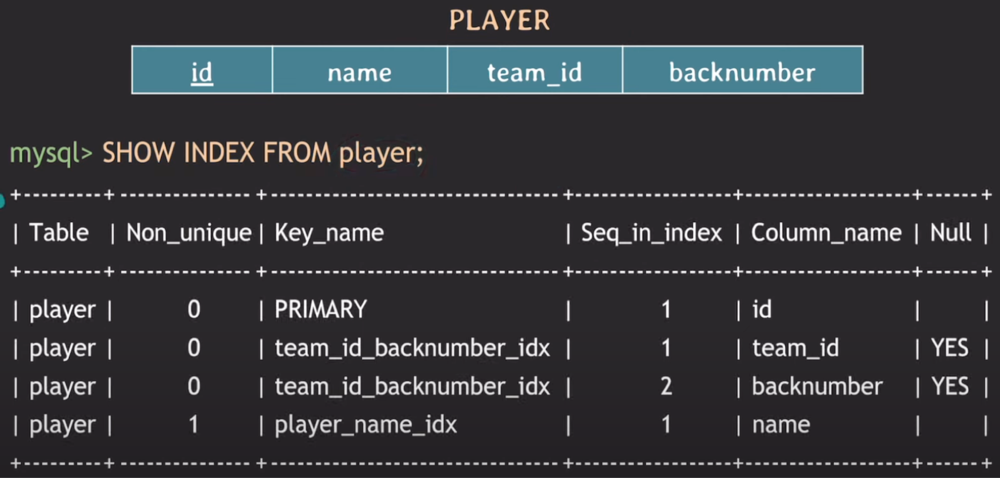   
  - 왼쪽부터 테이블 이름, unique 여부, index 이름, 해당 index 내에서 컬럼의 순서, index가 걸린 컬럼명, null 허용 여부를 의미한다.

- #### 특정 쿼리가 사용하는 index 조회
  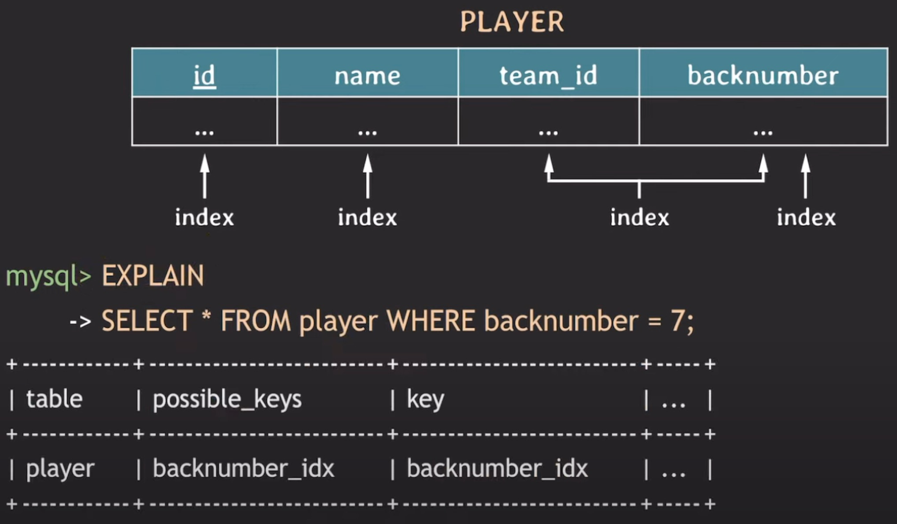
  - `possible_keys`: 해당 쿼리에 사용할 수 있는 index
  - `key`: 실제 사용한 index

### B-tree 기반 index의 동작 방식
아래 그림은 members 테이블에서 컬럼 a에 대한 index를 생성한 모습을 나타낸다. 

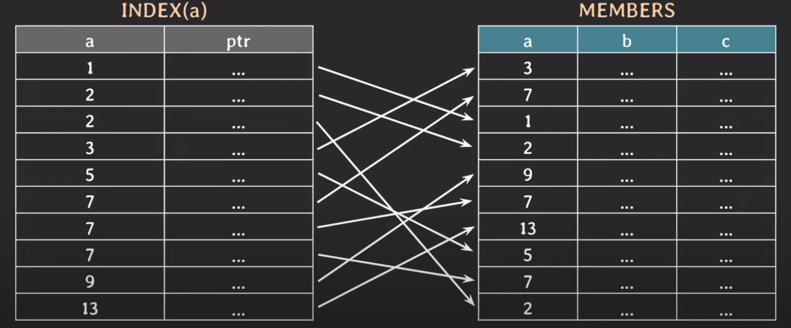

index에는 오름차순 정렬된 a의 값들과 실제 members 테이블의 튜플을 가리키는 포인터가 저장되어 있다.   
이 상태에서 `a=9` 조건으로 데이터를 조회한다면, 다음과 같이 binary search를 통해 탐색한다.   

1. 찾으려는 값 9는 5보다 크기 때문에 5보다 작은 데이터는 무시한다.   
  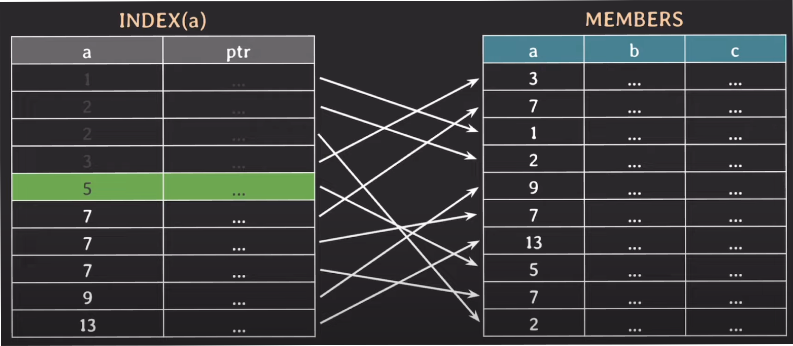
2. 9를 찾을 때까지 1번과 똑같은 과정을 반복한다.
3. 9를 찾았다면, 해당 포인터가 가리키는 튜플을 찾는다.    
  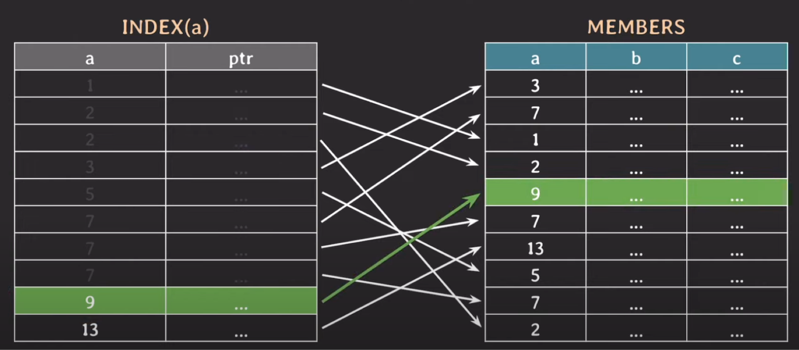

> #### 2개 이상의 컬럼에 대해 index를 생성할 수 있다.
> a에 대한 index만 존재할 때 a와 b에 대한 조건을 만족하는 값을 찾으려면, 결국 동일한 값들에 대해 각각 b 조건을 만족하는 값을 찾기 위해 full scan 방식으로 검색해야 한다. 이 경우 데이터가 많아질수록 성능 상의 문제가 커질 것이다.   
> 이 문제를 해결하기 위해서는 다음과 같이 a와 b를 하나로 묶은 index를 만들어야 한다.   
> 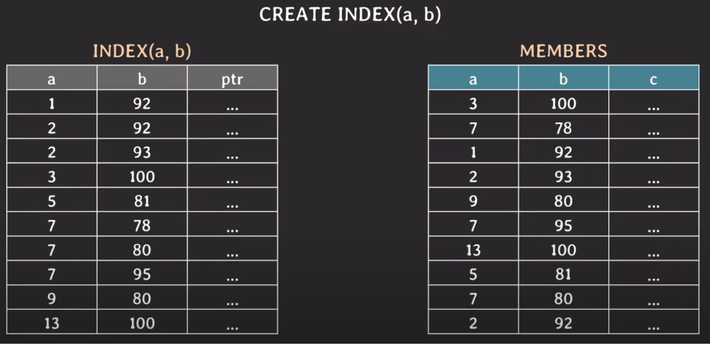   
> 이때 index 생성 시 왼쪽에 위치한 파라미터가 정렬의 기준이 된다. 따라서 이러한 multicolumn index를 생성할 때는 attribute 순서가 중요하다. 

> #### 자주 사용되는 쿼리에 맞춰서 index를 생성하자.
> 만약 a와 b에 대한 인덱스를 걸어준 상태에서 b에 대한 조건을 만족하는 데이터를 찾는다면, index(a,b)는 a를 기준으로 우선 정렬되기 때문에 오히려 성능이 더 떨어질 수도 있다.    
> 따라서 자주 사용되는 쿼리가 무엇인지 고민해보고, 이를 바탕으로 적절하게 index를 걸어주는 것이 좋다.

### index 선택 원리
우리가 어떤 쿼리를 작성할 때 어떤 index를 사용할지 명시하지 않아도, DBMS에 존재하는 optimizer가 알아서 적절한 index를 선택하여 데이터를 조회한다.   
하지만 가끔 optimizer가 이상하게 선택할 때도 있는데, 이를 위해 다음과 같이 수동으로 index를 선택할 수도 있다.   
```mysql
# index 선택 권장
SELECT * FROM player USE INDEX (backnumber_idx) WHERE backnumber = 7;

# index 선택 강제
SELECT * FROM player FORCE INDEX (backnumber_idx) WHERE backnumber = 7;

# 특정 index 제외
SELECT * FROM player IGNORE INDEX (backnumber_idx) WHERE backnumber = 7;
```
- `USE INDEX`: 지정 index를 사용하도록 하는데, 만약 optimizer가 판단 후 해당 index를 사용하지 않으면 full scan으로 동작한다.   
- `FORCE INDEX`: 지정 index를 사용하도록 강제한다. 그래도 가끔 optimizer가 해당 indexfmf 사용해서 원하는 값을 가져오지 못한다고 판단하면 full scan으로 동작한다.
- `IGNORE INDEX`: 지정 index를 제외한 다른 index 중에서 선택하도록 한다.

### 불필요한 index는 생성하지 말자.
여러 조건에 따라 다양하게 데이터를 검색할 일이 생길 수 있다. 이를 위해 index를 막 생성해도 괜찮을까?   

결론부터 말하자면 불필요한 index는 생성하지 않는 것이 좋다. 실제 테이블에 있는 데이터의 index를 생성할 때마다 그 index에 대한 부가적인 데이터들도 함께 생성되기 때문이다.   
이로 인해 index 생성 시 발생하는 다음 두 가지 사항을 주의해야 한다.

- **테이블에 write할 때마다 index도 변경된다.**   
  따라서 데이터가 많아질수록 write가 발생할 때마다 오버헤드가 생길 수 있다.
- **추가적인 저장 공간을 차지한다.**

### Covering index
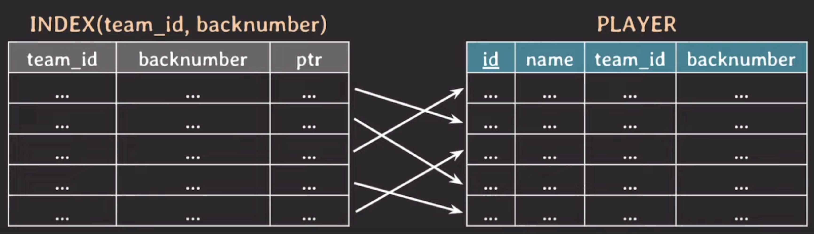

`SELECT team_id, backnumber FROM player WHERE team_id = 5;`   
여기서 team_id와 backnumber는 이미 index에 포함되어 있기 때문에, binary search를 통해 데이터를 찾고나서 굳이 player 테이블까지 탐색할 필요는 없다.   

이처럼 **조회하는 attribute를 index가 모두 cover할 때**, 해당 index를 **covering index**라고 한다.
테이블을 탐색하는 과정을 생략하므로 당연히 조회 성능이 더 빠르다. 따라서 종종 의도적으로 covering index로 만들어 사용하기도 한다.

### Hash index
Hash index는 B-tree가 아닌 hash table을 이용해서 index를 구현하는 방식이다.   
시간 복잡도가 O(1)로 굉장히 빠르지만, 아래 단점들로 인해 잘 사용되지 않고 보통 B-tree 계열이 index로 사용된다. 
- rehashing이 부담스럽다.   
  Hash table에 데이터가 계속 추가되면 어느 순간에 hash table의 크기를 확장해야 하는데, 이 작업을 rehashing이라고 한다.
- equality(`=`, `!=`) 비교만 가능하고 range 비교는 불가능하다.
- multicolumn index의 경우 전체 attribute에 대한 조회만 가능하다.   
  예를 들어, B-tree 계열의 경우 INDEX(a, b)가 있을 때 a에 대한 조회와 a, b 모든 값에 대한 조회가 가능하다. 하지만 hash index의 경우 a, b 모든 값에 대한 조회만 가능하다.

### Full scan 방식이 더 좋은 경우
물론 full scan 방식이 더 좋은 경우가 존재하는데, 이는 다음과 같다.
- #### 테이블에 데이터가 조금 있을 때 (몇 십, 몇 백건 정도)   
  물론 시간이 지날수록 데이터가 많아지기 마련이므로, 결국 index를 사용하는 것이 더 좋다.
- #### 조회하려는 데이터가 테이블의 상당 부분을 차지할 때

어떤 상황에 full scan을 사용할지, index 사용할지는 optimizer가 판단한다.

### 그 외 참고 사항
- order by나 group by에도 index가 사용될 수 있다.
- DBMS에 따라 FK에는 index가 자동 생성되지 않을 수 있다. (MySQL은 자동 생성됨)
- 이미 많은 데이터가 존재하는 테이블에 index를 생성하는 경우 시간이 몇 분 이상 소요될 수 있으며, DB 성능에 안 좋은 영향을 줄 수 있다.   
  따라서 되도록 DB 트래픽이 적은 시간에 생성하는 것이 좋다.