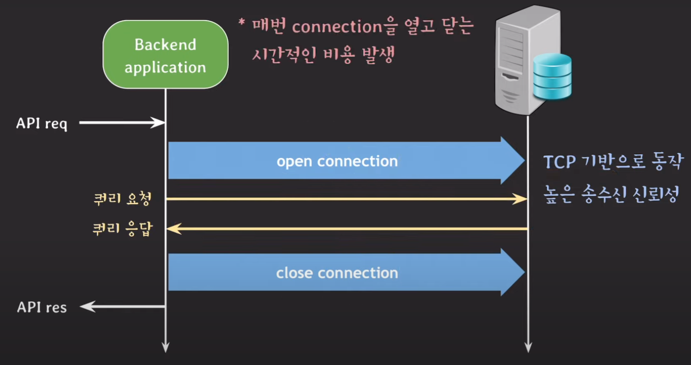
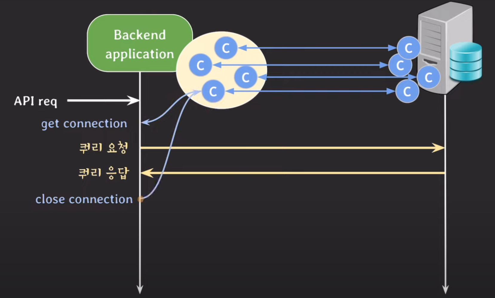
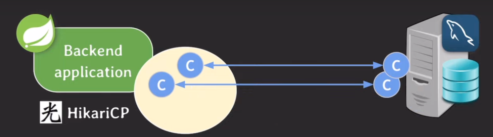
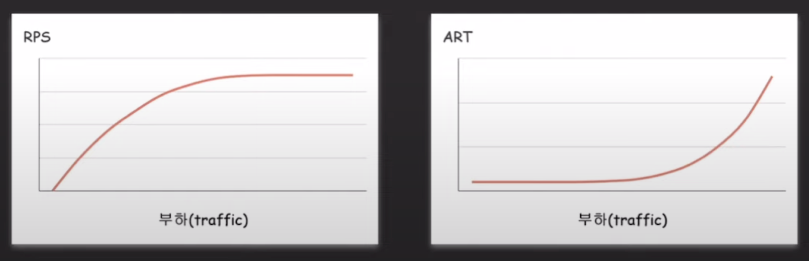

## WAS와 DB 서버가 통신하는 과정
Web Application Server는 사용자의 요청을 처리하는 과정에서 데이터를 전달하기 위해 DB 서버와 통신을 하게 된다.

가장 먼저 WAS에 API 요청이 오게 되고, 그 요청을 처리하는 도중 DB 서버와 연결을 맺는다.   
그리고나서 쿼리를 요청하고 응답을 받은 다음 DB 서버와의 연결을 끊는다.   

이러한 WAS와 DB 서버가 통신하는 과정은 TCP 기반으로 동작하기 때문에 높은 송수신 신뢰성을 보장할 수 있다.   
하지만 TCP의 연결지향적인 특성 때문에 connection을 맺고 끊는 과정이 반드시 필요한데, 이 과정은 생각보다 시간을 많이 잡아 먹는다.   

특히 실무에서는 굉장히 많은 종류의 API가 동시에 요청되므로 성능은 더욱 악화된다.

## DBCP(DB Connection Pool)
앞에서 본 통신 과정의 문제는 DB 서버에 쿼리 요청을 보낼 때마다 connection을 맺고 끊는 것이었는데, 이를 해결하기 위해 나오게 된 개념이 DB Connection Pool이다.

WAS가 시작되면, DB 서버와 통신하기 위한 여러 connection을 미리 맺어놓고 pool에서 그 connection들을 관리한다.   
이를 통해 쿼리를 요청하기 전에 connection을 새로 연결하는 것이 아니라, pool에 있는 하나의 connection을 잠깐 빌려온다.   
그리고나서 쿼리 응답을 받은 시점에 connection을 다시 pool로 반납한다.

이처럼 pool에서 관리중인 connection을 재사용함으로써, connection을 열고 닫는 시간을 절약해 전체 응답 속도를 개선할 수 있게 된다.

## DBCP 설정 방법
DB connection은 백엔드 서버와 DB 서버 사이의 연결을 의미한다. 따라서 각 서버에서 설정하는 방법을 잘 알고 있어야 한다.

(*여기서는 MySQL과 HikariCP를 기준으로 설명합니다*)

### DB 서버 설정
- #### max_connections
  - client와 맺을 수 있는 최대 connection 개수
  - max_connections를 충분히 적절하게 설정해야 나중에 신규 서버를 투입하거나 DBCP의 connection 수를 늘려도 정상 동작이 가능하다.   
    예를 들어, 만약 백엔드 서버가 모든 connection들을 사용중인 상태에서 과부하가 걸려 신규 서버를 투입해도 DB 서버의 최대 connection 수가 넉넉하지 않게 정해져 있으면 connection을 추가로 연결하지 못한다.   

- #### wait_timeout
  - connection이 inactive할 때, 다시 요청이 오기까지 connection을 close를 대기하는 시간
  - 지정된 시간 내에 요청이 도착하면 0으로 초기화된다.
  - 만약 다음과 같은 상황으로 인해 연결 상태가 이상하더라도, DB 서버 입장에서는 connection이 정상적으로 open되어 있다고 생각한다.
    - 비정상적인 connection 종료
    - connection 사용 후 반환 X
    - 네트워크 단절
    
    따라서 DB 서버는 요청이 올 때까지 하염없이 기다리게 된다. 이는 곧 죽은 connection이 DB 서버의 리소스를 점유하는 꼴이다.
  - 예를 들어, MySQL에서 wait_timeout을 60으로 설정하는 경우 
    마지막 요청을 받은 기준으로 60초까지 connection이 열려 있는 상태로 기다리고, 시간이 지나면 연결을 끊는다.

### Backend 서버 설정
- #### minimumIdle
  - pool에서 유지하는 최소한의 idle connection 개수
    - idle connection: 열려는 있지만 어떤 요청이 올 때까지 대기만 하는 connection 

- #### maximumPoolSize
  - pool이 가질 수 있는 최대 connection 개수 (idle과 active connection 모두 포함)

> #### minimumIdle과 maximumPoolSize의 우선 순위
> idle connection 개수가 minimumIdle보다 작고, 전체 connection 개수가 maximumPoolSize보다 작다면 신속하게 새로운 connection을 추가한다.   
> 즉, maximumPoolSize의 우선 순위가 minimumIdle보다 높다.
> 
> 
> 
> 예를 들어, minimumIdle이 2, maximumPoolSize가 4로 설정된 상태에서 열려 있는 connection이 2개라면 다음과 같이 흘러간다.
> 1. 백엔드 서버에 요청이 들어와서 connection 하나를 사용한다.
> 2. idle connection 수가 1로 minimumIdle보다 작기 때문에 새로운 connection을 추가한다.
> 3. 백엔드 서버에 또 다른 요청이 들어와서 connection을 사용하느라 다시 새로운 connection을 추가한다.
> 4. 백엔드 서버에 또 다른 요청이 더 들어와서 남은 connection 중 하나를 사용한다.
> 5. idle connection 개수가 1이지만, maximumPoolSizerk 4로 설정되어 있기 때문에 더이상 connection을 추가하지 못한다.
> 6. 요청이 끝날 때마다 connection이 종료되고, idle connection 개수를 다시 2개로 맞춘다.

- #### maxLifeTime
  - pool에 있는 connection의 최대 수명
  - connection이 idle 상태인 경우 maxLifeTime을 넘기면 pool에서 바로 제거되고, active 상태인 경우 pool로 반환 후 제거된다.   
    > wait_timeout이 만료됐는데 pool로 반환이 안 된 채로 끊긴다면, 해당 connection에 또 요청이 왔을 때 exception이 발생하게 된다. 따라서 다 쓴 connection은 반드시 pool로 반환시켜야 한다.
  - maxLifeTime을 넘겨 제거되더라도, pool 크기에 맞게 새로운 connection이 추가된다.
  - DB 서버의 wait_timeout보다 몇 초 정도 짧게 설정해야 한다.
    > #### 만약 DB 서버의 wait_timeout이 60초인데, DBCP의 maxLifeTime도 60초라면?   
    > connection의 수명이 59초에 돌입한 connection에 쿼리를 요청했을 때, 중간에 wait_timeout이 만료되어 DB 서버가 connection을 끊어버리게 되면 해당 요청은 정상 처리되지 않고 exception이 발생한다.

- #### connectionTimeout
  - pool에서 connection을 받기 위한 대기 시간
  - 모든 connection이 사용중인 상태에서 요청이 왔을 때, connection을 계속 기다릴 수는 없으므로 적정 시간이 지나면 exception을 발생시키는 용도로 사용한다.
  - 일반적으로 사용자는 요청 후 응답이 10초 이내로 오지 않으면 해당 서비스에 안 좋은 경험을 느끼게 된다. 따라서 적절한 값으로 설정하는 것이 중요하다.

## 적절한 connection 수를 찾는 과정
서비스에 사용자가 얼마나 있는지, 어떤 시간에 트래픽이 많이 발생하는지 등등 여러 요인에 따라 설정할 connection 개수가 달라진다.   
이는 당연히 팀과 서비스마다 다르지만, 일반적으로 수행하는 과정은 다음과 같다. 

### 성능 지표 확인
서버의 성능을 개선하기에 앞서 가장 먼저 할 일은 성능 지표를 확인하여 어떤 부분을 개선할지 파악하는 것이다.   
이에 대한 과정은 일반적으로 다음과 같다.
1. 서버 리소스, 스레드 수, DBCP 등등 여러 지표를 확인할 수 있는 모니터링 환경을 구축한다.
2. 백엔드 시스템에 부하 테스트를 진행한다.
3. request per second와 avg response time을 확인한다.
   
    
   
    트래픽에 따라 어느 시점에 성능이 떨어지는지 판단한다.

### 리소스 사용율 확인
백엔드 서버와 DB 서버의 CPU, Memory 등 리소스 사용률을 확인한 뒤 다음과 같은 작업을 수행한다.
- 백엔드 서버의 리소스 사용율이 점차 증가하면 우선 추가 서버를 투입해서 트래픽을 분산시킨다.
- DB 서버의 리소스 사용률이 점차 증가하면 아래 내용들을 고려한다.
  - secondary 서버 추가
  - cache layer 도입
  - sharding

### Thread pool의 active thread 개수 확인
WAS가 thread per request 모델인 경우 사용중인 스레드 개수를 확인한다.   
예를 들어, thread pool에서 수용 가능한 thread가 최대 5개일 때, 실제 active thread 개수가 5개라면 thread pool의 크기를 증가시킨다.

### DBCP의 active connection 개수 확인
DBCP에 있는 connection이 모두 사용중이라면 maximumPoolSize를 증가시킨다.   

이때 중요한 점은 DB 서버의 max_connections도 함께 고려해야 한다는 것이다.    
예를 들어, 모든 백엔드 서버의 maximumPoolSize 총합이 30이고, DB 서버의 max_connections도 30으로 설정되어 있을 경우 maximumPoolSize만 증가시킬 수 없다.   
따라서 max_connections를 먼저 충분히 증가시키고, 그에 맞춰서 maximumPoolSize를 설정해 주어야 한다.
