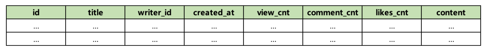
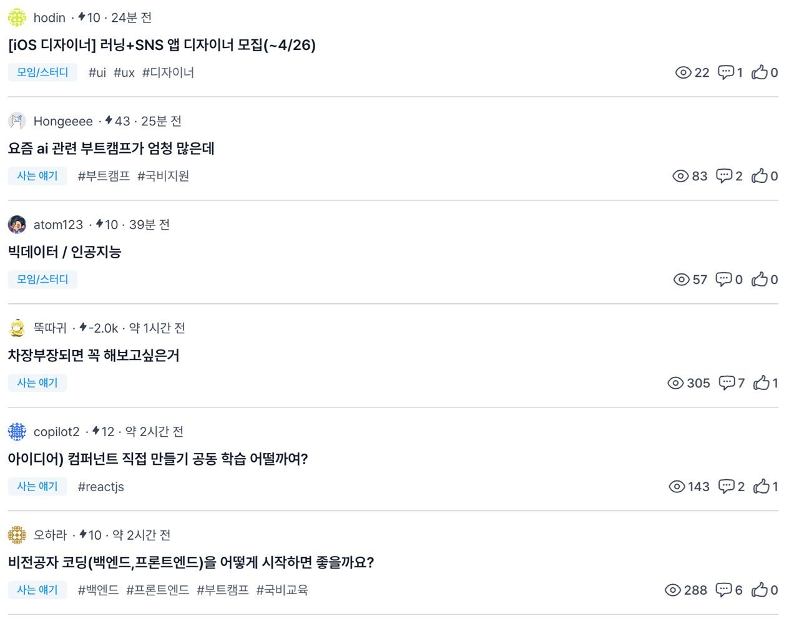
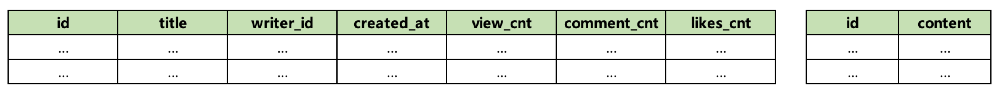
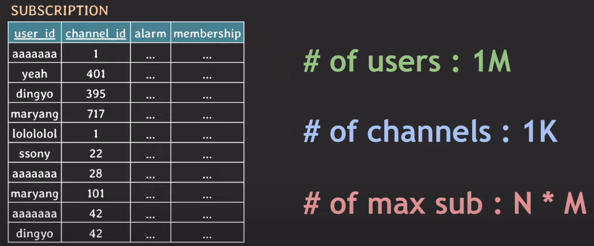
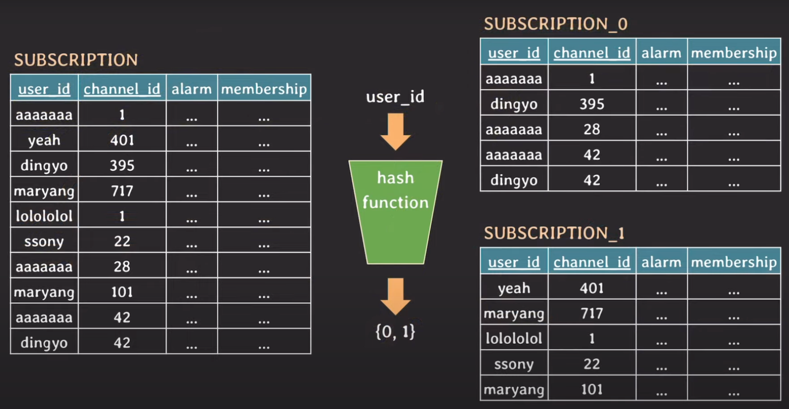
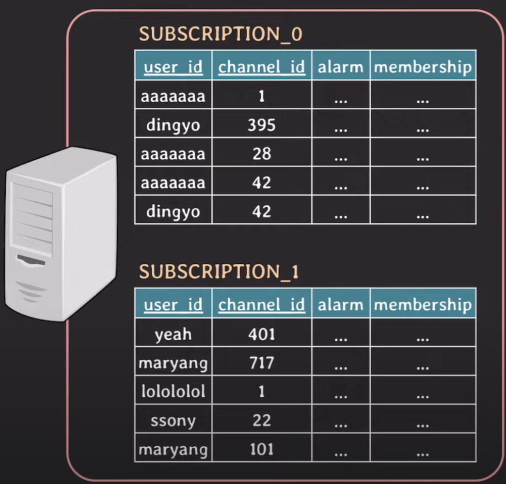
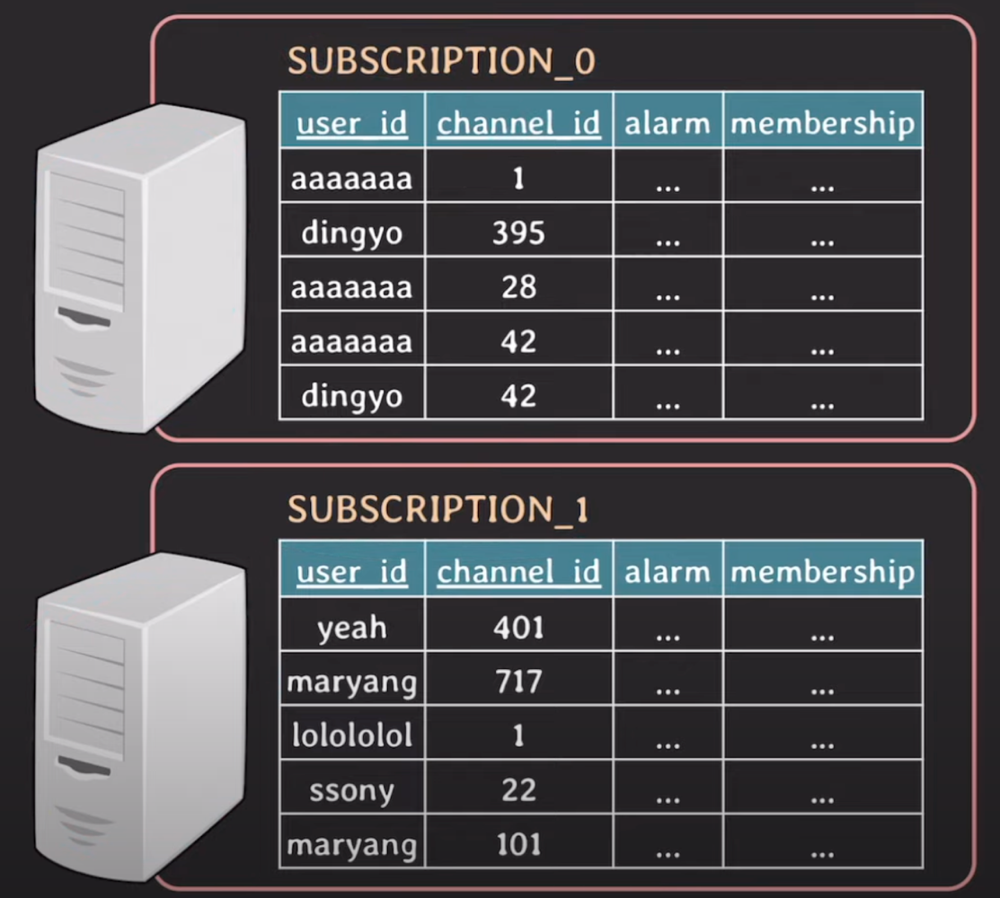
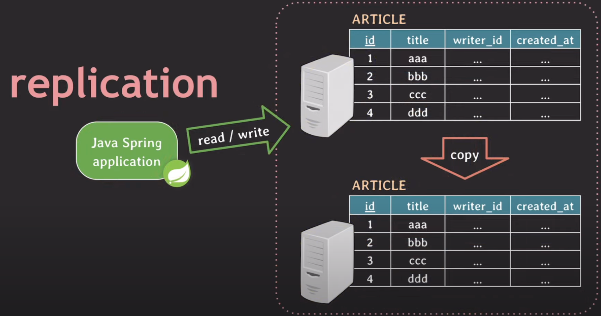

## Partitioning
DB 테이블을 관리하기 쉽도록 더 작은 테이블로 나누는 것을 파티셔닝이라고 한다.   
파티셔닝에는 vertical 파티셔닝과 horizontal 파티셔닝 두 가지 방법이 존재한다.

### Vertical Partitioning
Vertical 파티셔닝은 **column을 기준으로 테이블을 나누는 방식**으로, 대규모 DB 시스템에서 효율적인 데이터 조회 작업을 위해 사용된다.

예를 들어, 다음과 같이 게시글 정보를 담고 있는 테이블이 있다고 해보자.    



아래에 보이는 게시글 목록 페이지를 보여주기 위해 게시글 내용을 제외한 값을 모두 응답으로 내려주면 되는데, 이때 SQL문은 다음과 같을 것이다.   
```mysql
SELECT id, title, ..., likes_cnt FROM posts;
```



사실 위와 같이 쿼리를 작성해도 DB가 위치한 secondary storage에서는 데이터는 tuple 전체를 가져오고, 그 데이터들 중 쿼리에 따라 특정 데이터만 따로 가져오게 된다.   
이렇듯 모든 컬럼 값을 가져오므로 특정 컬럼 값의 크기가 크다면 결국 성능에 안 좋은 영향을 준다.

이런 성능 문제를 개선하고자 다음과 같이 크기가 큰 데이터는 다른 테이블에 저장하고, 필요할 때만 JOIN해서 조회하는 방식이 바로 vertical partitioning이다.



여기서 중요한 포인트는 **이미 정규화를 진행한 테이블이더라도 성능을 위해 vertical partitioning을 수행할 수 있다**는 것이다.

### Horizontal Partitioning
Vertical partitioning이 column을 기준으로 테이블을 나누는 방식이었다면, Horizontal partitioning은 row를 기준으로 테이블을 나누는 방식이다.   
row를 기준으로 테이블을 나눈다는 것에서 알 수 있듯이 horizontal partitioning은 vertical partitioning과 달리 테이블의 스키마를 변경하지는 않는다.

***그렇다면 horizontal partitioning은 언제 사용하는걸까?***

아래는 사용자의 채널 구독 정보를 저장하는 테이블이다.



이 테이블에 저장된 사용자 수가 100만개, 채널 수가 1000개라면 최대 구독 데이터 수는 10억개가 될 것이다.   
당연히 사용자나 채널 수는 계속해서 증가할 것이고, 이렇게 데이터가 쌓이게 되면 테이블의 크기뿐만 아니라 인덱스의 크기도 커지게 된다.   
즉, 테이블에 읽기나 쓰기 작업이 있을 때마다 인덱스에서 처리되는 시간도 조금씩 증가한다.

이러한 문제를 해결하기 위해 등장한 개념이 바로 horizontal partitioning이다.



horizontal partitioning에는 여러 방법론이 존재하는데, 여기서는 Hash 기반의 방식으로 파티셔닝을 진행한다.

파티셔닝이 진행되는 과정은 다음과 같다.
1. hash function은 정의하고, 파티셔닝의 기준이 되는 partition key를 지정한다. (여기서는 user_id로 지정함)
2. 기존 테이블에 있는 데이터의 user_id를 hash function에 넣는다. 
3. hash function에서 나온 값이 0이라면 subscription_0 테이블에, 1이라면 subscription_1 테이블에 데이터를 저장한다.

지금은 테이블을 둘로 나누었지만, 상황에 따라 더 많은 테이블로 나눌 수도 있다.

> #### 만약 'dingyo'라는 id를 가진 사용자가 구독한 채널들의 정보를 모두 조회하고 싶다면?
> user_id가 'dingyo'인 데이터를 hash function에 넣어서 나온 값(0 또는 1)에 해당하는 테이블로 가서 탐색을 진행한다.

> #### 만약 channel_id가 1인 채널을 구독한 사용자의 id를 모두 조회하고 싶다면?
> channel_id는 partitioning key가 아니기 때문에 어쩔 수 없이 모든 데이터를 조회해야 한다.

Horizontal partitioning을 진행할 때 고려할 중요 포인트는 다음과 같다.
- 가장 많이 사용될 패턴에 따라 partition key를 지정한다.
- 데이터가 균등하게 분배될 수 있도록 hash function을 잘 정의한다.
- hash 기반의 horizontal partitioning의 경우 한 번 파티션이 나눠져 사용되면, 이후에 파티션을 추가하기 까다롭다. 따라서 처음 설계 시 파티셔닝을 잘 계획해야 한다.

여기서는 hash 기반의 horizontal partitioning을 기준으로 설명했지만, 이외에도 List, Range, Composite 등 다양한 방법론이 존재한다.

## Sharding
Sharding은 row를 기준으로 테이블을 나눈다는 관점에서 horizontal partitioning과 동일하다.   

### 그렇다면 Sharding은 Horizontal Partitioning과 무엇이 다를까?
하나의 DB 서버에서 여러 테이블로 나눠지는 horizontal partitioning과 달리 sharding은 각 파티션이 독립된 DB 서버에 저장된다.



Horizontal partitioning의 경우 모든 파티션들을 같은 DB 서버에 저장하기 때문에 리소스가 한정되어 있다는 단점이 존재한다.      
예를 들어, 백엔드 서버로부터 요청이 밀려올 때 어떤 테이블에 대한 요청인지와 상관없이 하나의 DB 서버의 CPU와 memory를 사용해서 처리해야 한다.



반면 sharding의 경우 파티션을 독립된 DB 서버에 저장하는 방식이므로, DB 서버의 부하를 분산시킬 수 있다.   
예를 들어, 백엔드 서버로부터 요청이 밀려올 때 어떤 테이블에 대한 요청인지에 따라 트래픽을 처리하는 서버가 다르다.

이외에 용어 차원에서도 차이점이 존재한다.   
Horizontal partitioning의 경우 파티셔닝의 기준이 되는 컬럼을 partition key, 나눠진 각 테이블을 partition이라고 부른다.   
반면 sharding의 경우 샤딩의 기준이 되는 컬럼을 **shard key**, 나눠진 각 테이블을 **shard**라고 부른다.

## Replication
Replication이란 하나 이상의 DB 서버에서 주 DB 서버의 복사본을 유지하는 방식을 말한다.   



실무에서 replication을 사용하는 이유는 크게 두 가지가 있다.
1. primary DB 서버에 문제가 발생했을 때, 해당 서버에 요청을 보내던 WAS가 secondary DB 서버로 요청을 보내도록 빠르게 처리할 수 있다.    
   즉, 어떤 장애 발생 시 서비스가 지속적으로 유지될 수 있도록 하는 특성인 **고가용성**(H/A, High Availability)을 보장한다.  
2. 읽기 관련 쿼리를 분산시켜 DB 서버의 부하를 감소시킴으로써 읽기 작업을 잘 처리할 수 있다.   
   대부분의 일반적으로 서비스가 쓰기 작업보다 읽기 작업이 더 많다는 측면에서 보면 큰 장점이라고 할 수 있다.  

> 주로 사용되는 DB 서버를 primary DB 서버라 하고, 부가적으로 사용되는 DB 서버를 secondary DB 서버라고 한다.   
