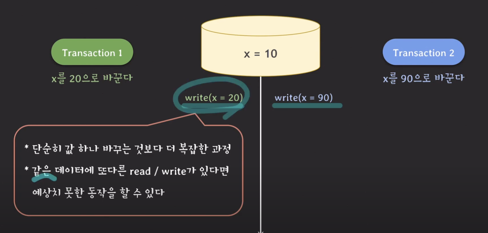

단순히 값을 바꾸는 것이 생각보다 더 복잡한 과정.
* (인덱스가 걸려있다면) 인덱스에 대한 처리
* 실제로 저장되는 파일에 대해서도 여러 처리가 필요

## Lock

위 문제를 해결하는 방법 중에, `Lock`이란 개념이 있다.

트랜잭션 1번에서 `lock`이 걸리고 나서 트랜잭션 2번이 `write_lock`을 수행하지만, 이미 트랜잭션 1번이 
락을 가지고 있기 때문에 대기 함 (block)

트랜잭션 1번이 `x=20`을 쓰고, `unlock`을 하고, 트랜잭션 2번이 락을 가지고 동작을 수행하게 된다.

### write-lock (exclusive lock)
    1. read/write (insert, modify, delete) 할 때 사용
    2. 다른 tx가 같은 데이터를 read/write 하는 것을 허용하지 않는다

### read-lock (shared lock)
    1. read 할 때 사용
    2. 다른 tx가 같은 데이터를 Read 하는 것은 허용한다

### 예제 1)

트랜잭션 2번이 먼저 `read_lock`을 획득하고 다른 트랜잭션이 `write` 할 때

트랜잭션 2번의 `read_lock`이 다른 트랜잭션이 같은 데이터에 대해서 `write` 하려고 할 때, **읽기를 보호하는 역할을 한다.**

### 예제 2)

트랜잭션 두개가 전부 `read` 일 때

`unlock` 될 때 까지 기다려야 하는 `write_lock`과는 다르게 `read_lock`은 같이 동작을 실행한다.

### Lock을 사용했음에도 Serializability 보장이 안되는 경우?!

#### 두개의 트랜잭션이 Serial 스케쥴로 동작하는 경우 (각각 동작)

### 두개의 트랜잭션이 겹쳐서 동작하는 경우

둘다 결과 값이 300이므로, Nonserializable 하다는 의미가 된다. (근데 왜??)

#### 그런데 왜 문제가 되는것인가?

트랜잭션 1은 업데이트 된 y를 읽어야 하는데, 

업데이트 되기 전에 y를 읽었기 때문에 문제가 발생했다. 

이 그림에서 보면, 트랜잭션 2번에서 언락을 하고, y에 대해서 읽고/쓰기를 하려고 `write_lock`을 얻으려는 사이에,
트랜잭션 1번이 `read_lock`을 취득한다.

이러한 문제로,
1. 트랜잭션 1번은 업데이트 되지 않은 y값을 읽고,
2. 트랜잭션 2번은 `read_lock` 때문에 블락이 걸리며 대기하게 된다.

#### 해결 방법은?

    unlock과 write_lock의 위치를 바꿔주면 된다.

이렇게 바꾸게 되면, 트랜잭션 1번의 `read_lock`은 2번이 `unlock` 될때까지 기다렸다가 업데이트 된 y 값을 읽게 된다.

그렇게 되면, 진행 과정도 이런식으로 변하게 된다.

### 2PL 프로토콜

2PL 프로토콜은, 한번 `unlock`이 되면, 그 사이에 새로운 락을 취득하지 않는다. 그리고, Serializability를 보장한다.

#### Deadlock

### conservative 2PL

* 모든 lock을 취득한 뒤 transaction을 시작
* 데드락 free
* 모든 락을 취득을 한 뒤에 시작을 하므로, 실용적이진 않다.

### strict 2PL

* strict schedule 보장
* recoverability 보장

## lock 방식의 약점

read-read를 제외하고는, 한쪽이 block이 되므로 전체 처리량이 좋지 않다.

그래서 read-write를 풀어주자? 