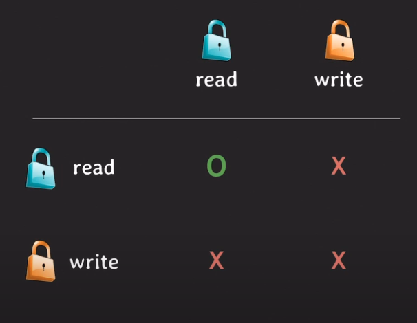
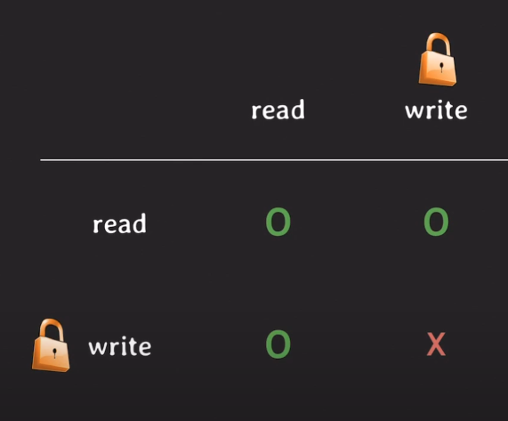
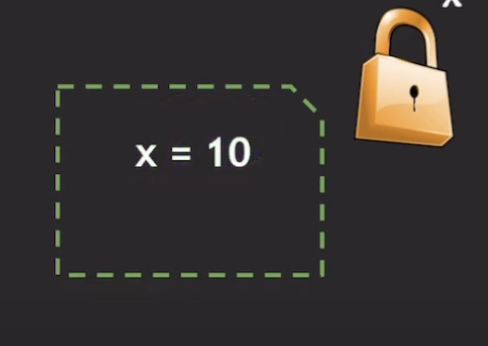
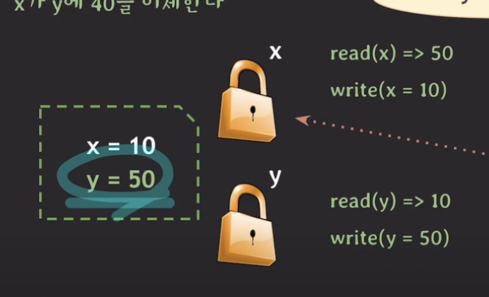
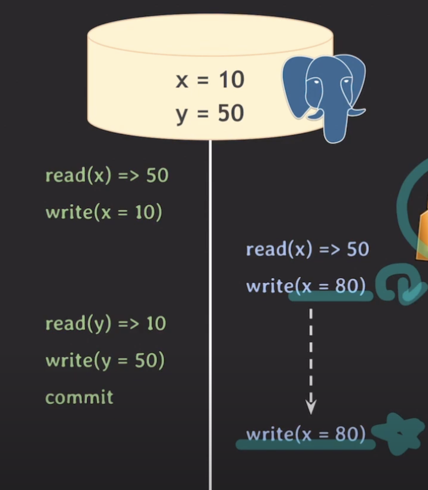

### 기존의 Lock-based concurrency control 문제점 

동시 처리량이 줄어 퍼포먼스가 좋지 않음.

위 문제를 해결하기 위해 MVCC가 등장함

### MVCC (multiversion concurrency control)

read - write도 허용해주다 보니 동시 처리량이 증가한다.

    MVCC는 커밋된 데이터만 읽는다

### 커밋을 할 떄 unlock이 필요한 이유?
-> `recoverability` 를 위해 commit 할때 write lock을 unlock 한다.

### Isolation Level

Isolation Level에 따라서 데이터를 읽는 때도 다르다.

* read committed: read 하는 시간을 기준으로 그 전에 commit 된 데이터를 읽는다.

트랜잭션 1번에서 `x=10`을 읽고, 그리고 트랜잭션 2번이 실행되어서 `x=50`을 쓰고 커밋 됐다면, 다음 트랜잭션 1번이 읽기를 수행한다면
10이 아니라 50을 읽는다.

* **repeatable read**: 트랜잭션 시작 시간을 기준으로 **그 전에 commit된** 데이터를 읽는다.

* serializable? 

    * MySQL: MVCC로 동작하기 보다는 lock으로 동작한다
    * PosgreSQL: SSI기법이 적용된 MVCC로 동작

* **read uncommitted**: MVCC는 커밋된 데이터를 읽기 떄문에 이 레벨에서는 MVCC 적용 X

트랜잭션 1번에서 읽기를 수행하면, 10을 읽게 된다.

MVCC에 대해서 정리를 하자면,
    1. 데이터를 읽을 때 특정 시점 기준으로 가장 최근에 커밋된 데이터를 읽는다.
    2. 데이터 변화(write) 이력 관리
    3. read와 write은 서로 block하지 않음

### PosgreSQL 동작 방식

`x=50`, `y=10`일떄, 트랜잭션 1번은 x가 y에 40을 이체, 2번은 x에 30입금이라고 가정해보자.

#### 예제 1) 두 트랜잭션 isolation level이 read commited 일 때

트랜잭션 1번부터 시작할때, read(x) => 50, write(x = 10)을 하면 `write lock`을 취득
하게 된다.

MVCC로 동작을 하기 때문에 바로 커밋을 하는게 아니라, 자신만에 공간에 저장.

그 다음에, 트랜잭션 2번이 실행되어 read(x) => 50, write(x = 80)을 하며 `write lock`을
취득해야 하는데, 트랜잭션 1번이 현재 가지고 있다..!!!

그래서 트랜잭션 1번이 언락 될 때 까지 기다려야 한다.

그렇게 트랜잭션 1번이 y를 업데이트 해주고, 커밋을 하는 순간 데이터 베이스의 값이 업데이트 되고
`write lock`도 해지가 된다.

아까 트랜잭션 1번의 쓰기 락 때문에 실행되지 못했던 write(x = 80)은 비로소 쓰기 락을 취득하여 
동작을 수행할 수 있는데, 결과 값은 `x = 80`, `y = 50`이 된다.

`x = 40`, `y = 50`이 나와야 하는데 어떤 것이 잘못 되었을까?

이런 현상을 
### Lost Update 라고 한다.

### 해결 방법 1) Isolation Level 변경

트랜잭션 2의 격리 레벨을 `Repeatable read`로 바꾼다면?

PosgreSQL에서 repeatable read의 규칙을 알아보자.
    
    같은 데이터에 먼저 update한 트랜잭션이 커밋되면 나중 트랜잭션은 롤백 된다.

그 말인즉슨, 나중에 시작한 트랜잭션 2번은 롤백이 되어, 결과적으로 데이터베이스엔
`x = 10`, `y = 50`이 남아 있게 된다.

각 트랜잭션마다 isolation level을 다르게 할 수 있다는 사실이 있고, 하나의 의문이 생긴다.
### 트랜잭션 1은 read committed여도 괜찮은가?

트랜잭션 2번이 먼저 시작할 때의 결과는 `x = 10`, `y = 50`이 되어 Lost Update가 일어났다는
것을 알 수 있다.

이를 통해서 트랜잭션 1번의 Isolation Level이 read committed로는 충분하지 않다는 것을
알 수 있다!!!

### 둘다 repeatable read로 설정하면? 

트랜잭션 1번은 롤백되어, 최종적으로 데이터베이스엔 트랜잭션 2번의 결과만 남아있게 된다.

Lost update를 해결하기 위해선, 한 트랜잭션의 레벨만 고려할 것이 아니라, 
다른 연관있는 트랜잭션의 isolation level도 고려해야 한다!

## MySQL 에선?

Mysql에선,

    같은 데이터에 먼저 update한 트랜잭션이 커밋되면 나중 트랜잭션은 롤백 된다.

위와 같은 개념이 없기 때문에 두 트랜잭션이 repeatable read여도 롤백이 되지 않고,
lost update가 생긴다.