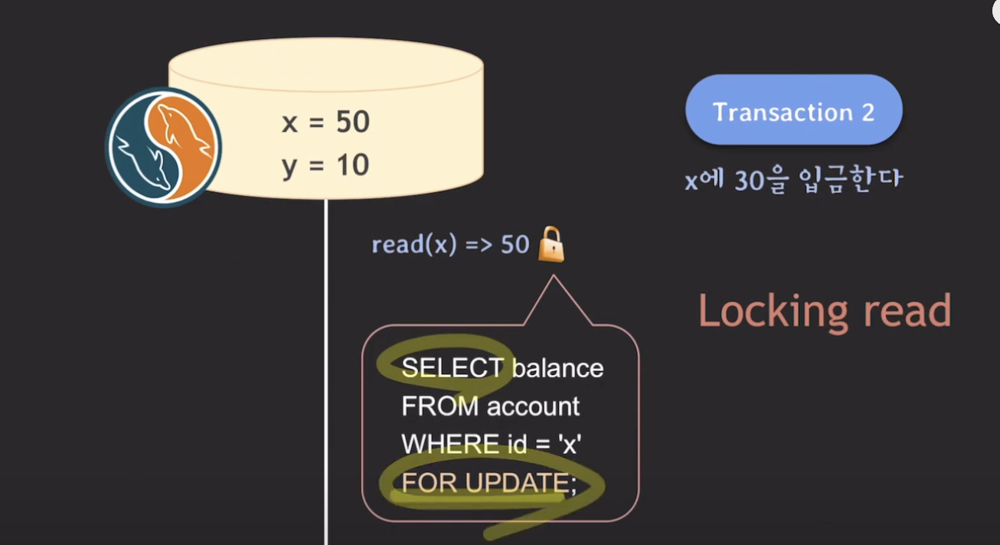
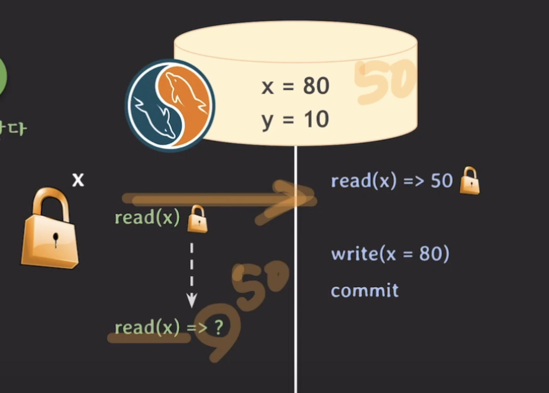
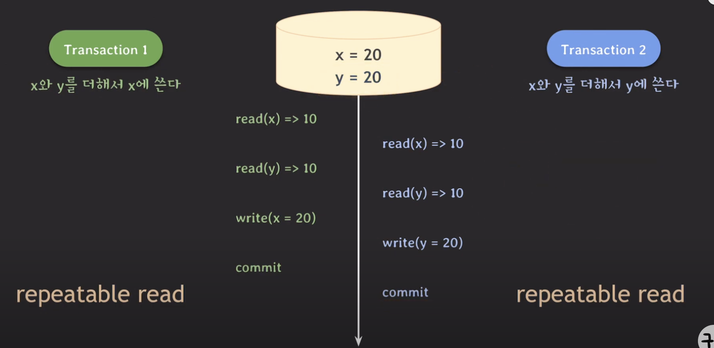

### MySQL에선 Lost Update를 어떻게 해결할까?

#### Locking read



read를 하면서도, `write lock`을 취득할 수 있게끔 사용자가 `FOR UPDATE`를 통해서 설정을
해줘야 한다.

트랜잭션 2번 뿐만 아니라, 1번에서도 locking read를 해줘야 lost update가 발생하지 않음!



그러면, 트랜잭션 1번이 읽는 값은 뭐가 될까?

repeatable read는 트랜잭션 시작을 기준으로 데이터를 읽는다는데 그러면 50을 읽는건가?

결과는, 80이라는 값을 읽는다.

    locking read는 가장 최근에 커밋된 데이터를 읽는다.

이런식으로 동작하므로 동작하므로, 시작 값이 아닌 커밋된 값인 80을 읽는다.

x에 40을 이체하는 과정을 거치면, `x = 40` , `y = 50`으로 원하던 결과를 확인할 수 있다.

### 결론
결과적으로, MySQL에서 lost update를 방지하는데는 repeatable read로는 충분하지 않고,
locking read가 필요하다.


## Write Skew



반환 값이 x = 30, y = 20이거나 x = 20, y = 30이여야 하는데 둘다 20이 되어버렸다.

MySQL과 postgreSQL 동시에 발생할 수 있는데 어떻게 해결할 수 있을까?


### MySQL

locking read 사용 (FOR UPDATE문 추가)


### postgreSQL

여기선, FOR UPDATE를 사용해도 앞서 얘기했던 이 개념때문에

    같은 데이터에 먼저 update한 트랜잭션이 커밋되면 나중 트랜잭션은 롤백 된다.

트랜잭션 하나가 커밋됐을 때, 다른 하나는 롤백 처리가 된다.

### Serializable로도 write skew 해결 가능

격리 레벨을 더 높인, serializable로도 문제 해결이 가능하다.

MySQL 동작 방식

* repeatable read와 비슷
* 평범한 select문이 암묵적으로 select ... for share 처럼 동작한다.

```mysql
SELECT balance FROM account WHERE id = 'x' FOR SHARE;
```

postgreSQL 동작 방식

* first-committer-winner