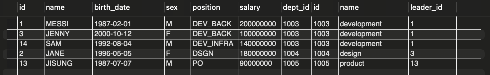
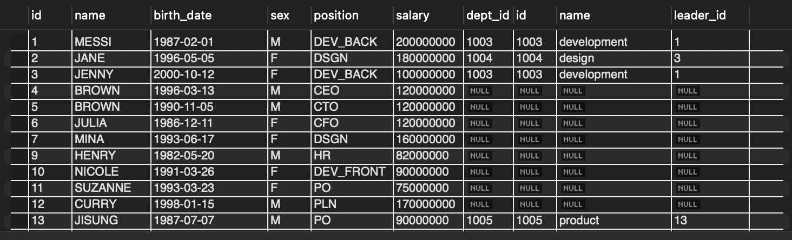

## implicit join vs explicit join

Implicit Join
* from 절에 table을 나열하고, where 절에 join condition을 명시하는 방식
* 복잡한 쿼리를 작성할 떄 실수할 수 있다.

Explicit join

```mysql
select d.name
from employee e join department d on e.dept_id = d.id
where e.id = 1;
```

* from 절에 join 키워드와 함께 join table을 명시
* from에서 on 뒤에 `join condition` 명시
* 복잡해질 때 실수 가능성이 적

## Inner Join vs Outer join

Inner Join
* 두 테이블에서 join condition을 만족하는 tuple들로 result table을 만드는 join
* **null 값을 가지는 tuple은 result table에 포함 x**

```mysql
select * 
from employee e join department d on e.dept_id = d.id;
```


Outer Join
* 두 테이블에서 join condition을 만족하지 않는 tuple들도 result table에 포함하는 join
* Left, Right, Full Join이 있음

```mysql
select * 
from employee e left outer join department d on e.dept_id = d.id;
```
