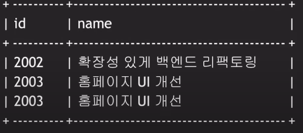
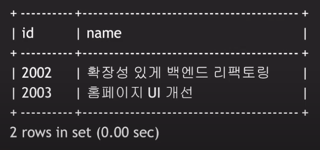

### Cascade
```mysql
CREATE table WORKS_ON(
    empl_id INT,
    proj_id INT,
    PRIMARY KEY (empl_id, proj_id),
    FOREIGN KEY (empl_id) references EMPLOYEE(id)
        on delete CASCADE on update CASCADE,
    FOREIGN KEY (proj_id) references  PROJECT(id)
        on delete CASCADE on update CASCADE 
)
```

Employee 에서 데이터가 삭제되면, `Cascade` 옵션 때문에 `WORKS_ON` 테이블의 데이터도 함께 삭제가 된다.

## 조회
### 예제 1)
Project 2002를 리딩하고 있는 임직원의 ID, 이름과 직군을 알고 싶다.

```mysql
select e.id, e.name, position
from employee e, project p
where p.id = 2002 and p.leader_id = e.id;
```

p.leader_id = e.id 라는 연결 조건이 필요하다. (join condition)

### 예제 2)
디자이너 들이 참여하고 있는 프로젝트들의 ID와 이름을 알고 싶다.
```mysql
select p.id, p.name
from project p, employee e, works_on w
where e.position = 'DSGN' and
    e.id = w.empl_id and w.proj_id = p.id;
```



결과를 실행했을 떄, `id = 2003`인 값이 중복되기 때문에 중복을 제거하기 위해 `DISTINCT` 를 사용해 준다.

```mysql
select DISTINCT p.id, p.name
from project p, employee e, works_on w
where e.position = 'DSGN' and
    e.id = w.empl_id and w.proj_id = p.id;
```


