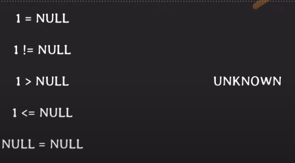

## Subquery

예제 1)
ID가 14인 임직원 보다 생일이 빠른 임직원의 ID, 이름, 생일을 알고 싶다.

* without subquery

```mysql
select birth_date from employee where id = 14;

select id, name, birth_date
from employee
where birth_date < '1992-08-04';
```
쿼리를 두번 실행해서, birth_date 정보를 가져왔다.

* with subquery

```mysql
select id, name, birth_date
from employee
where birth_date < (
	select birth_date from employee where id = 14
);
```

## IN
예제 2) ID가 5인 임직원과 같은 프로젝트에 참여한 임직원들의 ID를 알고 싶다.

```mysql
select empl_id 
from works_on
where empl_id != 5 AND (proj_id = 2001 or proj_id = 2002);
```

여기 있는 `or` 조건을 하나로 합칠 수 있다.

```mysql
select empl_id 
from works_on
where empl_id != 5 AND proj_id IN (2001,2002);
```

## NULL
SQL에서는, 의미가 크게
* unknown
* unavailable or withheld
* not applicable


id가 14, id가 15인 직원의 birth_date의 null값은 같을 수도 있고, 다를 수도 있다.

업데이트가 안되었을 수도 있고, 개인정보 때문에 비공개를 했을 수도 있다.

그렇기 때문에 값이 같거나 다르거나 단정 지을 수 없다.

```mysql
SELECT id FROM employee WHERE birth_date = NULL;
```

Empty Set (0.00 sec)

```mysql
SELECT id FROM employee WHERE birth_date is NULL;
```

id = 14, 15

결과 값이 다른 것을 확인할 수 있다. NULL 값을 확인 할 때는 `IS`, `IS NOT`을 통해 확인 해주어야 한다.

### three-valued logic

SQL에선, 비교/논리 연산의 결과로 TRUE, FALSE, **UNKNOWN**을 가진다.



NULL이랑 어떤 값을 비교해도 `UNKNOWN` 이라고 결과가 나오는데, 이는 `NULL`이 실제로 유효한 값을 가질 때 
결과가 달라질 수 있기 떄문이다.

### NOT IN 사용시 주의 사항?

3 not in (1,3,NULL) -> false

3 not in (1,2,NULL) -> unknown ????

결국 3 != NULL을 비교하게 되는데, (False,False,Unknown) 결과값이 unknown을 리턴한다.

## 해결 방법 
1. `Not NULL` constraints 걸기
2. `IS NOT NULL` 으로 NULL 값 체킹
3. `NOT EXISTS` 사용