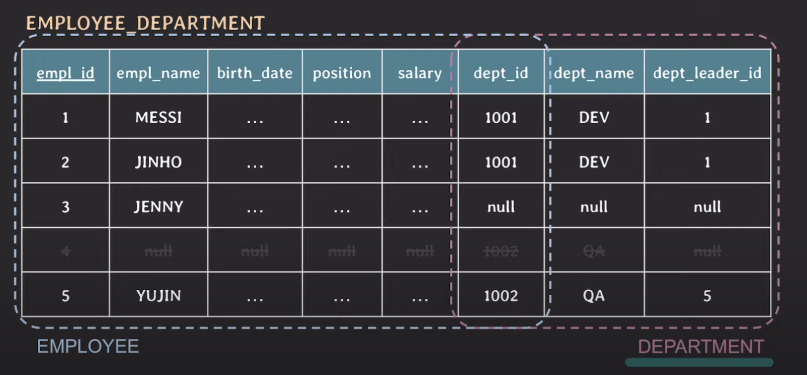
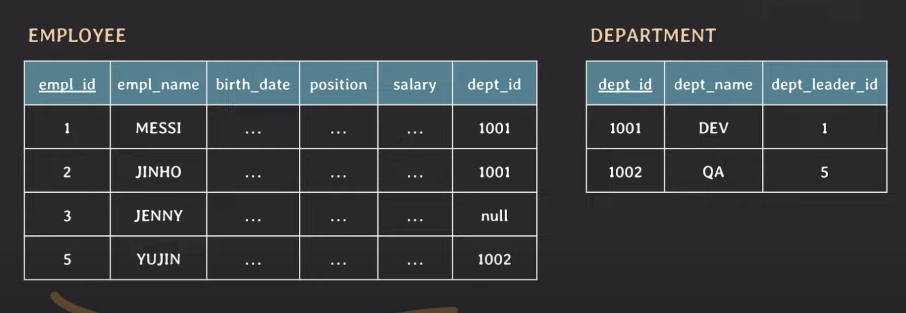
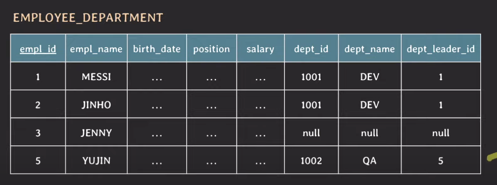
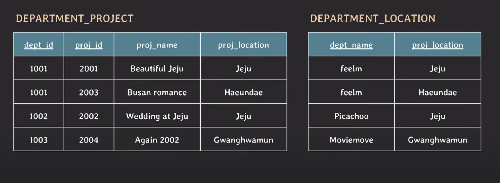
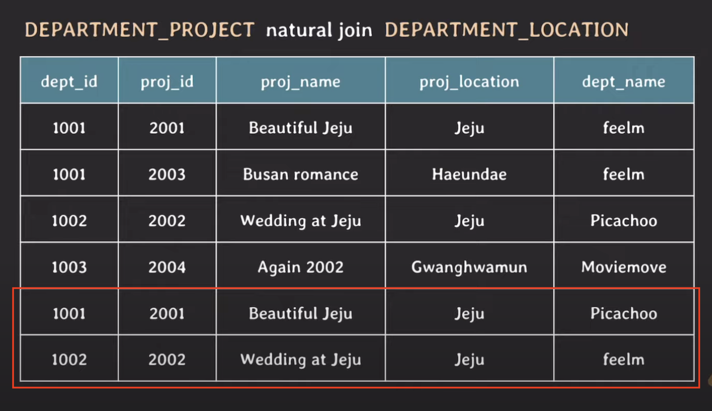

## 중복 데이터 문제

* 저장 공간 낭비
* 실수로 인한 데이터 불일치 가능성 존재

NULL값은 최대한 적게 쓰는 것이 좋음 

### 관심사의 분리

위 테이블엔 임직원과 부서의 한 테이블에 존재한다.

임직원이 한명 도 없는 부서 정보를 입력할 때, 임직원의 모든 값은 `NULL`이 들어가고, 부서 정보만 입력하게 된다.

추후에 새로운 부서에 임직원이 새로 들어온다고 할 때, 이전에 작성했던 정보를 삭제해줘야 하는 번거로움이 있다.

### 분리 후

분리 후 장점 

 * 새로운 임직원이 들어 올 때, 부서 값인 `dept_id`만 맞춰서 정해주면 된다. 만약에 부서가 없다면, `NULL`로 표시하면 된다.
 * NULL값이 줄어든다 

#### Deletion anomalies 

YUJIN의 정보를 삭제할 때, 튜플 자체를 없앨 때, 부서 정보 자체가 삭제된다.

이를 해결하기 위해선, EMPLOYEE값을 전부 `NULL`로 표시하면 되지만 매끄럽지 않음. 

## Spurious Tuples (가짜 튜플)

위 두개의 테이블을 `NATURAL JOIN`을 해보자?

Natural Join이란?
* 서로 다른 두개의 테이블에서 똑같은 `attribute`를 기준으로 join을 진행한다. 

위 경우, `proj_location`을 기준으로 조인이 된다.

결과를 확인했을 때, 

아래 두개의 예상하지 못한 튜플이 발생한다. 

NATURAL JOIN을 하기 전에, 각 테이블에 똑같은 `Jeju` 값을 조인 했을 떄, 불필요한 조인을 하게 되어 가짜 튜플이 생성된다.

### 해결 방법은? 

결국은 관심사의 분리를 통해서 부서, 프로젝트, 그리고 어떤 부서가 어떤 프로젝트가 참여하고 있는지를 알려주는 테이블을 만든다.

## NULL 값의 문제점

* join할 때, 예상과 다른 결과가 발생할 수 있다. 
* aggregate function 사용 시 주의해야함 
  * count 사용 시, `NULL`값을 카운트 하지 않음 
* 불필요한 storage 낭비

