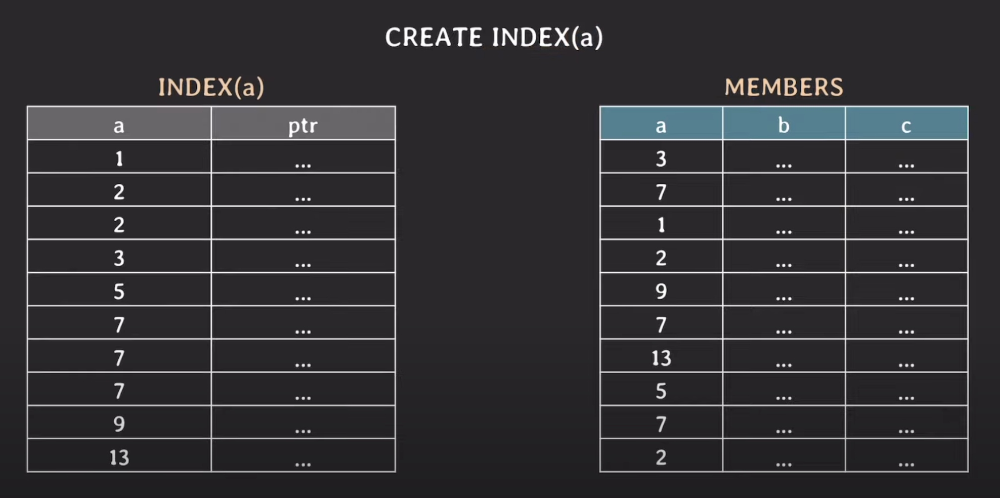
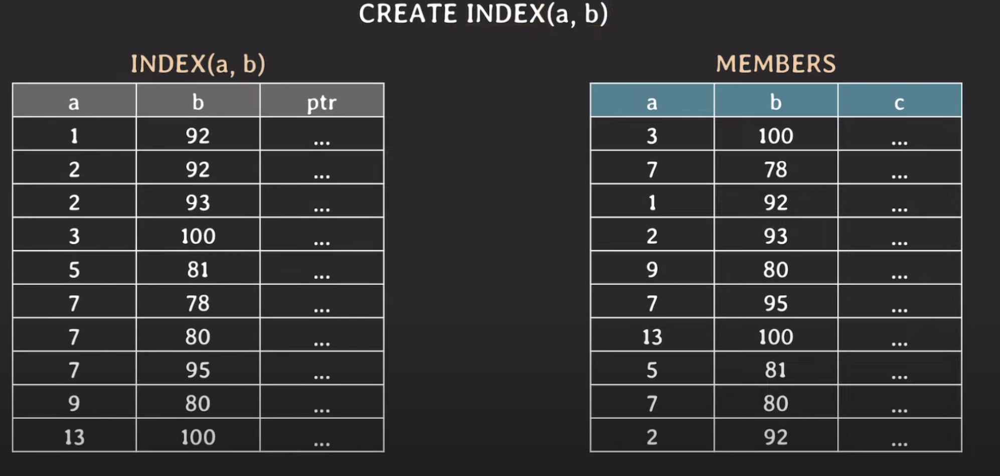
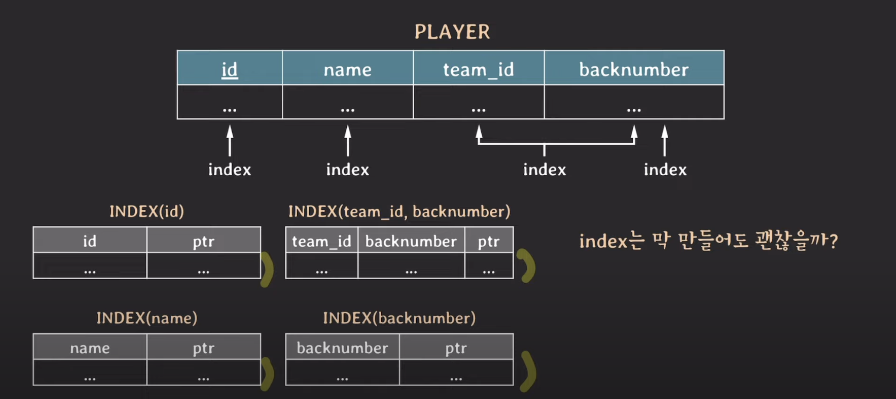
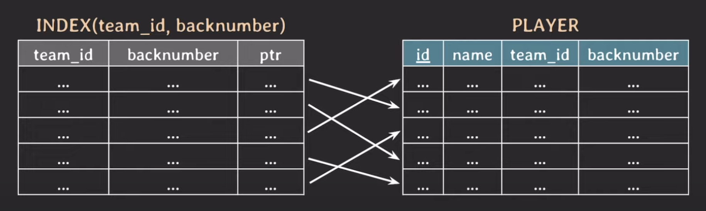

## 인덱스

인덱스가 왜 필요한가?

```mysql
CREATE TABLE CUSTOMER (
    ...
    first_name VARCHAR(10)
)
```

만약에 이 테이블에 데이터가 100만건 있다고 가정할 때, 
```mysql
SELECT *
FROM CUSTOMER
WHERE first_name = 'Minsoo';
```

index가 없다면, full scan으로 동작하고, 시간 복잡도는 O(N)이 될 것이다.

하지만, 인덱스가 걸려있고, B-Tree기반이라면 O(logN)으로 성능 향상 가능.

결국, 사용목적은 **조건을 만족하는 튜플을 빠르게 조회하기 위해서**!

### 인덱스를 거는 방법


```mysql
SELECT *
FROM PLAYER
WHERE name = 'Sonny';
```

```mysql
SELECT *
FROM PLAYER
WHERE team_id = 105
  and backnumber = 7;
```

이 두개의 쿼리에 Index를 걸어보자.
```mysql
CREATE INDEX player_name_idx ON player (name);
```
```mysql
CREATE UNIQUE INDEX team_id_backnumber_idx
    ON player (team_id, backnumber);
```

생성 단계에서 index를 걸어주는 방법은?

```mysql
CREATE TABLE player(
    name VARCHAR(20) NOT NULL,
    ...
    INDEX player_name_idx (name)
)
```
이 경우 player_name_idx는 생략 가능.

#### multicolumn index (composite index)
* 두 개 이상의 attribute로 구성된 index

```mysql
UNIQUE INDEX (team_id, backnumber)
```

📌 primary key엔 index가 자동 생성된다!

## B-Tree



MEMBERS에 대해서 인덱스를 생성하면 왼쪽 테이블처럼 생성된다.

이 테이블의 특징으론,
* a의 값이 정렬되어 있음
* 포인터로 MEMBERS에 있는 tuple을 가르킴

```mysql
WHERE a = 9;
```
시간 복잡도가 O(logN)인 이유는, 이분탐색을 사용하기 때문이다.

```mysql
WHERE a = 7 AND b = 95;
```

위 케이스에선, a에 대해서는 인덱스가 생성되어 있으므로 성능이 빠르지만, 
b에 대해서는 인덱스가 없기 때문에 성능적으로 비효율적이며 `full scan`으로 동작하는 것과 다를바 없다.

이 문제를 해결하기 위해선, (a, b)를 묶는 인덱스를 생성해줘야 한다.

```mysql
CREATE INDEX (a,b);
```



근데 어떻게 정렬되는데?

* 먼저 a를 기준으로 정렬되고, a의 값이 같다면 b의 값을 기준으로 정렬이 된다.

```mysql
WHERE b = 95;
```

위 조건을 검색하면 어떻게 될까?

성능이 `full scan`과 비슷하며, 더 안좋을 수도 있다.

해결 방법은 b에 대한 INDEX를 따로 만들어야 한다.

📌AND가 아니라 OR인 경우도 추가적으로 INDEX를 따로 생성해야 한다!


#### 직접 INDEX를 고르고 싶을 때?
```mysql
SELECT * FROM player USE INDEX (backnumber_idx)
         WHERE backnumber = 7;
```

가급적이면 INDEX를 사용
```mysql
SELECT * FROM player FORCE INDEX (backnumber_idx)
         WHERE backnumber = 7;
```

INDEX 사용을 강요


### INDEX 만드는 것은 다다익선일까?



테이블에 write를 할 때마다 INDEX도 변경이 발생
* PLAYER에 데이터가 추가되면, 인덱스도 변경을 해줘야 한다.

추가적인 저장 공간 차지

=> 불필요한 INDEX는 만들지 말자.


#### Covering Index



```mysql
SELECT team_id, backnumber FROM player WHERE team_id = 5;
```

이 쿼리를 날리는 경우에, 인덱스 테이블에 필요한 정보가 모두 있으므로 
PLAYER 테이블까지 가서 정보를 찾지 않아도 된다.

인덱스 테이블에서만 처리가 가능한 경우, 조회 성능도 빨라진다.


## Hash Index

장점 
* 해시 테이블을 사용하여 조회 성능은 O(1)

단점
* 배열에 데이터가 계속 추가가 될 때, 더 큰 사이즈로 늘려줘야 하는데, rehashing에 대한 부담이 있다.
* 값이 같은지(equality) 만 비교가 가능하고, 범위(range)는 비교가 불가능하다.
* multicolumn index의 경우 전체 attribute에 대해서만 조회가 가능하고, 일부분은 불가능하다.
  * (a,b) 중 a만 조회 불가능!

### Full scan이 더 좋은 경우?
* table에 데이터가 별로 없는 경우
* 조회하려는 데이터가 테이블의 상당 부분을 차지할 때?
  * 근데 왜? 조회 데이터도 수십만이라 그런건지?

### 참고 사항
* 이미 몇백 만 건의 데이터가 있는 테이블에 인덱스를 걸어준다면 DB 성능에 안좋을 수 있다. 
    그러므로, 트래픽이 적을 때 작업을 해야함!