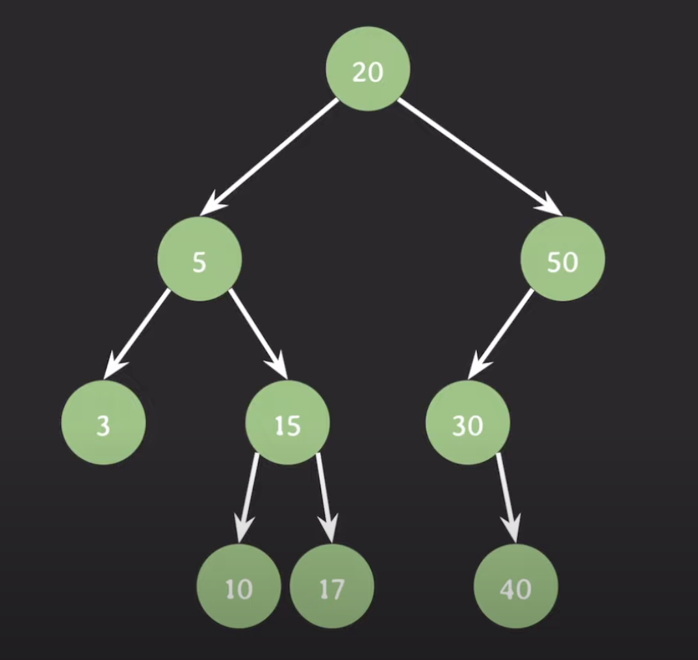
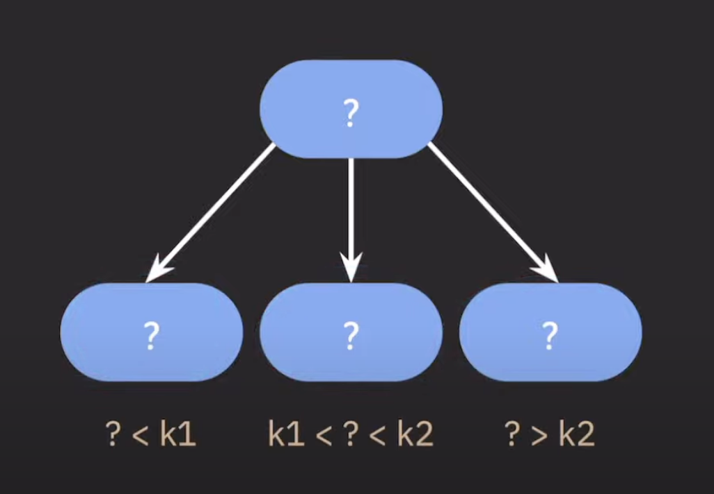
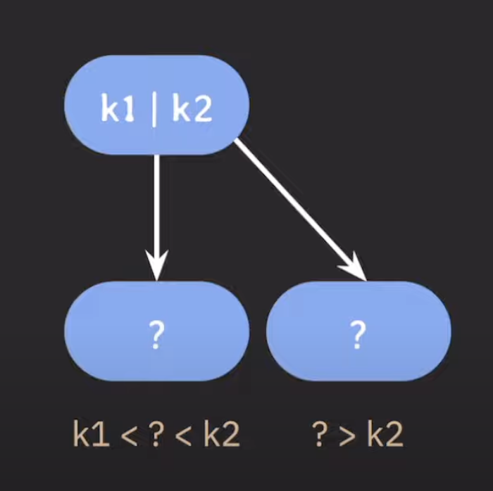
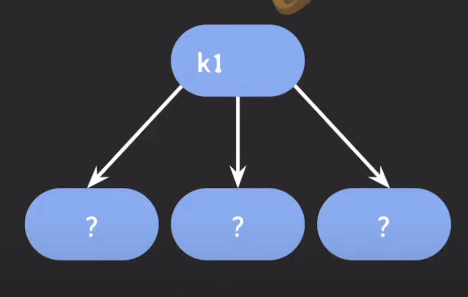
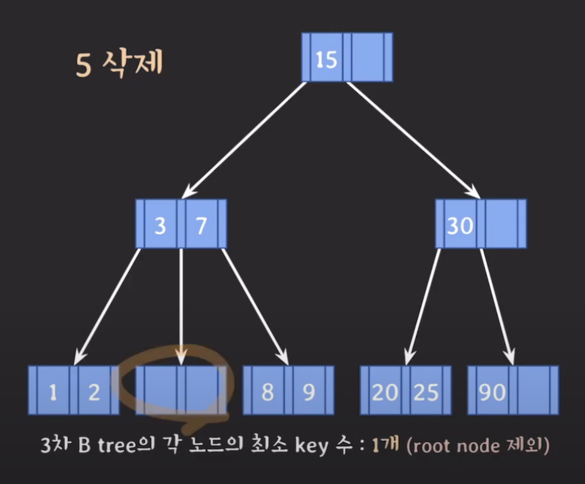
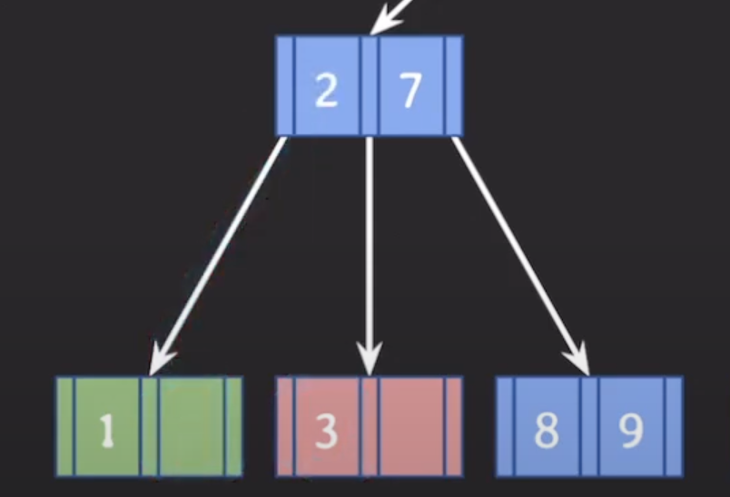
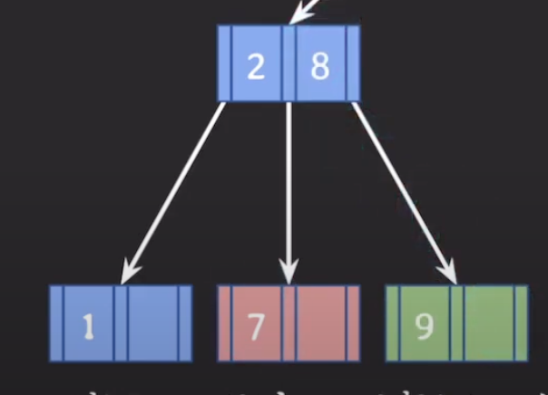
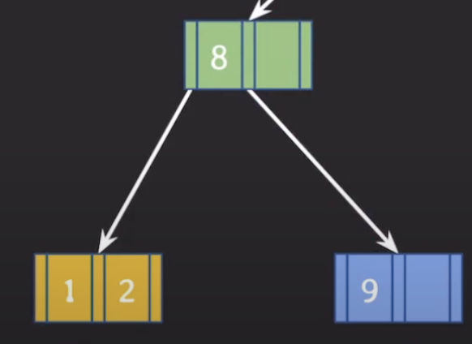

### Binary Search Tree

왼쪽 노드 > Root > 오른쪽 노드

#### 자녀 노드를 3개 까지 가지고 싶다면?

이 경우, 부모의 노드에는 하나의 값이 아닌 두개의 값(k1|k2)이 저장되도록 해야한다.

* 부모 노드의 key는 오름차순으로 정렬되어야 한다.

즉, 이런 형태로 동작하는 것이 `B tree`이고, 자녀 노드의 최대 갯수를 정할 수 있다.

* B tree는 BST를 일반화한 tree라고도 말할 수 있다.

#### 최대 몇 개의 자녀 노드를 가질 것인가? 

-> 자녀 노드 개수를 기준으로 잡아야 편함

각 노드의 최대 자녀 노드 수가 M일 때, 자연스럽게 각 노드의 최대 `key`수는 M-1이 된다.

위의 예제에서, 3개의 자녀 노드를 가지기 위해서 부모 노드는 k1, k2 값을 가졌었다.

각 노드의 최대 자녀 수: [M/2]

* leaf node (자녀가 없는 노드), root node 제외

각 노드의 최소 key 수: [M/2] - 1

* root node 제외

    
    internal 노드의 수가 x개라면 자녀 노드의 수는 언제나 x+1개다.
      
    internal 노드는 최소 2개의 자녀를 가진다.

### 틀린 예시 1)

부모의 key가 2개 이므로, 자식은 M+1, 즉 3개의 노드를 가져야 한다.

### 틀린 예시 2)

``

부모의 key가 1개인데, 자식은 3개의 노드를 가지고 있다. 2개의 자식 노드를 가져야 한다.

## 데이터 삽입

* 추가는 항상 leaf 노드에 한다.
* 노드가 넘칠 때 가운데 key를 기준으로 좌우 key들은 분할하고 가운데 key는 승진한다.
  * 노드가 넘치는 경우?
  * 부모 노드가 M개일 때, 자식 노드가 M+1보다 더 많이 있을 때.

## 데이터 삭제

* 삭제도 항상 leaf 노드에서 발생한다.

* 삭제 후에 **최소 key 수**보다 적어졌다면 재조정을 한다.

3차 B tree에서 각 노드의 최소 key 수는 -> 1개 (root node) 제외

재조정 과정

위 그림에서 key의 수가 1개보다 적기 때문에 재조정을 해줘야 한다!

### 1. key 수가 여유있는 형제의 지원을 받는다

먼저 왼쪽에 있는 key인 1,2를 조회하고 key의 여유가 있기 때문에 지원이 가능하다.

### 2. 1번이 불가능 한 경우, 부모의 지원을 받고 형제와 합친다.

위 그림에서 2를 빈 key에 보내려고 하는 경우에, 3보다 작기 때문에 1번이 불가능하다.

그러므로, 3번을 밑으로 내려주고 2를 올려준다.

#### 3 삭제

3을 삭제하게 된다면, key가 0개가 되기 때문에 또 재조정이 필요하다.

형제의 도움을 받아서 8을 옆으로 보내준다면? 7보다 크기 때문에 문제가 생긴다.

그렇기 때문에 7을 밑으로 내려주고, 8을 부모로 올려주고 9를 한칸 앞으로 땡겨줘야 한다.

### 7 삭제

7을 삭제하고 나서, 형제의 지원이 불가능 하므로 부모의 지원을 받고 형제와 합친다.

이런 식으로 1/2가 합쳐지게 된다.

### 3. 2번 후 부모에 문제가 있다면, 거기서 다시 재조정을 한다.

근데 internal 노드에서도 삭제될 때는?

-> leaf 노드에 있는 데이터와 위치를 바꾼 후 삭제한다.

어떤 데이터와 위치를 바꿔줄 것인가? 고려해야함