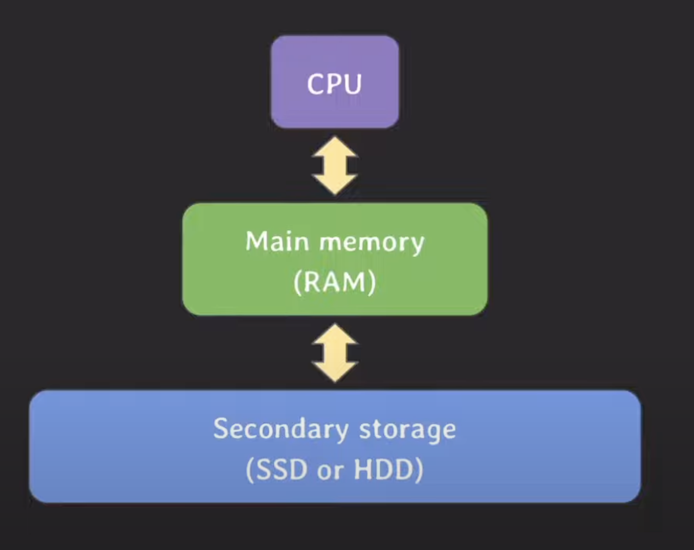
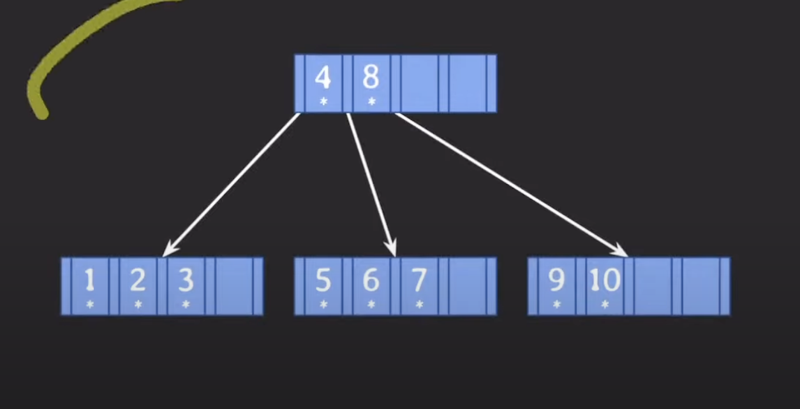

### 왜 DB index로 B tree 계열이 사용되는가?

Self-balancing BST (AVL tree, Red-Black tree)와 비교했을 때, B tree(B+ tree, B* tree)의 
조회, 삽입, 삭제의 시간 복잡도는 모두 O(logN)이다. 

시간복잡도가 동일한데 왜 굳이 B tree 계열을 쓰는가? 

#### computer system

CPU: 프로그램 코드가 실제로 실행 되는 곳

Main Memory: 실행 중인 프로그램의 코드들이나 결과로 나온 데이터들이 상주하는 곳

Secondary Storage: 데이터가 영구적으로 저장되는 곳
    
* db도 이곳에 저장, 프로그램 실행 유무에 관계없이 항상 안정적으로 저장이 되어야 함.
  * 용량도 크기 때문에, 용량이 큰 secondary storage에 저장해야 함.
* 프로그램을 처리하는 속도가 가장 느리다.
  * RAM: 40 ~ 50GB/s
  * SSD: 3 ~ 5GB/s
  * HDD: 0.2 ~ 0.3GB/s
* 데이터를 저장하는 용량이 가장 크다.
* block 단위로 데이터를 읽고 쓴다.
  * block: file system이 데이터를 읽고 쓰는 논리적인 단위
  * ex) 4KB, 8KB, 16KB...
  * 블락 단위로 데이터를 읽기 때문에, 불필요한 데이터까지 읽어올 가능성이 있음

### DB에서 데이터를 조회할 때 secondary storage에 최대한 적게 접근하는 것이 성능 면에서 좋다.
왜? 
* 앞에서 알아봤듯이, 프로그램을 처리하는 속도가 느리기 때문이다.

### block 단위로 읽고 쓰기 때문에 연관된 데이터를 모아서 저장하면 효율적으로 읽고 쓸 수 있다.

## AVL tree vs B tree

### AVL tree

`b=5`인 데이터를 찾는다고 가정할 때, 값을 계속 비교해나가다 보면 5인 노드를 찾는데까지 4번의 조회가 필요하다.

이 조회라는 것은, secondary storage에 4번 접근했다는 의미이기도 하다.

### B tree (5차)

똑같이 `b=5`를 찾을 때, 처음에 루트에서 4와 8을 비교해서 5는 중간 값이므로 중간 자녀 노드로 이동해서 찾는다.

데이터를 조회하는 데 까지 2번 조회가 발생했다.

### B tree 장점

#### 1. 성능
두 개의 tree의 성능을 비교했을 때, AVL tree는 4번, 그리고 B tree는 2번이므로 당연히 B tree의 성능 속도가 우수하다고
볼 수 있다.

이 차이는, 자녀 노드의 수가 B tree는 3~5개를 가질 수 있고, AVL tree는 1~2개 이기 때문에 탐색 범위에서 차이가 난다.

* 탐색 범위: root 노드에서 찾는 leaf 노드까지 도달하는 시간

#### 2. block

AVL tree에서 8이라는 데이터를 읽는다고 할 때, block을 같이 읽는데 필요하지 않은 데이터들도 같이 읽게 된다.

반면에, B tree에서는 블락에 연관된 데이터들이 같이 저장되기 때문에 **저장 공간 활용도가 더 좋다고 말할 수 있다**.

### 101차 B tree의 best/worst case

#### Best case

최대 자녀수: 101 (M)

최대 key수: 100 (M-1)

최소 자녀수: 51 ([M/2])

최소 key수: 50 ([M/2] - 1)

노드 수, 데이터 수

level 0: 1, 100

level 1: 101, 101 * 100

level 2: 101^2, 101^2 * 100

level 3: 101^3, 101^3 * 100

총 데이터 수의 합은, 대략 1억 정도가 된다.

### worst case

이 경우, 최소 자녀 수는 2개를 가질 수 있고, 최소 Key는 1개를 가질  수 있다.

level 0: 1, 1

level 1: 2, 2 * 50

level 2: 2 * 51, 2 * 51 * 50

level 3: 2 * 51^2, 2 * 51^2 * 50

총 데이터 수의 합은, 약 26만개가 된다.

**즉, B tree는 4개의 level만으로 26만개 ~ 1억 개의 데이터를 저장할 수 있다는 의미가 된다.**

가장 멀리 있는 데이터도 세번의 이동 만으로 접근이 가능하다!

#### 두가지 의문

AVL tree의 노드들도 block안에 최대한 담으면 저장 공간 활용도가 좋은 것 아닌가?

-> 이 방법이 결국 B tree 동작 방식으로 귀결 된다.

#### hash index를 쓰는건?

해쉬를 사용하면 삽입,삭제,조회 시간 복잡도가 O(1)인데, 이 것을 사용하는건 어떤가?

해쉬엔 치명적인 단점이 있는데, 값이 같은지 다른지 비교하는 equality 조회만 가능하고, 범위 기반 검색이나 정렬엔 사용할 수 없는
단점이 있다.