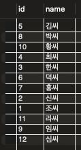
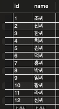
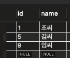
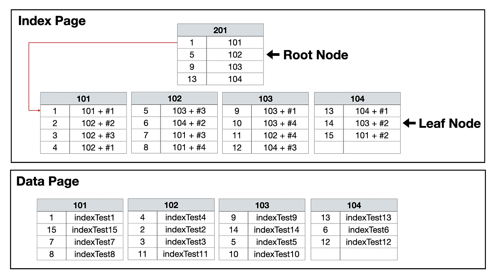

앞서서 인덱스에 관해서 배웠는데 인덱스와 관련된 Clustered, NonClustered 개념이 추가적으로 있다. 이것들은 무엇을 뜻하는 것일까?


클러스터드 인덱스란 실제 데이터와 묶인 `(clustered)` 인덱스를 뜻하며, 해당 페이지를 알아서 바로 해당 페이지를 찾는 것과 같다.

반면에, 논 클러스터드 인덱스는 뒤에 목차에서 찾고자 하는 내용의 페이지를 찾고 그 페이지로 이동하는 것과 비슷하다.
## Clustered Index

### 생성 조건
* PK 설정 시, 자동 생성
* Unique와 NOT NULL 제약 조건을 함께 생성할 때 자동 생성

```mysql
CREATE TABLE singer_non(
    int id,
    name VARCHAR(255)
)
```

클러스터 설정이 없는 테이블을 설정하고, 데이터들을 삽입을 하면
```mysql
INSERT INTO singer_non VALUES (5, '김씨');
INSERT INTO singer_non VALUES (8, '박씨');
INSERT INTO singer_non VALUES (10, '황씨');
INSERT INTO singer_non VALUES (4, '최씨');
INSERT INTO singer_non VALUES (3, '한씨');
INSERT INTO singer_non VALUES (6, '덕씨');
INSERT INTO singer_non VALUES (7, '홍씨');
INSERT INTO singer_non VALUES (2, '신씨');
INSERT INTO singer_non VALUES (1, '조씨');
INSERT INTO singer_non VALUES (11, '라씨');
INSERT INTO singer_non VALUES (9, '임씨');
INSERT INTO singer_non VALUES (12, '심씨');
```



삽입한 순서대로 결과가 나온다.

하지만, id값에 클러스터드 인덱스를 적용한다면 어떻게 될까?

```mysql
CREATE TABLE singer (
    int id PRIMARY KEY,
    name VARCHAR(255)
)
```

데이터 삽입과정은 위와 동일



앞선 결과완 달리 정렬되어 저장되었다!! id값에 PK 설정을 해주었기 때문에 클러스터드 인덱스가 자동으로 설정되었기 때문이다.

클러스터드 인덱스엔 루트 페이지가 존재하는데, 이는 **실제 데이터가 저장된** 페이지다.



루트 페이지엔 각 데이터 페이지의 첫번째 값들과 `데이터 페이지`의 주소값을 가진다.

`id=6`인 가수를 찾는다고 할 때, 루트 페이지에서 값을 비교하게 되고, 5보단 크고 9보단 작으니 중간 `리프 페이지`에 데이터가 있음을 알 수 있다. 

이러한 부분 때문에, 조회 동작 속도가 Non-clustered Index보다 빠르지만, 조회가 아닌 쓰기/수정/삭제 작업시에는 **정렬을 수행하기 때문에 속도가 더 느리다**.

클러스터드 인덱스는 테이블 당 `한개`씩만 존재한다.

그래서, 테이블에서 인덱스를 걸어야 할 때 가장 효율적으로 동작하는 컬럼을 클러스터드 인덱스로 지정해주어야 한다.

### 주의점

정렬되지 않은 데이터들에 클러스터드 인덱스를 적용한다고 할 때, 데이터들을 정렬하게 된다면 많은 리소스를 차지하게 되기 때문에 사용자가 적은 시간대에 작업을 
수행해줘야 한다.


## Non-clustered Index

`Non-clustered Index`는 정렬되지 않은 상태로 데이터 페이지가 구성이 된다.

### 생성 조건
* Unique 제약 조건으로 자동 생성
* CREATE INDEX name_idx ON singer(name);

앞선 방식과는 달리, 테이블 당 여러개가 존재할 수 있다. 


### 구조


데이터 페이지가 존재하는 것 이외에, 별도의 인덱스 페이지를 생성한다.

인덱스 페이지는 키 값과 위치 포인터 (ROWID)로 구성된다.

    ROWID: 파일 그룹 번호 - 데이터 페이지 번호 - 데이터 페이지 오프셋으로 구성되는 포인팅 정보

위치 포인터는 Clustered Index와 다르게 `페이지 번호 + #오프셋`이 기록되어 바로 데이터를 가르킨다. 

* 일반적으로 위치 포인터는 힙에 저장된다.
* Clustered Index의 리프 노드에는 실제 데이터가 저장되어 있기 때문에 인덱스 키를 이용하여 데이터를 직접 가져올 수 있다.
* 인덱스의 리프 페이지는 데이터 그 자체가 아닌 포인터를 가지고 있기 때문에 검색 속도가 Clustered Index보다 느리다.
  * 하지만 쓰기,수정,삭제는 더 빠르다!
* 별도의 인덱스 페이지를 생성하기 때문에 추가적인 용량이 필요하다.


## 두 인덱스를 혼합해서 사용하는 경우

일반적으로는, 두 인덱스가 혼합되어 사용되는 경우가 많다.

### 어떻게 동작하게 되는 걸까?

클러스터드 인덱스는 동일하게 동작하지만, 논 클러스터드 인덱스는 `페이지 번호 + #오프셋`형태로 리프 페이지가 원래는 존재하지만, 
이제는 클러스터드 인덱스가 적용된 `키 값`을 대신 가진다

### ❓왜 키 값을 가지게 될까?

기존 `페이지 번호 + #오프셋` 형태를 가질 때, 데이터의 삽입이나 삭제가 일어날때마다 매번 논 클러스터드 인덱스의 데이터 위치 정보가 변경되고,
리프 페이지가 재구성된다. 이로 인해서, 많은 비용이 낭비될 수 있다. 

하지만, 키 값을 가지는 방식은 이러한 치명적인 단점을 커버해준다.


한가지 의문

데이터 주소를 가지는 방법 대신에 키 값을 컬럼에 저장한다면 검색 속도의 차이?  

인터넷을 찾아보니 검색 속도가 살짝 저하된다고 함. 

이부분이 좀 헷갈림

