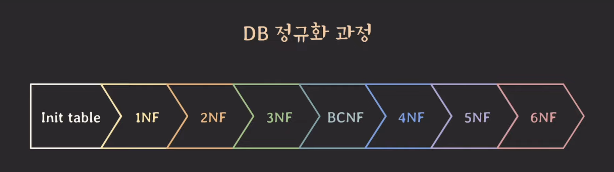
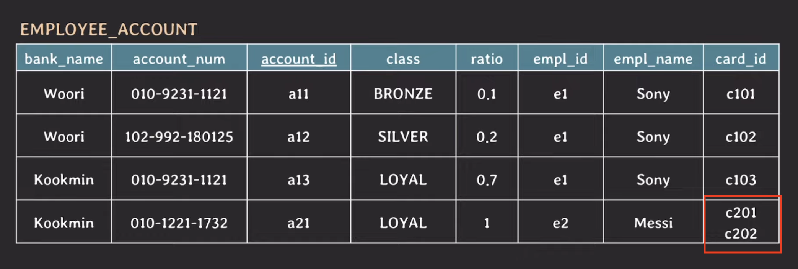
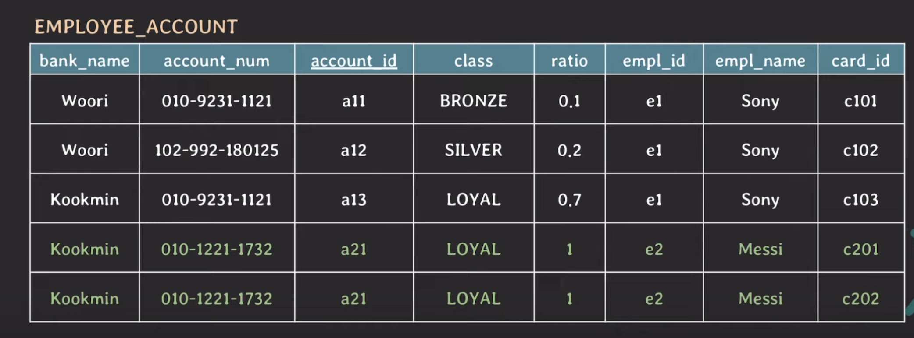
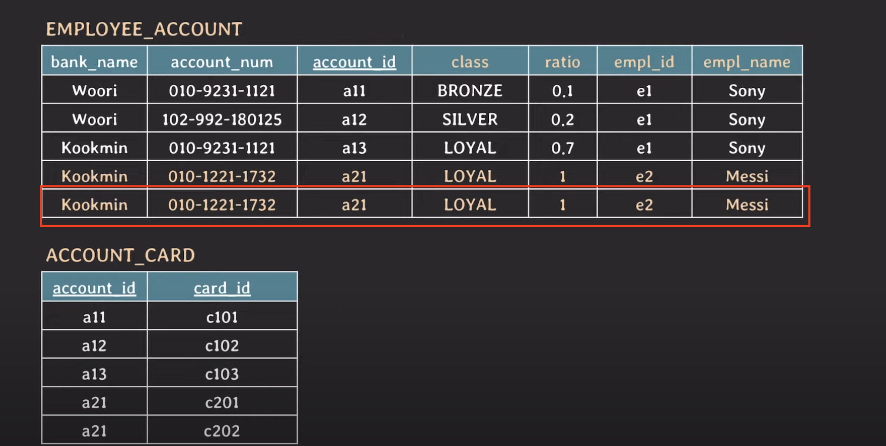
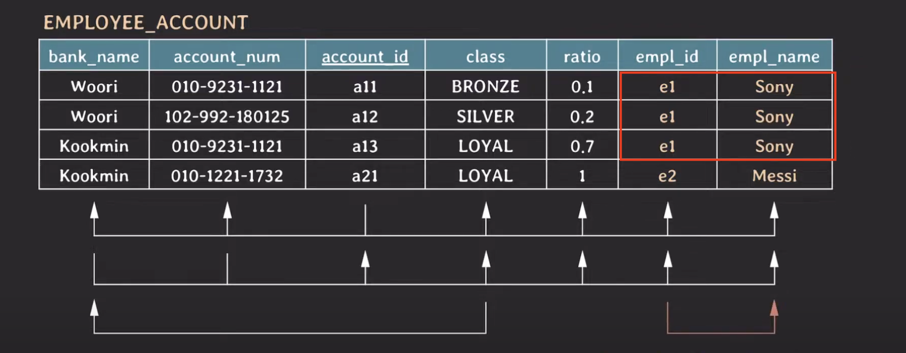
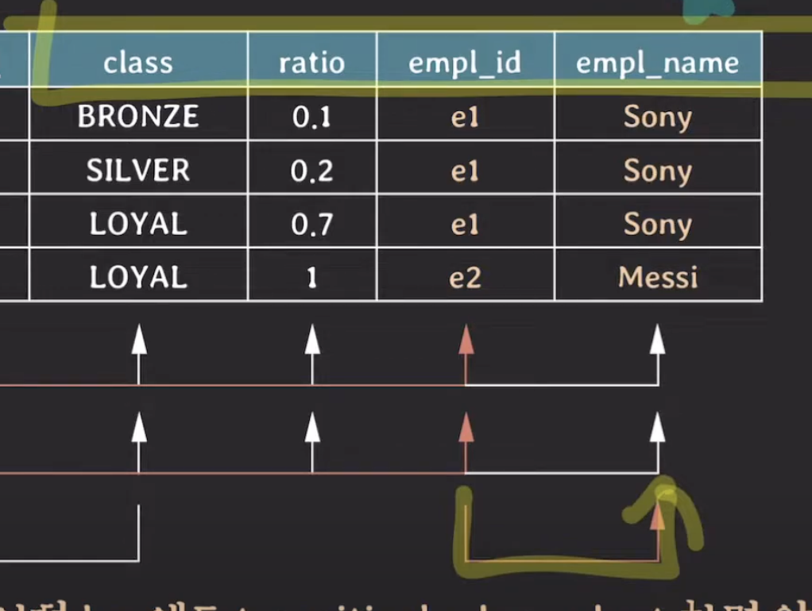
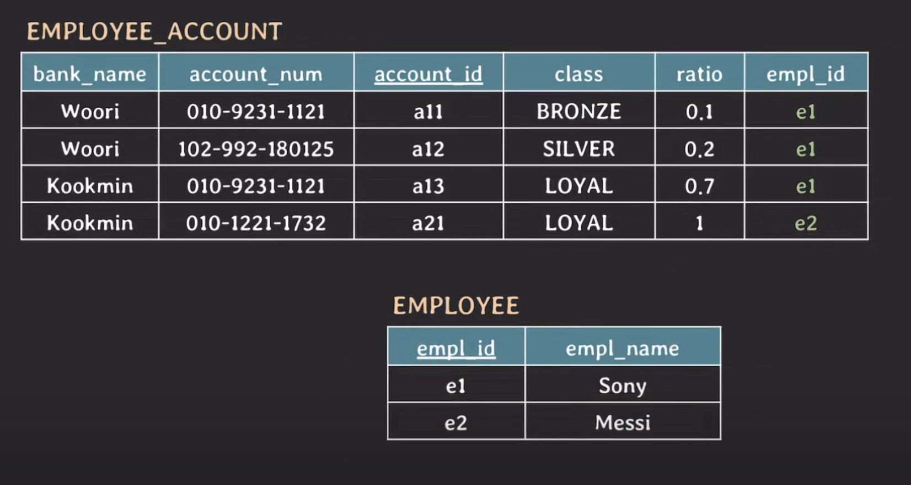
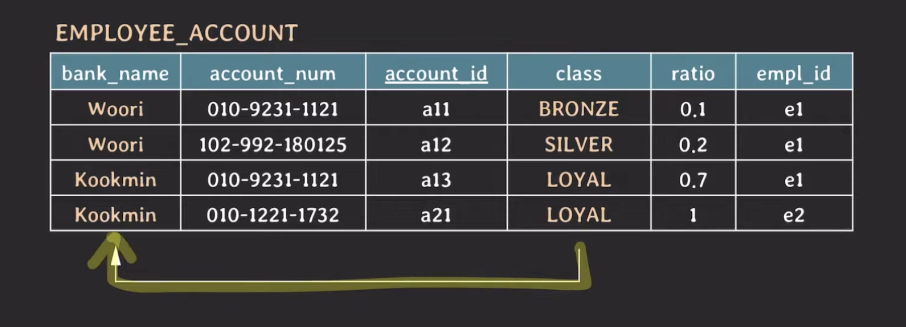
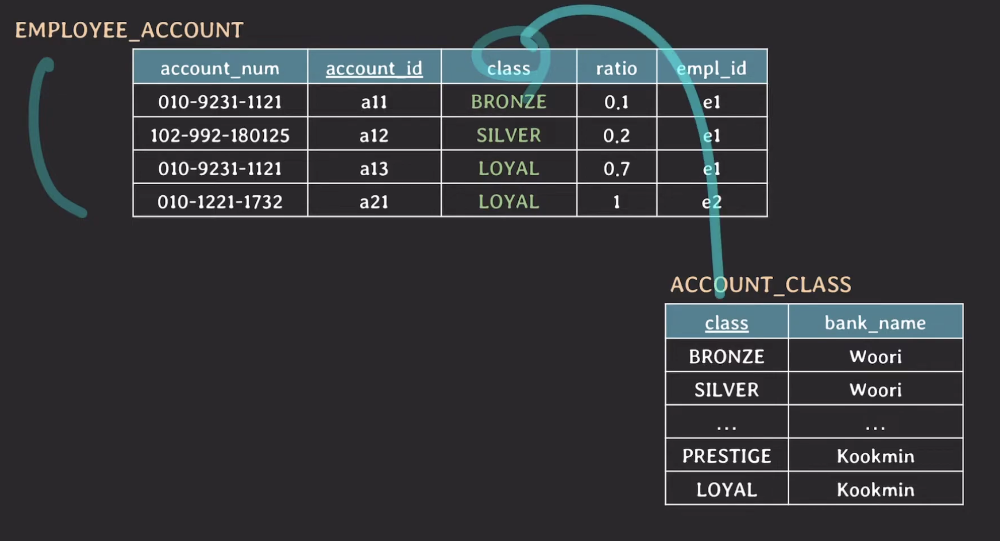
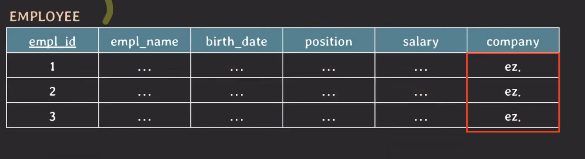

## DB 정규화

데이터 중복과 insertion, update, deletion anomaly를 최소화 하기 위해 Normal Form에 따라
DB를 구성하는 과정

#### Normal Form
* 정규화 되기 위해 지켜야 하는 몇가지 rule

### 정규화 과정

처음부터 순차적으로 진행되며, 앞 단계를 만족해야 다음 단계로 진행 가능.

1NF ~ BCNF
* FD와 Key만으로 정의되는 Normal Form
* 3NF 까지 도달하면 정규화 됐다고 말하기도 함
* 실무에서는 보통 3NF, BCNF까지 진행

해당 테이블은 임직원의 월급 계좌를 관리하는 테이블이다.
* 하나 이상의 월급 계좌를 등록하고 월급 비율(ratio)를 조절할 수 있다.
* 계좌마다 등급이 있다. (국민: STAR -> PRESTIGE -> LOYAL, 우리: BRONZE -> SILVER -> GOLE)

### Key
#### super key : table에서 tuple들을 unique하게 식별할 수 있는 attributes set

* account_id

#### (candidate) key : 어느 한 attribute라도 제거하면 unique하게 tuples를 식별할 수 없는 super key

* {account_id}, {bank_name, account_num}

계좌 번호와 은행 이름을 함꼐 묶는다면, tuple들을 unique하게 식별할 수 있다.

#### primary key : table에서 tuple들을 unique하게 식별하려고 선택된 (candidate) key

* {account_id}

#### prime attribute : 임의의 key에 속하는 attribute

* account_id, bank_name, account_num

#### non-prime attribute : 어떠한 Key에도 속하지 않는 attribute

* class, ratio, empl_id, empl_name, card_id

### Functional Dependency는 어떻게 될까?

* account_id -> {나머지}
* {bank_name, account_num} -> {나머지}
* empl_id -> empl_name
* class -> bank_name
    * 각 은행에서 겹치는 이름이 없기 때문에 성립 가능!

## Normalization

### 1NF: attribute의 value는 반드시 나눠질 수 없는 단일한 값이어야 한다.

이런 데이터가 들어가 있다고 가정할 때, MESSI는 두개의 card_id를 가지고 있어서 문제가 발생한다.

따라서, 1NF에 위배가 되므로 단일한 값을 가질 수 있도록 분리를 해줘야 한다.

1NF를 해결하기 위해서 새로운 tuple을 추가해 주었지만, 몇 가지 문제가 있다.
* ratio의 합이 1이 되어야 하지만, 현재 2
* primary key가 더이상 unique 하지 않음

#### candidate key

    {account_id, card_id} , {bank_name, account_num, card_id}

새로운 tuple을 추가해줬기 때문에, 기존의 candidate key로는 더 이상 tuple을 unique하게 식별할 수 없어서 card_id가 추가가
되었다.

#### non-prime attribute
    
    class, ratio, empl_id, empl_name

근데 non-prime attribute들이 반드시 {account_id, card_id}에 의존을 해야할까?

account_id 만으로도 unique하게 식별 가능하다.

**이런 상황을 non-prime attribute들이 {account_id, card_id}에 partially dependent 하다고 한다.**

그리고, **모든 non-prime attribute들이 {bank_name, account_num, card_id}에 partially dependent** 하다.

### 2NF: 모든 Non-prime attribute는 모든 key에 fully functionally dependent 해야 한다

위 테이블은 partially dependent하기 때문에 2NF에 위배되고, 이는 `card_id`가 key에 포함이 되었기 때문에 발생했다.

결국, card_id를 분리시켜줘야 해야 한다.

이렇게 card_id를 분리하게 되면, 기존 임직원 테이블에선 중복되는 tuple이 생기고, 삭제해주면 된다.

이제 non-prime attribute는 key에 대해서 unique 결정이 되기 때문에, fully dependent 하게 된다!!

* {account_id} -> {class, ratio, empl_id, empl_name}
* {bank_name, account_num} -> {class, ratio, empl_id, empl_name}

두 개의 key에 대해서 non-prime attribute들이 fully FD 하기 때문에 2NF를 만족하게 된다.

FD를 살펴보면, 

{account_id} -> {empl_id} , {empl_id} -> {empl_name} 이런식으로 되는데

{account_id} -> {empl_name} 처럼 한번에 합쳐줄 수 있다. 

이렇게 합쳐지는 경우, **transitive FD** 라고 한다. (X->Y & Y->Z, Y or Z is not subset of any key)

### 이 경우는? 

{account_id} -> {class}, {class} -> {bank_name}이기 때문에 {account_id} -> {bank_name}이 성립하는가?

이 경우는, `bank_name`은 `account_num`과의 key의 일부분이기 때문에 성립하지 않는다! 

### 3NF: 모든 non-prime attribute는 어떤 key에도 transitively dependent 하면 안된다.

즉, non-prime attribute와 non-prime attribute 사이에 FD가 있으면 안된다.

위 그림에서, non_prime attribute 사이에 FD가 존재하기 때문에, 3NF를 위반하고 있다.

결국, 3NF를 해결하기 위해서, 테이블을 분리 해야한다.

분리 후, 3NF 만족!

3NF까지 완료됐다면, 정규화 되었다고 말할 수 있다.

### BCNF: 모든 유효한 non-trivial FD X->Y는 X가 super key여야 한다.

* non-trivial: Y가 X의 부분집합이 아닌 경우

위 클래스의 경우 super key가 될 수 없기 때문에, BCNF를 위반하고 있다.

이 경우에도, 테이블을 분리해줘야 한다.

#### 2NF 참고사항

2NF는 key가 composite key가 아니라면 2NF는 자동적으로 만족?

composite key란?

    primary key는 한 테이블에 한 개만 존재할 수 있고 여러 개가 존재할 수 없다. 하지만,
    primary key(col1, col2) 이런 식으로 조합한다면, 에러가 발생하지 않음. 

2NF란?
    
    모든 non-prime attribute는 모든 Key에 fully dependent 해야 한다
    모든 non-prime attribute는 어떤 key에도 partially dependent 하면 안된다

여기서 primary key는 team, back_number가 된다. team, back_number 만으로는 tuple들을 unique하게 식별할 수 없다. 

그런데, non-prime attribute(team_name)이 key(team, back_number)에 partially dependent하기 때문에 2NF를 위반.

보통은 맞는데, 예외적인 상황이 있음.

모든 회사 값이 항상 `ez` 일 때,

{empl_id} -> {empl_name, birth_date, position, salary, company}

{} -> {company} 일 떄, 공집합은 모든 집합에 대해 부분 집합이고, company는 결국 partially dependent on key가 되어 
2NF를 위반한다.

이를 해결하기 위해선, COMPANY_NAME을 분리해서 저장해야 한다.

### denormalization (반정규화)

쪼갰던 테이블을 다시 합치는 것 

