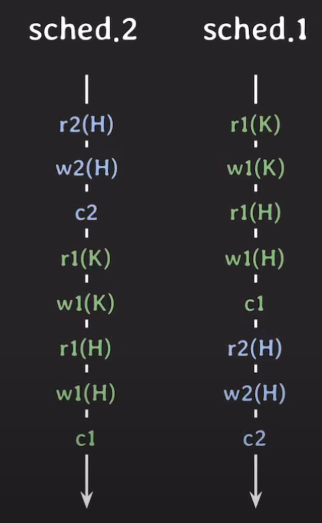
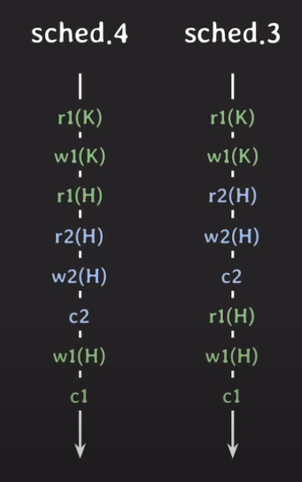
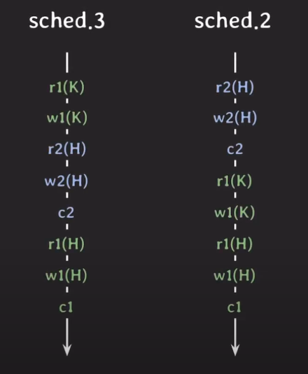
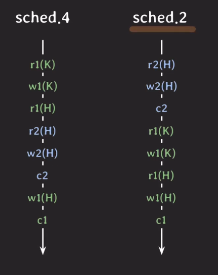
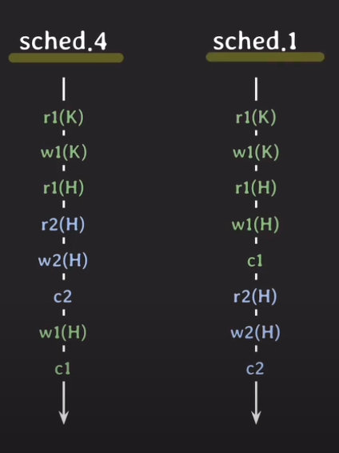

## Schedule

여러 트랜잭션들이 동시에 실행될 때 각 트랜잭션이 속한 operation들의 실행 순서
    
    Operation이란 데이터 베이스에 대한 읽기, 쓰기와 같은 작업을 의미한다.
    ex) K의 데이터를 읽음 => 하나의 Operation

### Serial Schedule

트랜잭션들이 겹치지 않고, 한번에 하나씩 실행되는 Schedule 이다. 

부정확한 데이터를 만들어내지는 않지만, 동시성이 없기 때문에 성능이 낮아서 현실적으로 사용하기 힘들다.

### Non-Serial Schedule

트랜잭션이 겹쳐서 실행되는 Schedule 이다.

사진 상에는 병렬적으로 수행되는것 같이 표현됐지만, 실제로는 `r1(K)`가 실행되고 조금 뒤에 `r2(K)`도 실행된다. 

그렇기 때문에, 동시성이 높아져 같은 시간 내 더 많은 트랜잭션을 처리할 수 있다. 

### 하지만, 

이상한 결과가 나올수도 있다.

#### 해결 방법
* Serial Schedule과 동일한 NonSerial Schedule을 살행하자 ! 

그렇다면, `Schedule`이 동일하다란 의미가 뭘까?

### Conflict
세가지 조건을 모두 만족할 때 conflict 하다고 한다.

    1. 서로 다른 transaction 소속
    2. 같은 데이터에 접근
    3. 최소 하나는 write operation이여야 한

### Conflict Equivalent
두 조건 모두 만족할 때, equivalent 하다고 한다.

    1. 두 schedule은 같은 트랜잭션을 가진다.
    2. 어떤(any) conflicting operation의 순서도 양쪽 schedule 모두 동일하다.

위 사진에서 보면, 같은 트랜잭션을 가지는 것을 확인할 수 있다.

그리고, r2(H) -> w1(H), w2(H) -> r1(H), w2(H) -> w1(H) 에 대해서 동일한 순서를 가지는 것을 확인할 수 있다.

그래서, 두 개는 **Conflict Equivalent** 하다고 할 수 있다.

이 때, schedule 2가 Serial Schedule 이므로 이것과 equivalent 하다면, `Conflict Serializable` 이라고 한다.

### 결론
Schedule 3는 NonSerial 임에도 불구하고, 정상적인 결과를 리턴한다.

### Schdule 4도 `Serializable` 할까?

같은 트랜잭션이긴 하나, r1(H) -> w2(H) 의 방향이 다르기 때문에 equivalent 하지 않다.

### Schedule 1과의 비교

r2(H) -> w1(H)의 방향이 다르기 때문에, equivalent 하지 않다.

### 결론적으로, 

Conflict Serializable 하지 않다 -> 이상한 결과  