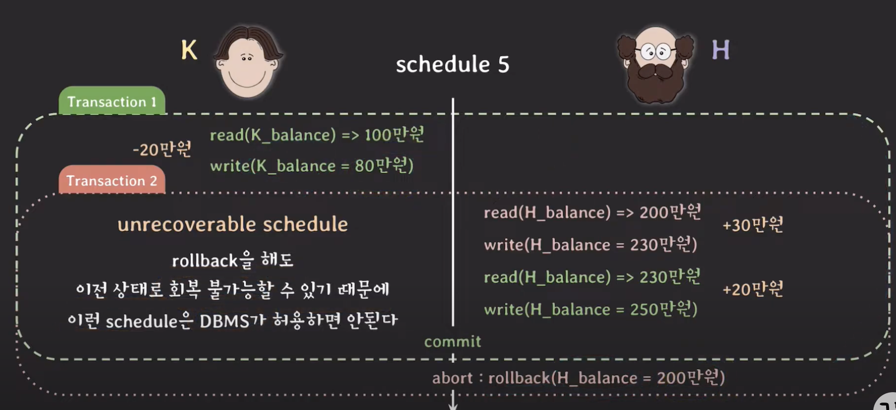
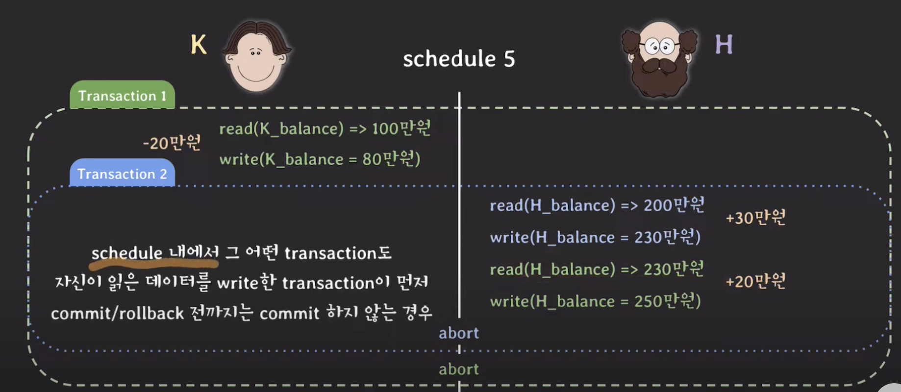
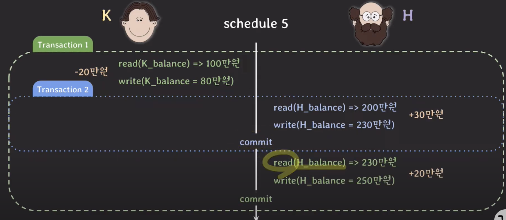

## Recoverable Schedule

트랜잭션이 롤백을 해서 H의 돈은 200만원이 됐는데, K의 밸런스는 80만원이다.

20만원이 사라졌으므로, **데이터 불일치**가 발생했다.

커밋된 트랜잭션이 롤백된 트랜잭션의 `write` 한 데이터를 `read`한 경우, 이를

#### Unrecoverable Schedule 이라고 한다.

하나의 트랜잭션이 롤백을 하면, 의존성이 있는 다른 트랜잭션도 롤백을 해야한다
-> Cascading Rollback

하지만, 이 방식은 비용이 많이 드는 문제가 있는데, 아래와 같은 방법으로 해결 
가능하다.

이런식으로 1번 트랜잭션이 커밋되고 나서, 데이터를 읽는 방식을 `Cascadeless Schedule` 이라고 한다.

즉, 스케쥴 내에서 커밋되지 않은 트랜잭션들이 `write`한 데이터를 읽지 않는 경우를 말한다.

### Strict Schedule

Cascadeless Schedule에서 쓰지도 않는 경우를 더해준다. 

## Concurrency Control이 제공하는 것 
    Serializablity와 Recoverablity를 제공하고, 이와 관련된 트랜잭션 속성
    은 isloation 이다. 