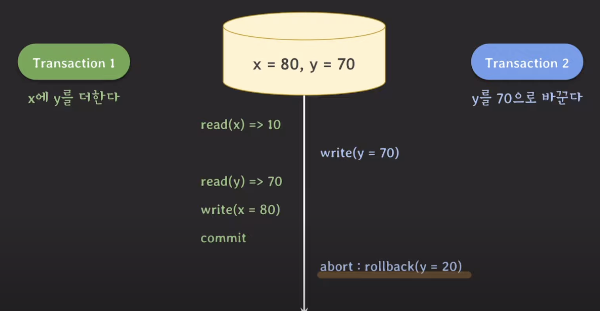

### Dirty Read?

커밋되지 않은 변화를 읽음.

ex) x = 10, y = 20이 있을때, 트랜잭션 1, 2가 수행된다고 하자.

이 그림에서 같이, 트랜잭션 2가 롤백이 된다면, y는 초기값인 `20`으로 돌아간다.

그런데, 트랜잭션 1은 y로 부터 `70`인 값을 읽었는데, 정작 트랜잭션 2는 롤백됐다..!

유효하지 않은 값을 읽은 상황을, Dirty Read 라고 한다.

### Non-Repeatable Read

같은 데이터를 두번 읽었는데, 값이 달라지는 경우

### Phantom Read

위 세가지를 모두 허용하지 않는것이 좋은 방법이지만, 그렇게 하면 성능이 너무 
떨어지기 때문에, `isolation level`을 만들어서 사용자가 선택할 수 있게 만들었다.

대부분의 RDBMS는 위 세가지 이상 현상을 기준으로 만들어졌으나, 

이상 현상의 정의가 모호하고, 더 많은 이상현상이 존재한다는 비판 논문이 쓰였다.
* Dirty write: 커밋되지 않은 데이터 덮어쓰기 
* Lost Update: 변경된 데이터 유실
* Read skew: inconsistent한 데이터를 읽는 경우 (읽는 시점에 따라 데이터가 변함)
* Write skew: inconsistent한 데이터 쓰는 경우

## Snapshot Isolation

### 등장 배경

    기존의 정의한 Isolation Level은 이상한 현상 세가지를 정의하고, 얼마나 허용하는지 여부에
    따라 레벨을 구분했다.

    Snapshot Isolation은 Concurrency Control이 어떻게 동작할지, 구현을 바탕으로
    만들어졌다. 

데이터베이스에 변화된 값을 바로 쓰는것이 아닌, `Snapshot` 에 값을 저장하여 관리한다.

Snapshot isolation에선 같은 값에 대해서 write를 할 때, 먼저 커밋된 트랜잭션만
인정하고, 뒤에 있는 트랜잭션은 abort 한다.

(Lost Update가 발생하지 않음!!)

RDBMS 마다 조금씩 isolation level이 다르고, 동작 방식도 다르기 때문에,
사용자가 해당 RDBMS의 레벨을 파악하고, 적절하게 사용해야 한다.