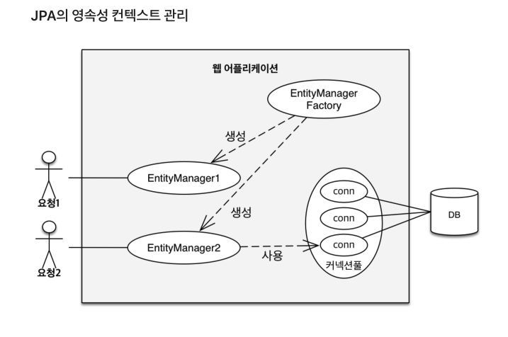

## 무지성 트랜잭션 사용?

개발을 하면서 서비스 쪽에 `@Transaction` 을 무조건 달고 시작하는 
내 모습을 발견할 수 있었다.
    
### 트랜잭션 단점?
* 리소스 자원 낭비

```java
    @Transactional
    public void append(String data) {
        메일 발송 로직();
        슬랙 메세지 발송 로직();
        ...
    }
```

만약애 메일 발송 로직에 `timeout=30초` 이런 설정이 있다고 할 때, 만약에 장애가 발생한다면
30초 동안 계속 대기를 하게 되고, 다른 메서드에서도 메일 발송 로직을 사용한다면 큰 문제가 될 것.




사용자의 요청이 들어올 때, `EntityManagerFactory` 는 각 요청마다 `EntityManager`를
발급하고, 얘가 영속성 컨텍스트를 관리한다. 각 `EntityManager`는 DB에 접근할 때
커넥션 풀을 점유해야 읽기/쓰기 작업을 진행할 수 있음.

커넥션 풀은, 데이터베이스와 미리 연결된 객체를 담아놓은 풀인데, DB 접속 설정 객체를 미리
만들어 놓기 때문에 클라이언트가 DB에 빠르게 접근이 가능하다. 

그런데, 트랜잭션으로 인한 장애가 생긴다면 DB 커넥션을 계속 붙들고 있는 것이 문제가 된다.

예상치 못한 트래픽 상황에서 긴 시간을 잡아먹는 `transaction`이 코드에 퍼져있다면,
간단한 조회 API 요청 쪽에서도 커넥션을 취득하는데 문제가 있다.

### 프로젝트

```java
    @Transactional
    public Long join(final JoinRequest joinRequest) {
        ...
        return memberRepository.save(member).getId();
    }
```

위는 현재 진행중인 프로젝트에서 회원 가입을 하는 메서드이다. 

여기서 `save()` 메서드를 까보면

```java
@Transactional
@Override
public <S extends T> S save(S entity) {

	Assert.notNull(entity, "Entity must not be null");

	if (entityInformation.isNew(entity)) {
		em.persist(entity);
		return entity;
	} else {
		return em.merge(entity);
	}
}
```

save 메서드 자체에 트랜잭션이 적용된 것을 확인할 수 있다.


```java
    public Long join(final JoinRequest joinRequest) {
        ...
        return memberRepository.save(member).getId();
    }
```

트랜잭션이 중복으로 적용되기 때문에 어노테이션을 삭제해주었다.

### 궁금한점
    
    트랜잭션이 사용되는 코드에 트랜잭션 어노테이션을 또 걸면 리소스 낭비가 발생하는가?

### ReadOnly = true 옵션을 사용하는 이유?

트랜잭션을 읽기 전용 모드로 설정한다는 뜻으로, 데이터를 읽기만 하고 쓰는 동작은 하지 않아서 
데이터 변경이 일어나지 않는다. 

그렇기 때문에 이로 인한 성능 향상을 기대할 수 있다.

그리고 `readOnly=true` 를 사용할 때 `Optimistic Lock`의 동작에 영향을 미칠 수가
있다는 점을 고려해야 한다는데, 아직 배우지 않았으므로 다음에 정리해서
올려봐야겠다.

참고자료)

https://www.youtube.com/watch?v=mB3g3l-EQp0


https://woonys.tistory.com/entry/Transactional%EC%9D%80-%EB%A7%8C%EB%8A%A5%EC%9D%B4-%EC%95%84%EB%8B%99%EB%8B%88%EB%8B%A4-1-Transaction%EC%9D%98-%EA%B0%9C%EB%85%90%EA%B3%BC-%ED%8A%B8%EB%A0%88%EC%9D%B4%EB%93%9C%EC%98%A4%ED%94%84