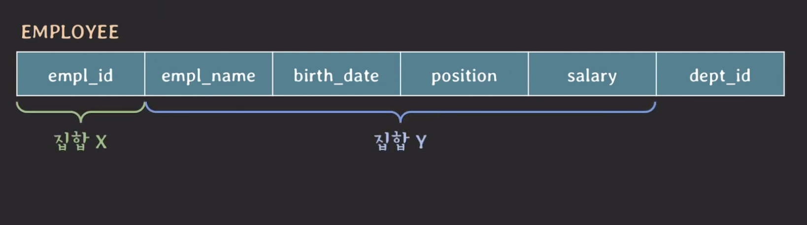
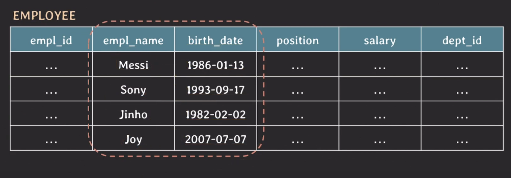

## Functional Dependency란? 

한 테이블에 있는 두 개의 `attribute` 집합 사이의 제약(constraint)

이런식으로 Employee 테이블을 둘로 나눌 때, 특징은 두 tuple의 X값이 같다면 Y값도 같다.

X의 값에 따라 Y값이 유일하게 결정될 때, 이러한 제약 관계를 Functional Dependency, X->Y라고
할 수 있다.

### 테이블의 state만 보고서 FD를 파악하면 안된다?

테이블의 state만 보고서 `empl_name`-> `birth_date`라고 가정해보자.

이럴 때, 이름이 같은 직원이 추가될 경우에 맞지 않게 된다.

그러므로, 테이블의 schema를 보고 의미적으로 FD를 파악해야 한다.

임직원이 어떻게 부서에 속할 수 있는지에 따라서도 `dept_id`까지 Y에 포함해서 
FD를 정의할수도 있다.

#### {} -> Y

Y값은 언제나 하나의 값만 가진다는 의미 

예를 들어 `company` attribute가 항상 같은 값을 가질 때, 이렇게 표현 할 수 있다.

### Trivial Functional Dependency

X->Y 일떄, Y가 X의 부분집합 이라면 trivial FD라고 한다.

### Non-trivial

ex) {a, b, c} -> {b, c, d}

{a,b, c} -> {d,e} 같이 겹치는게 하나도 없는 경우 completely non-trivial FD라고 한다.

### Partial functional dependency

부분 집합

### Full functional dependency 

완전 함수 종속